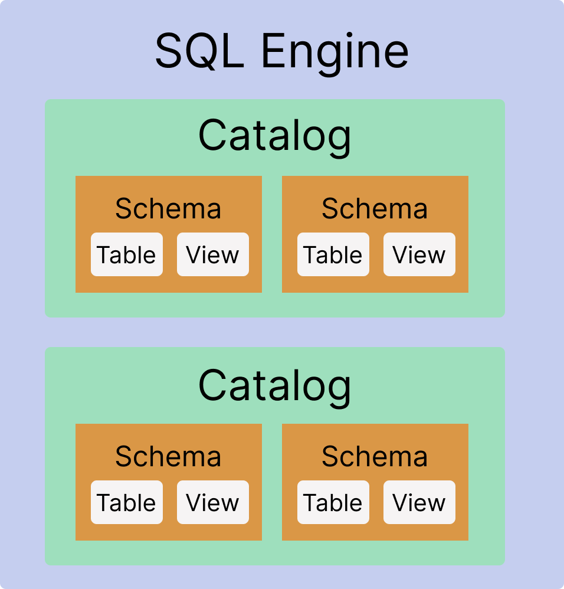

# Database object creation

The most familiar types of database objects are the ones we query: tables and views. But tables and views reside in `catalog` and `schema` containers that enable granular control of how they are stored and who can access them.

SQLMesh creates and/or manages some of the database objects your project uses - this guide discusses which ones, how you can override SQLMesh's default behavior, and approaches for some common use cases.

## Terminology

Data transformation tasks range from tidying one CSV file to processing billions of rows per day and are accomplished with a wide variety of tools and computing systems.

These systems use different terminology to describe their components and, in some cases, use the same term to mean different things. This page uses a consistent set of terminology to describe the components of these systems, regardless of the language the systems themselves use. This section defines those terms.

??? warning "System-specific terminology"
    Different computing systems may use the same term to mean different things, such as "database." The definitions used on this page may differ from those used by the computing system you are most familiar with.

### SQL Engine

We use the generic term "SQL Engine" to refer to the system performing data transformation computations for a SQLMesh project.

SQLMesh supports multiple types of SQL engine:

- Traditional RDBMSs like PostgreSQL and SQL Server
- File-based systems like MySQL and DuckDB
- Cloud systems like Snowflake and BigQuery
- Distributed systems like Spark and Trino

These systems vary widely in their architecture and flexibility. In some systems, like Snowflake, the components are tightly integrated and internally coherent. Other systems, like Spark, fully separate the computational, metadata, and data storage components, allowing users to customize each one.

Due to the variety of systems and capabilities, we use the generic term "SQL Engine" to avoid confusion about the definitions of "database" and other terms.

### Governance and administrators

Data should not be accessible to everyone, and the process of determining who can access it is called _governance_. An _administrator_ is the person responsible for assigning and revoking permissions from user accounts.

Governance is implemented via a system's _access controls_, which assign permissions to user accounts. Permissions can be assigned for actions (e.g., can the user create a new table), for objects (e.g., can the user query the `finance` table), or both (e.g., user can create tables in some schemas but not others).

User accounts do not have to correspond to people - they can be created for any entity capable of taking action. For example, a specific server might be responsible for running a query every day at 2pm. We could create a user representing that server and grant it permissions to query that table (but no others). User accounts created for servers are often called "service accounts" to differentiate them from human user accounts.

### Catalogs and schemas

Database objects are organized hierarchically, starting with the entire SQL engine system and moving down to individual tables and views.

This diagram shows the object hierarchy, consisting of the SQL engine, catalogs, schemas, and tables/views:

Some SQL engines use different terminology, but **this page exclusively uses "catalog" and "schema"** to refer to the objects depicted in this diagram.

??? warning "'Schema' has two meanings"
    The term "schema" has two distinct meanings in data transformation systems. The first is a container for tables/views, as depicted in the diagram. The second is a property of a table/view: a table's "schema" is the set of column names and data types it contains. This page always uses the first meaning.

### SQL rendering

SQLMesh [SQL models](../concepts/models/sql_models.md) must contain a query, but that query may contain non-SQL elements. For example, a query might use a [SQLMesh macro variable](../concepts/macros/macro_variables.md#predefined-variables), such as `@start_date`.

SQL engines cannot run code containing those macro variables, so SQLMesh performs a pre-processing step to convert the raw model query into SQL code an engine can run. This processing step is called **rendering** the model query.

## Table/view names

All tables and views are contained in both a catalog and a schema. Therefore, their names have three components, corresponding to each of their catalog name, schema name, and table/view name.

For example, we might create a table `my_table` located in the catalog `my_catalog` and schema `my_schema`. That table's name is `my_catalog.my_schema.my_table`, and we could use it in a SQL query like `SELECT my_column FROM my_catalog.my_schema.my_table`.

A table name containing all three components is called **fully qualified**. SQLMesh always uses fully qualified names in its rendered SQL; if you omit the catalog or schema from a model name SQLMesh automatically derives the fully qualified name.

### Default catalog/schema

A newly installed SQL engine contains a default catalog and schema. If the catalog and schema are omitted from the table name in a statement, like `CREATE TABLE my_table (my_column INTEGER)`, the table is stored in the default catalog and schema. If the schema is present but catalog is omitted from the table name, like `CREATE TABLE my_schema.my_table (my_column INTEGER)`, the table is stored in the default catalog.

### User catalog

-- Usually specified in connection parameter

## Physical and virtual layers

[Environments](../concepts/environments.md) play a key role in SQLMesh functionality, allowing model code to be modified and tested in isolated namespaces and pushed to production without re-running the computations.

SQLMesh environments work by separating database objects into two conceptual "layers": physical and virtual. The physical layer consists of the tables created, modified, and queried by SQLMesh models. The virtual layer consists of [views](https://en.wikipedia.org/wiki/View_(SQL)) that pass through data from an underlying physical table via `SELECT *`.

When an existing model is modified, a new physical table is created to reflect the updated model. When the model is merged into the production environment, the model's view is updated to point to the new physical table. This approach allows end users to query an unchanging view name while SQLMesh ensures that the view points to the appropriate physical table.

## SQLMesh model names

Model names play a critical role in SQLMesh. Model queries select from one another via their names, and the views in the [virtual layer](#physical-and-virtual-layers) inherit the model names.

## Schema creation

This section describes the schemas SQLMesh creates and manages with its default configuration.

### SQLMesh state schema

SQLMesh creates and maintains data about your project so it can identify model changes and correctly run incremental models. This data is called "state" data (as in "the state of things right now").

When SQLMesh is first run in a SQL engine, it creates

## Model naming

## Specifying defaults

## Permissions and governance

### Segregating environments

### Segregating systems