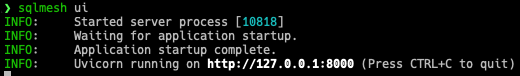
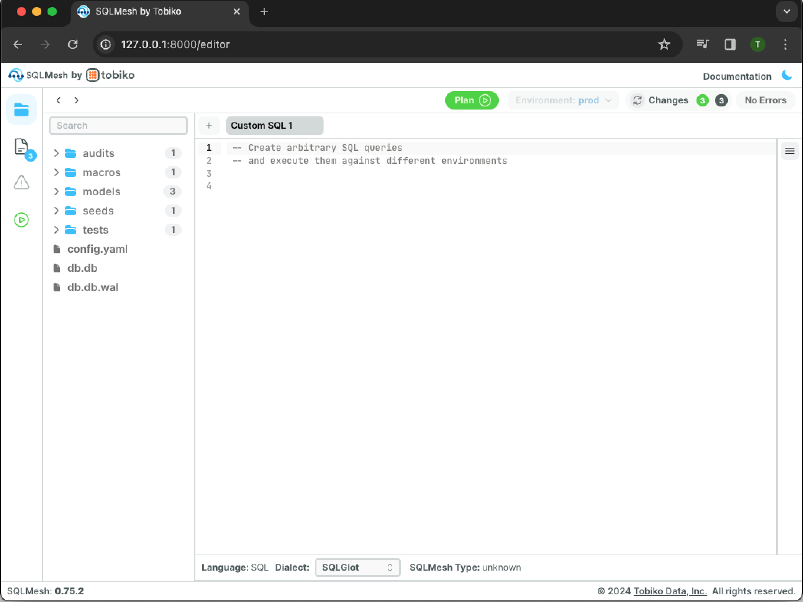
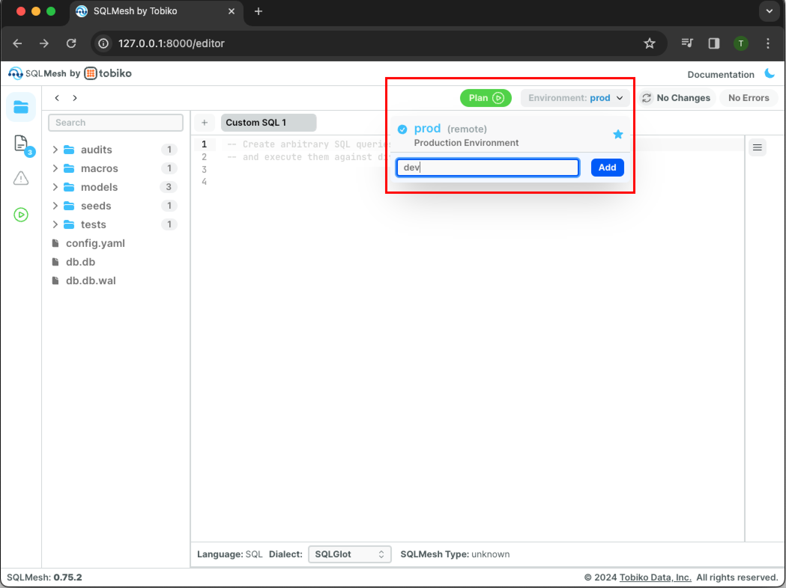

# Browser UI guide

SQLMesh's free, open-source browser user interface (UI) makes it easy to understand, explore, and modify your SQLMesh project.

This page describes the UI's components and how they work.

## Purpose

Modifying SQLMesh projects involves changing code, creating environments, and applying plans. The browser UI facilitates this process with a graphical interface for executing SQLMesh commands.

However, not all SQLMesh commands can be executed - for example, `sqlmesh run` must be executed via the [CLI](../reference/cli.md) or [Python](../reference/python.md) interfaces.

### Editing code

Editing code is the primary activity when modifying SQLMesh projects.

Many developers edit code in an integrated development environment (IDE), such as [VSCode](https://code.visualstudio.com/) or [PyCharm](https://www.jetbrains.com/pycharm/). IDEs include extensive editing functionality like auto-completion, customized key mappings, code validation, and embedded terminals.

The SQLMesh UI editor is not an IDE; it is a code editor for quickly updating models and writing ad-hoc SQL queries.

For development work, we recommend using the SQLMesh UI alongside an IDE. The UI's modular design lets you mix and match UI components while you edit code in the IDE. Learn more [below](#working-with-an-ide).

## Setup

Before beginning, ensure that you meet all the [prerequisites](../prerequisites.md) for using SQLMesh. The SQLMesh browser UI requires additional Python libraries not included in the base SQLMesh installation.

To use the UI, install SQLMesh with the `web` add-on. First, if using a python virtual environment, ensure it's activated by running `source .env/bin/activate` command from the folder used during [installation](../installation.md).

Next, install the UI with `pip`:

```bash
pip install "sqlmesh[web]"
```

## Start the Browser UI

Open the UI by running the `sqlmesh ui` command from within the project directory:

```bash
sqlmesh ui
```

After starting up, the SQLMesh web UI is served at `http://127.0.0.1:8000` by default:

{ loading=lazy }

Navigate to the URL by clicking the link in your terminal (if supported) or copy-pasting it into your web browser:

{ loading=lazy }

## Modules

The UI consists of modules that contain different functionality, and sets of modules are grouped into "modes" (learn more about modes [below](#modes)).

The UI modules are:

- [Code editor](#editor-module)
- [Plan builder](#plan-module)
- [Project documentation](#docs-module)
- [Table and column lineage](#lineage-module)

The screenshots in most examples below use the default `editor` mode.

### Editor module

The `editor` module will appear by default if the UI is started without specifying a mode. Its default view contains five panes:

1. Project directory allows navigation of project directories and files.
2. Editor tabs displays open code editors.
3. Code editor allows viewing and editing code files.
4. Inspector provides settings and information based on recent actions and the currently active pane. (Note: inspector pane is collapsed by default. Expand it by clicking the hamburger button at the top of the collapsed pane - see previous image.)
5. Details displays column-level lineage for models open in the editor and results of queries. (Note: details pane is collapsed by default. It will automatically expand upon opening a model in the editor or running a query.)

{ loading=lazy }

It also contains nine buttons:

1. Toggle Editor/Docs/Errors/Plan toggles among the editor module (default), docs module, errors view, and plan module. Errors view is only available if an error has occurred.
2. History navigation returns to previous views, similar to the back button in a web browser.
3. Add new tab opens a new code editor window.
4. Plan opens the plan module.
5. Documentation links to the SQLMesh documentation website.
6. The crescent moon toggles between page light and dark modes.
7. Run SQL query executes the [`sqlmesh fetchdf` command](../reference/cli.md#fetchdf).
8. Format SQL query reformats a SQL query using SQLGlot's pretty layout.
9. Change SQL dialect specifies the SQL dialect of the current tab for custom SQL queries. It does not affect the SQL dialect for the project.

{ loading=lazy }

And it contains four status indicators:

1. Editor tab language displays the programming language of the current code editor tab (SQL or Python).
2. Current environment displays the currently selected environment
3. Change indicator displays a summary of the changes in the project files relative to the most recently run SQLMesh plan in the selected environment.
4. Error indicator displays the count of errors in the project.

{ loading=lazy }

#### Edit models

Open a model in a new tab by clicking its file name in the left-hand project directory pane.

The tab will show the model definition, and the details pane at the bottom will display the model in the project's table and column lineage.

{ loading=lazy }

The lineage display will update as model modifications are saved. For example, you might modify the incremental SQL model by adding a new column to the query. Press `Cmd + S` (`Ctrl + S` on Windows) to save the modified model file and display the updated lineage:

{ loading=lazy }

The `Changes` indicator in the top right now shows blue and orange circles that reflect our model update.

#### Run SQL queries

Run SQL queries by executing them from custom SQL editor tabs.

For example, we might add a SQL query `select * from sqlmesh_example.incremental_model` to the Custom SQL 1 tab. To run the query, first click the hamburger icon to open the explorer pane:

{ loading=lazy }

Then click the `Run Query` button in the bottom right to execute the query:

{ loading=lazy }

The results appear in an interactive table in the details pane below the editor.

### Plan module

The plan module provides a graphical interface for the `sqlmesh plan` command. Its actions change based on the current state of your SQLMesh project. For example, it will auto-update impact analysis based on the latest saved changes to a SQL model.

Open the plan module by clicking the green circle button on the left-hand pane or the green Plan button on the top bar next to the environment dropdown.

The sections below use the SQLMesh [quickstart project](../quick_start.md) to demonstrate the module.

#### New project

In a brand new project, the only environment is the empty `prod` environment. The first SQLMesh plan must execute every model to populate the production environment.

When you open the plan module, it contains multiple pieces of information about the project's first plan:

- The `Initializing Prod Environment` section shows that the plan is initializing the `prod` environment.
- The Start and End date sections are grayed out because they are not allowed when running a plan in the `prod` environment.
- The `Changes` section shows that SQLMesh detected three models added relative to the current empty environment.
- The `Backfills` section shows that backfills will occur for all three of the added models.

{ loading=lazy }

SQLMesh will apply the plan and initiate backfill when you click the blue button labeled `Apply Changes And Backfill`.

The page will update and new output sections will appear. Each section reflects a stage in the plan application and will be green if the step succeeded.

The `Tests Completed` section indicates that the project's [unit tests](../concepts/tests.md) ran successfully.

The `Snapshot Tables Created` indicates that [snapshots](../concepts/architecture/snapshots.md) of the added and modified models were created successfully.

The `Backfilled` section shows progress indicators for the backfill operations. The first progress indicator shows the total number of tasks and completion percentage for the entire backfill operation. The remaining progress bars show completion percentage and run time for each model (very fast in this simple example).

{ loading=lazy }

#### New environment

To create a new environment, open the environment menu by clicking the drop-down labeled `Environment: prod \/` next to the green `Plan` button on the top right.

To create an environment named "dev," type `dev` into the Environment field and click the blue `Add` button.

{ loading=lazy }

The drop-down now shows that the SQLMesh UI is working in the `dev` environment:

{ loading=lazy }

To populate the environment with views of the production environment, click the green `Plan` button to open the plan module:

{ loading=lazy }

The output section does not list any added/modified models or backfills because `dev` is being created from the existing `prod` environment without modification.

Clicking the blue `Apply Virtual Update` button applies the new plan:

{ loading=lazy }


#### Existing environment

If you modify the project files, you will want to apply the changes to an existing environment. In this example, we have changed the project's `incremental_model` and are applying the changes to the `dev` environment.

The plan module will summarize the changes when you open it:

{ loading=lazy }

The `Changes` section detects that `incremental_model` was directly modified and that `full_model` was indirectly modified because it selects from the incremental model.

Click the blue `Apply Changes And Backfill` button to apply the plan and execute the backfill:

{ loading=lazy }

### Docs module

The docs module displays information about all your project's models in one interface.

A list of all models is displayed in the left-hand pane. You can filter models by name by typing in the field at the top of the pane.

When you choose a model, its query, lineage, and attributes are displayed. This example shows information from the [quickstart project](../quick_start.md) incremental model:

{ loading=lazy }

By default, the model definition source code is displayed. If you toggle to `Compiled Query`, it will display an example of the model query rendered with macro values substituted:

{ loading=lazy }

### Lineage module

The lineage module displays a graphical representation of the project's table and column lineage.

Click a model in the left-hand pane to view its lineage. By default, only the model's upstream parents and downstream children are displayed:

{ loading=lazy }

You may include all a project's models by clicking `All` in the Show drop-down on the upper right. In this example, two additional models appear:

{ loading=lazy }

Click `Connected` in the Show drop-down menu to highlight edges between upstream parents and downstream children in blue. This may be helpful when when a project contains many models:

{ loading=lazy }

## Modes

The SQLMesh UI consists of the four modules described above, grouped into three different "modes." Modes allow you to maintain a clean interface by suppressing UI features you don't plan to use during a session.

You may specify the UI mode as an option when you [start the UI on the command line](#start-the-browser-ui). For example, to run the UI in plan mode issue the CLI command `sqlmesh ui --mode plan` from within the project directory.

The UI modes contain these modules:

- `editor`: code editor, plan builder, project documentation, table and column lineage
- `plan`: plan builder, project documentation, table and column lineage
- `docs`: project documentation, table and column lineage

### Working with an IDE

The SQLMesh browser UI complements an IDE by rapidly surfacing the implications of changes to project code.

This section demonstrates one way to use the UI while editing in VSCode; the UI's `plan` mode suppresses the code editor module so it's not in the way.

VSCode natively supports [opening a web browser in a VSCode window](https://dev.to/equiman/vscode-browser-inside-2b06). We can open the browser UI in that window and see the effects of our code updates in real time.

To use this workflow, first open a terminal in VSCode and navigate to your project directory. Then follow these steps:

<b>1.</b> Start the browser UI in `plan` mode with the command `sqlmesh ui --mode plan`:

{ loading=lazy }

<br></br>
<b>2.</b> In VSCode, type the shortcut `cmd+shift+p` to open the search menu:

{ loading=lazy }

<br></br>
<b>3.</b> Type `simple browser` into the search menu and click the entry `Simple browser: Show`:

{ loading=lazy }

<br></br>
<b>4.</b> Copy the web address printed by the command output (`http://127.0.0.1:8000` by default), paste it into the menu, and click enter:

{ loading=lazy }

<br></br>
<b>5.</b> The UI will now appear in a VSCode tab:

{ loading=lazy }

<br></br>
<b>6.</b> Split the VSCode window to open a code editor alongside the UI. As you update models, the UI plan and lineage interfaces will update to reflect the changes in real time:

{ loading=lazy }

{ loading=lazy }
