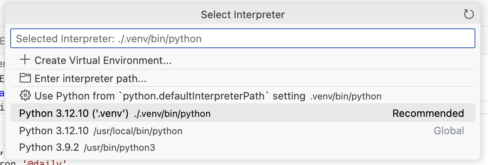
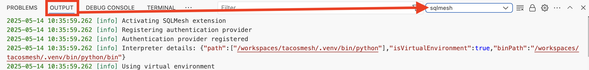
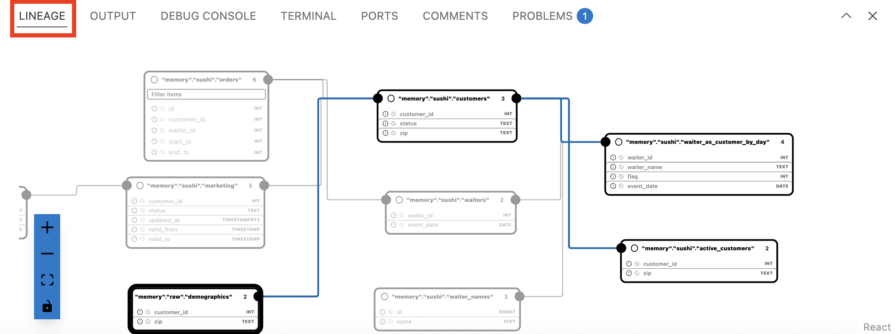
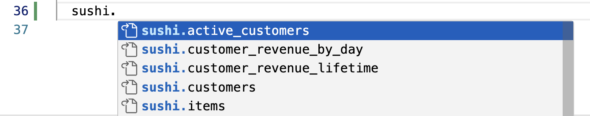
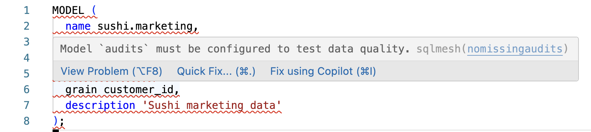

# Visual Studio Code Extension

!!! danger "Preview"

    The SQLMesh Visual Studio Code extension is in preview and undergoing active development. You may encounter bugs or API incompatibilities with the SQLMesh version you are running.

    We encourage you to try the extension and [create Github issues](https://github.com/tobikodata/sqlmesh/issues) for any problems you encounter.

In this guide, you'll set up the SQLMesh extension in the Visual Studio Code IDE software (which we refer to as "VSCode").

We'll show you the capabilities of the extension and how to troubleshoot common issues.

## Installation

### VSCode extension

Install the extension through the official Visual Studio [marketplace website](https://marketplace.visualstudio.com/items?itemName=tobikodata.sqlmesh) or by searching for `SQLMesh` in the VSCode "Extensions" tab.

Learn more about installing VSCode extensions in the [official documentation](https://code.visualstudio.com/docs/configure/extensions/extension-marketplace#_install-an-extension).

### Python setup

While installing the extension is simple, setting up and configuring a Python environment in VSCode is a bit more involved.

We recommend using a dedicated *Python virtual environment* to install SQLMesh. Visit the [Python documentation](https://docs.python.org/3/library/venv.html) for more information about virtual environments.

We describe the steps to create and activate a virtual environment below, but additional information is available on the [SQLMesh installation page](../installation.md).

We first install the SQLMesh library, which is required by the extension.

Open a terminal instance in your SQLMesh project's directory and issue this command to create a virtual environment in the `.venv` directory:

```bash
python -m venv .venv
```

Next, activate the virtual environment:

```bash
source .venv/bin/activate
```

#### Open-source SQLMesh

If you are using open-source SQLMesh, install SQLMesh with the `lsp` extra that enables the VSCode extension (learn more about SQLMesh extras [here](../installation.md#install-extras)):

```bash
pip install 'sqlmesh[lsp]'
```

#### Tobiko Cloud

If you are using Tobiko Cloud, the `tcloud` library will install SQLMesh for you.

First, follow the [Python setup](#python-setup) steps above to create and activate a Python environment. Next, install `tcloud`:

```bash
pip install tcloud
```

Finally, add the `lsp` extra to your `tcloud.yml` configuration file, as described [here](../cloud/tcloud_getting_started.md#connect-tobiko-cloud-to-data-warehouse).

### VSCode Python interpreter

A Python virtual environment contains its own copy of Python (the "Python interpreter").

We need to make sure VSCode is using your virtual environment's interpreter rather than a system-wide or other interpreter that does not have access to the SQLMesh library we just installed.

Confirm that VSCode is using the correct interpreter by going to the [command palette](https://code.visualstudio.com/docs/getstarted/userinterface#_command-palette) and clicking `Python: Select Interpreter`. Select the Python executable that's in the virtual environment's directory `.venv`.



Once that's done, validate that the everything is working correctly by checking the `sqlmesh` channel in the [output panel](https://code.visualstudio.com/docs/getstarted/userinterface#_output-panel). It displays the Python interpreter path and details of your SQLMesh installation:



## Features

SQLMesh's VSCode extension makes it easy to edit and understand your SQLMesh project with these features:

- Lineage
    - Interactive view of model lineage
- Editor
    - Auto-completion for model names and SQLMesh keywords
    - Model summaries when hovering over model references
    - Links to open model files from model references
    - Inline SQLMesh linter diagnostics
- VSCode commands
    - Format SQLMesh project files
    - Sign in/out of Tobiko Cloud (Tobiko Cloud users only)

### Lineage

The extension adds a lineage view to SQLMesh models. To view the lineage of a model, go to the `Lineage` tab in the panel:



### Render

The extension allows you to render a model with the macros resolved. You can invoke it either with the command palette `Render SQLMesh Model` or by clicking the preview button in the top right.

### Editor

The SQLMesh VSCode extension includes several features that make editing SQLMesh models easier and quicker:

**Completion**

See auto-completion suggestions when writing SQL models, keywords, or model names.



**Go to definition and hover information**

Hovering over a model name shows a tooltip with the model description. 

In addition to hover information, you can go to a definition of the following objects in a SQL file by either right-clicking and choosing "Go to definition" or by `Command/Control + Click` on the respective reference. This currently works for:

- Model references in a SQL file like `FROM my_model`
- CTE reference in a SQL file like `WITH my_cte AS (...) ... FROM my_cte` 
- Python macros in a SQL file like `SELECT @my_macro(...)`

**Diagnostics**

If you have the [SQLMesh linter](../guides/linter.md) enabled, issues are reported directly in your editor. This works for both SQLMesh's built-in linter rules and custom linter rules.



**Formatting**

SQLMesh's model formatting tool is integrated directly into the editor, so it's easy to format models consistently.

### Commands

The SQLMesh VSCode extension provides the following commands in the VSCode command palette:

- `Format SQLMesh project`
- `Sign in to Tobiko Cloud` (Tobiko Cloud users only)
- `Sign out of Tobiko Cloud` (Tobiko Cloud users only)

## Troubleshooting

### DuckDB concurrent access

If your SQLMesh project uses DuckDB to store its state, you will likely encounter problems.

SQLMesh can create multiple connections to the state database, but DuckDB's local database file does not support concurrent access.

Because the VSCode extension establishes a long-running process connected to the database, access conflicts are more likely than with standard SQLMesh usage from the CLI. 

Therefore, we do not recommend using DuckDB as a state store with the VSCode extension.

### Environment variables

The VSCode extension is based on a [language server](https://en.wikipedia.org/wiki/Language_Server_Protocol) that runs in the background as a separate process. When the VSCode extension starts the background language server, the server inherits environment variables from the environment where you started VSCode. The server does *not* inherit environment variables from your terminal instance in VSCode, so it may not have access to variables you use when calling SQLMesh from the CLI.

If you have environment variables that are needed by the context and the language server, you can use one of these approaches to pass variables to the language server:

- Open VSCode from a terminal that has the variables set
- Use environment variables pulled from somewhere else dynamically (e.g. a `.env` file) in your config 
- Set the environment variables in the python environment that the extension uses. You can find detailed instructions [here](https://code.visualstudio.com/docs/python/environments#_environment-variables)

### Python environment woes

The most common problem is the extension not using the correct Python interpreter.

Follow the [setup process described above](#vscode-python-interpreter) to ensure that the extension is using the correct Python interpreter.

If you have checked the VSCode `sqlmesh` output channel and the extension is still not using the correct Python interpreter, please raise an issue [here](https://github.com/tobikodata/sqlmesh/issues).

### Missing Python dependencies

When installing SQLMesh, some dependencies required by the VSCode extension are not installed unless you specify the `lsp` "extra".

If you are using open-source SQLMesh, install the `lsp` extra by running this command in your terminal:

```bash
pip install 'sqlmesh[lsp]'
```

If you are using Tobiko Cloud, make sure `lsp` is included in the list of extras specified in the [`tcloud.yaml` configuration file](../cloud/tcloud_getting_started.md#connect-tobiko-cloud-to-data-warehouse).

### SQLMesh compatibility

While the SQLMesh VSCode extension is in preview and the APIs to the underlying SQLMesh version are not stable, we do not guarantee compatibility between the extension and the SQLMesh version you are using.

If you encounter a problem, please raise an issue [here](https://github.com/tobikodata/sqlmesh/issues).