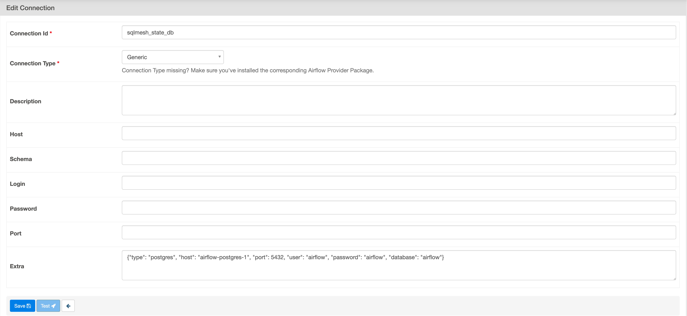

# Airflow

SQLMesh provides first-class support for Airflow with the following capabilities:

* A Directed Acyclic Graph (DAG) generated dynamically for each model version. Each DAG accounts for all its upstream dependencies defined within SQLMesh, and only runs after upstream DAGs succeed for the time period being processed.
* Each plan application leads to the creation of a dynamically-generated DAG dedicated specifically to that Plan.
* The Airflow [Database Backend](https://airflow.apache.org/docs/apache-airflow/stable/howto/set-up-database.html) is used for persistence of the SQLMesh state, meaning no external storage or additional configuration is required for SQLMesh to work.
* The janitor DAG runs periodically and automatically to clean up DAGs and other SQLMesh artifacts that are no longer needed.
* Support for any SQL engine can be added by providing a custom Airflow Operator.

## Airflow cluster configuration
To enable SQLMesh support on a target Airflow cluster, the SQLMesh package should first be installed on that cluster. Ensure it is installed with the extras for your engine if needed; for example: `sqlmesh[databricks]` for Databricks. Check [setup.py](https://github.com/TobikoData/sqlmesh/blob/main/setup.py) for a list of extras.

!!! note
    The Airflow Webserver instance(s) must be restarted after **installation** and every time the SQLMesh package is **upgraded**.

Once the package is installed, the following Python module must be created in the `dags/` folder of the target DAG repository with the following contents:

```python linenums="1"
from sqlmesh.schedulers.airflow.integration import SQLMeshAirflow

sqlmesh_airflow = SQLMeshAirflow("spark", default_catalog="spark_catalog")

for dag in sqlmesh_airflow.dags:
    globals()[dag.dag_id] = dag
```
The name of the module file can be arbitrary, but we recommend something descriptive such as `sqlmesh.py` or `sqlmesh_integration.py`.

`SQLMeshAirflow` has two required arguments (`engine_operator` and `default_catalog`). Details on these and additional optional arguments below:

| Argument                        | Description                                                                                                                                                                                                     |          Type          | Required |
|---------------------------------|-----------------------------------------------------------------------------------------------------------------------------------------------------------------------------------------------------------------|:----------------------:|:--------:|
| `engine_operator`               | Name or operator to use for creating models. See [Engine Support](#engine-support) for list of options                                                                                                          | string or BaseOperator |    Y     |
| `default_catalog`               | The default catalog (also called "database" in other engines) to use when models are defined that do not contain a catalog in their name. This should match the default catalog applied by the connection.      |         string         |    Y     |
| `engine_operator_args`          | The dictionary of arguments that will be passed into the evaluate engine operator during its construction. This can be used to customize parameters such as connection ID.                                      |          dict          |    N     |
| `ddl_engine_operator`           | The type of the Airflow operator that will be used for environment management. These operations are SQL only. `engine_operator` is used if not provided                                                         | string or BaseOperator |    N     |
| `ddl_engine_operator_args`      | Args to be passed into just the environment management operator. This can be used to customize parameters such as connection ID.                                                                                |          dict          |    N     |
| `janitor_interval`              | Defines how often the janitor DAG runs. The janitor DAG removes platform-managed DAG instances that are pending deletion from Airflow. Default: 1 hour.                                                         |       timedelta        |    N     |
| `plan_application_dag_ttl`      | Determines the time-to-live period for finished plan application DAGs. Once this period is exceeded, finished plan application DAGs are deleted by the janitor. Default: 2 days.                                |       timedelta        |    N     |
| `external_table_sensor_factory` | A factory function that creates a sensor operator for a given signal payload. See [External signals](#external-signals) for more info                                                                           |        function        |    N     |
| `sensor_mode`                   | The mode to use for SQLMesh sensors. Supported values are "poke" and "reschedule". See https://airflow.apache.org/docs/apache-airflow/stable/core-concepts/sensors.html for more details. Default: "reschedule" |         string         |    N     |
| `high_water_mark_sensor_args`   | The dictionary of arguments that will be passed into the high water mark sensor during its construction.                                                                                                        |          dict          |    N     |
| `external_sensor_args`          | The dictionary of arguments that will be passed into the external sensor during its construction.                                                                                                               |          dict          |    N     |
| `generate_cadence_dags`         | Whether to generate cadence DAGs for model versions that are currently deployed to production.                                                                                                                  |          bool          |    N     |


### State connection

By default, SQLMesh uses the Airflow's database connection to read and write its state.

To configure a different storage backend for the SQLMesh state you need to create a new [Airflow Connection](https://airflow.apache.org/docs/apache-airflow/stable/howto/connection.html) with ID `sqlmesh_state_db` and type `Generic`. The configuration should be provided in the connection's `extra` field in JSON format.



Refer to the [Connection Configuration](../reference/configuration.md#connection) for supported fields.

## SQLMesh client configuration
In your SQLMesh repository, create the following configuration within config.yaml:
```yaml linenums="1"
default_scheduler:
  type: airflow
  airflow_url: https://<Airflow Webserver Host>:<Airflow Webserver Port>/
  username: <Airflow Username>
  password: <Airflow Password>
```

## External signals

Sometimes there is a need to postpone the model evaluation until certain external conditions are met.

For example, a model might refer to an external table and should only be evaluated when the data actually lands upstream. This can be achieved using external signals.

Signals are defined as part of the model's definition using arbitrary key-value pairs. Additionally, `@start_*` and `@end_*` [macros](../concepts/macros/macro_variables.md) can be used within these values. The macro values will be resolved accordingly at the time of evaluation.

```sql linenums="1"
MODEL (
  name test_db.test_name,
  signals [
    (
      table_name = 'upstream_table_a',
      ds = @end_ds,
    ),
    (
      table_name = 'upstream_table_b',
      ds = @end_ds,
      hour = @end_hour,
    ),
  ],
)
```

Note that in the example above, `table_name`, `ds`, and `hour` are arbitrary keys defined by the user.

Now, as part of the SQLMesh integration module, a function needs to be passed into the `SQLMeshAirflow` constructor. This function should accept signal payload and return an Airflow Sensor instance representing this signal.

```python linenums="1"
import typing  as t
from airflow.sensors.base import BaseSensorOperator
from sqlmesh.schedulers.airflow.integration import SQLMeshAirflow


def create_external_sensor(signal: t.Dict[str, t.Any]) -> BaseSensorOperator:
    table_name = signal["table_name"]
    ds = signal["ds"]
    hour = signal["hour"]
    return MyCustomSensor(partition=f"{table_name}/ds={ds}/hour={hour:02}")


sqlmesh_airflow = SQLMeshAirflow(
    "spark",
    default_catalog="spark_catalog",
    external_table_sensor_factory=create_external_sensor,
)
```

The `create_external_sensor` function in the example above takes the `signal` dictionary as an argument and returns an instance of `BaseSensorOperator`. The keys in the signal dictionary match the keys provided in the model definition.

## Engine support
SQLMesh supports a variety of engines in Airflow. Support for each engine is provided by a custom Airflow operator implementation. Below is a list of links to operators supported out of the box with information on how to configure them.

* [BigQuery](engines/bigquery.md#airflow-scheduler)
* [Databricks](engines/databricks.md#airflow-scheduler)
* [MSSQL](engines/mssql.md#airflow-scheduler)
* [Postgres](engines/postgres.md#airflow-scheduler)
* [Redshift](engines/redshift.md#airflow-scheduler)
* [Snowflake](engines/snowflake.md#airflow-scheduler)
* [Spark](engines/spark.md#airflow-scheduler)
* [Trino](engines/trino.md#airflow-scheduler)
* [MySQL](engines/mysql.md#airflow-scheduler)

## Managed Airflow instances

Multiple companies offer managed Airflow instances that integrate with their products. This section describes SQLMesh support for some of the options.

### Google Cloud Composer

SQLMesh fully supports Airflow hosted on [Google Cloud Composer](https://cloud.google.com/composer/docs/composer-2/composer-overview) - see the [configuration reference page](../reference/configuration.md#cloud-composer) for more information.

### Astronomer

Astronomer provides [managed Airflow instances](https://www.astronomer.io/product/) running on AWS, GCP, and Azure. SQLMesh fully supports Airflow hosted by Astronomer.

### AWS MWAA

Due to MWAA not supporting the Airflow REST API, users are required to configure an external state connection for both the [client](../guides/connections.md#state-connection) and [Airflow cluster](#state-connection) to point to the same database.

Additional dependencies need to be installed:
```bash
pip install "sqlmesh[mwaa]"
```

Additionally, the scheduler needs to be configured accordingly:
```yaml linenums="1"
default_scheduler:
  type: mwaa
  environment: <The MWAA Environment Name>
```
