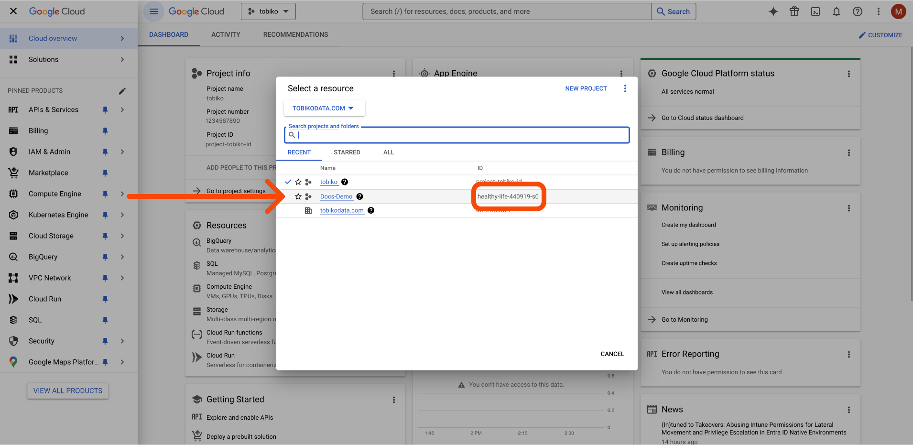

# BigQuery

## Introduction

This guide provides step-by-step instructions on how to use SQLMesh with the BigQuery SQL engine. It assumes you have an existing BigQuery project with CLI/API access enabled and billing configured. The guide will walk you through the steps of installing SQLMesh for BigQuery locally and connecting the Quickstart project tables.

## Prerequisites

- Existing BigQuery project
- [CLI/API access enabled](https://cloud.google.com/sdk/gcloud/reference/init)
- [Billing configured](https://console.cloud.google.com/billing) (i.e. its not a sandbox project)
- User account with permissions to execute commands against the project

## Installation

### Follow the Quickstart guide

Up to the installing the [sqlmesh core step](https://sqlmesh.readthedocs.io/en/stable/installation/#install-sqlmesh-core), this is where we will deviate slightly 

Instead of installing just SQLMesh core we will specify the BigQuery engine
```
pip install "sqlmesh[bigquery]"
```
### Install Google Cloud SDK 

Follow these steps to install the Google Cloud SDK to the new environment that you just made:

- Download the appropriate package for your system from [Google Cloud installation guide](https://cloud.google.com/sdk/docs/install)
- Unpack the downloaded file:
    
    ```bash
    tar -xzvf google-cloud-cli-darwin-{SYSTEM_SPECIFIC_INFO}.tar.gz
    ```
    
- Run the installation script:
    
    ```bash
    ./google-cloud-sdk/install.sh
    ```
    
- Reload your shell profile (e.g., for zsh):
```
source $HOME/.zshrc
```
## Configuration

### Configure SQLMesh for BigQuery

Add the following to your SQLMesh config.yaml file:

```yaml
bigquery:
  connection:
    type: bigquery
    project: <your_project_id> 

default_gateway: bigquery
```

In bigquery, navigate to the dashboard and select project your going to work with to get your project ID and copy that into the SQLMesh config.yaml


- Docs-Demo is the one we will use
    - the project ID for this example is: `healthy-life-440919-s0`



## Usage

### Test the connection

Run the following command to verify your BigQuery connection:

```bash
sqlmesh info
```

The output will look something like this 


- **Set quota project (optional)**
    
    If you get a bunch of warnings when you run `sqlmesh info` , something like the screen shot below: 
    
    
    
    You can avoid these warnings about quota projects, by running:
    
    ```bash
    gcloud auth application-default set-quota-project <your_project_id> 
    gcloud config set project <your_project_id>
    ```
    

### Create and run a plan

To create and execute a plan in BigQuery:

```bash
sqlmesh plan
```

### View results in BigQuery Console

Navigate to the BigQuery Studio Console


Use the left sidebar to find your project and the newly created models


## Local/Built-in Scheduler

**Engine Adapter Type**: `bigquery`

### Installation
```
pip install "sqlmesh[bigquery]"
```

### Connection options

| Option                          | Description                                                                                                                                                       |  Type  | Required |
|---------------------------------|-------------------------------------------------------------------------------------------------------------------------------------------------------------------|:------:|:--------:|
| `type`                          | Engine type name - must be `bigquery`                                                                                                                             | string |    Y     |
| `method`                        | Connection methods - see [allowed values below](#connection-methods). Default: `oauth`.                                                                           | string |    N     |
| `project`                       | The ID of the GCP project                                                                                                                                       | string |    N     |
| `location`                      | The location of for the datasets (can be regional or multi-regional)                                                                                              | string |    N     |
| `execution_project`             | The name of the GCP project to bill for the execution of the models. If not set, the project associated with the model will be used.                              | string |    N     |
| `quota_project`                 | The name of the GCP project used for the quota. If not set, the `quota_project_id` set within the credentials of the account is used to authenticate to BigQuery. | string |    N     |
| `keyfile`                       | Path to the keyfile to be used with service-account method                                                                                                        | string |    N     |
| `keyfile_json`                  | Keyfile information provided inline (not recommended)                                                                                                             |  dict  |    N     |
| `token`                         | OAuth 2.0 access token                                                                                                                                            | string |    N     |
| `refresh_token`                 | OAuth 2.0 refresh token                                                                                                                                           | string |    N     |
| `client_id`                     | OAuth 2.0 client ID                                                                                                                                               | string |    N     |
| `client_secret`                 | OAuth 2.0 client secret                                                                                                                                           | string |    N     |
| `token_uri`                     | OAuth 2.0 authorization server's toke endpoint URI                                                                                                                | string |    N     |
| `scopes`                        | The scopes used to obtain authorization                                                                                                                           |  list  |    N     |
| `job_creation_timeout_seconds`  | The maximum amount of time, in seconds, to wait for the underlying job to be created.                                                                             |  int   |    N     |
| `job_execution_timeout_seconds` | The maximum amount of time, in seconds, to wait for the underlying job to complete.                                                                               |  int   |    N     |
| `job_retries`                   | The number of times to retry the underlying job if it fails. (Default: `1`)                                                                                       |  int   |    N     |
| `priority`                      | The priority of the underlying job. (Default: `INTERACTIVE`)                                                                                                      | string |    N     |
| `maximum_bytes_billed`          | The maximum number of bytes to be billed for the underlying job.                                                                                                  |  int   |    N     |

## Airflow Scheduler
**Engine Name:** `bigquery`

In order to share a common implementation across local and Airflow, SQLMesh BigQuery implements its own hook and operator.

### Installation

To enable support for this operator, the Airflow BigQuery provider package should be installed on the target Airflow cluster along with SQLMesh with the BigQuery extra:
```
pip install "apache-airflow-providers-google"
pip install "sqlmesh[bigquery]"
```

### Connection info

The operator requires an [Airflow connection](https://airflow.apache.org/docs/apache-airflow/stable/howto/connection.html) to determine the target BigQuery account. Please see [GoogleBaseHook](https://airflow.apache.org/docs/apache-airflow-providers-google/stable/_api/airflow/providers/google/common/hooks/base_google/index.html#airflow.providers.google.common.hooks.base_google.GoogleBaseHook) and [GCP connection](https://airflow.apache.org/docs/apache-airflow-providers-google/stable/connections/gcp.html)for more details. Use the `sqlmesh_google_cloud_bigquery_default` (by default) connection ID instead of the `google_cloud_default` one in the Airflow guide.

By default, the connection ID is set to `sqlmesh_google_cloud_bigquery_default`, but it can be overridden using the `engine_operator_args` parameter to the `SQLMeshAirflow` instance as in the example below:
```python linenums="1"
sqlmesh_airflow = SQLMeshAirflow(
    "bigquery",
    default_catalog="<project id>",
    engine_operator_args={
        "bigquery_conn_id": "<Connection ID>"
    },
)
```

#### Optional Arguments

* `location`: Sets the default location for datasets and tables. If not set, BigQuery defaults to US for new datasets. See `location` in [Connection options](#connection-options) for more details.

```python linenums="1"
sqlmesh_airflow = SQLMeshAirflow(
    "bigquery",
    default_catalog="<project id>",
    engine_operator_args={
        "bigquery_conn_id": "<Connection ID>",
        "location": "<location>"
    },
)
```

## Connection Methods
- [oauth](https://google-auth.readthedocs.io/en/master/reference/google.auth.html#google.auth.default) (default)
    - Related Credential Configuration:
        - `scopes` (Optional)
- [oauth-secrets](https://google-auth.readthedocs.io/en/stable/reference/google.oauth2.credentials.html)
    - Related Credential Configuration:
        - `token` (Optional): Can be None if refresh information is provided.
        - `refresh_token` (Optional): If specified, credentials can be refreshed.
        - `client_id` (Optional): Must be specified for refresh, can be left as None if the token can not be refreshed.
        - `client_secret` (Optional): Must be specified for refresh, can be left as None if the token can not be refreshed.
        - `token_uri` (Optional): Must be specified for refresh, can be left as None if the token can not be refreshed.
        - `scopes` (Optional): OAuth 2.0 credentials can not request additional scopes after authorization. The scopes must be derivable from the refresh token if refresh information is provided (e.g. The refresh token scopes are a superset of this or contain a wild card scope like 'https://www.googleapis.com/auth/any-api')
- [service-account](https://google-auth.readthedocs.io/en/master/reference/google.oauth2.service_account.html#google.oauth2.service_account.IDTokenCredentials.from_service_account_file)
    - Related Credential Configuration:
        - `keyfile` (Required)
        - `scopes` (Optional)
- [service-account-json](https://google-auth.readthedocs.io/en/master/reference/google.oauth2.service_account.html#google.oauth2.service_account.IDTokenCredentials.from_service_account_info)
    - Related Credential Configuration:
        - `keyfile_json` (Required)
        - `scopes` (Optional)

## Permissions Required
With any of the above connection methods, ensure these BigQuery permissions are enabled to allow SQLMesh to work correctly.

- [`BigQuery Data Editor`](https://cloud.google.com/bigquery/docs/access-control#bigquery.dataEditor)
- [`BigQuery User`](https://cloud.google.com/bigquery/docs/access-control#bigquery.user)
