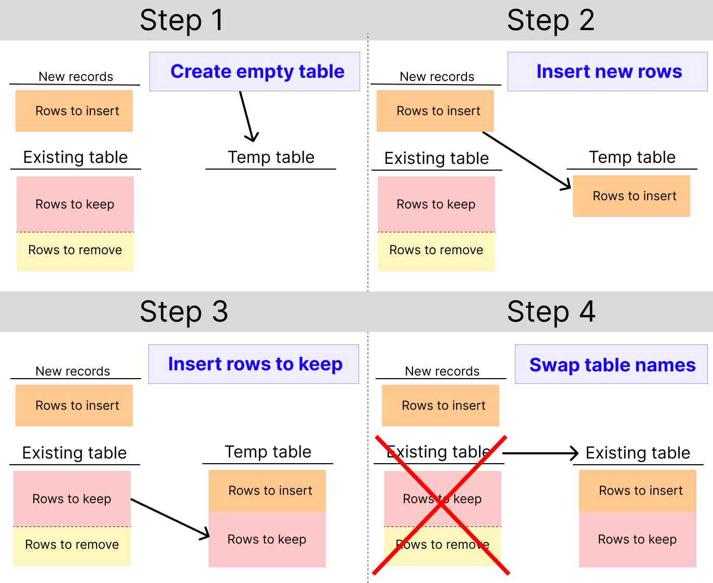

# Clickhouse

This page describes SQLMesh support for the Clickhouse engine, including configuration options specific to Clickhouse.

!!! note
    Clickhouse may not be used for the SQLMesh [state connection](../../reference/configuration.md#connections).

## Background

[Clickhouse](https://clickhouse.com/) is a distributed, column-oriented SQL engine designed to rapidly execute analytical workloads.

It provides users fine-grained control of its behavior, but that control comes at the cost of complex configuration.

This section provides background information about Clickhouse, providing context for how to use SQLMesh with the Clickhouse engine.

### Object naming

Most SQL engines use a three-level hierarchical naming scheme: tables/views are nested within _schemas_, and schemas are nested within _catalogs_. For example, the full name of a table might be `my_catalog.my_schema.my_table`.

Clickhouse instead uses a two-level hierarchical naming scheme that has no counterpart to _catalog_. In addition, it calls the second level in the hierarchy "databases." SQLMesh and its documentation refer to this second level as "schemas."

SQLMesh fully supports Clickhouse's two-level naming scheme without user action.

### Table engines

Every Clickhouse table is created with a ["table engine" that controls how the table's data is stored and queried](https://clickhouse.com/docs/en/engines/table-engines). Clickhouse's (and SQLMesh's) default table engine is `MergeTree`.

The [`MergeTree` engine family](https://clickhouse.com/docs/en/engines/table-engines/mergetree-family/mergetree) requires that every table be created with an `ORDER BY` clause.

SQLMesh will automatically inject an empty `ORDER BY` clause into every `MergeTree` family table's `CREATE` statement, or you can specify the columns/expressions by which the table should be ordered.

### Clickhouse modes of operation

Conceptually, it may be helpful to view Clickhouse as having three modes of operation: single server, cluster, and Clickhouse Cloud. SQLMesh supports all three modes.

#### Single server mode

Single server mode is similar to other SQL engines: aside from choosing each table's engine, you do not need to worry about how computations are executed. You issue standard SQL commands/queries, and Clickhouse executes them.

#### Cluster mode

Cluster mode allows you to scale your Clickhouse engine to any number of networked servers. This enables massive workloads, but requires that you specify how computations are executed by the networked servers.

Clickhouse coordinates the computations on the networked servers with [Clickhouse Keeper](https://clickhouse.com/docs/en/architecture/horizontal-scaling) (it also supports [Apache ZooKeeper](https://zookeeper.apache.org/)).

You specify named virtual clusters of servers in the Keeper configuration, and those clusters provide namespaces for data objects and computations. For example, you might include all networked servers in the cluster you name `MyCluster`.

In general, you must be connected to a Clickhouse server to execute commands. By default, each command you execute runs in single-server mode on the server you are connected to.

To associate an object with a cluster, DDL commands that create or modify it must include the text `ON CLUSTER [your cluster name]`.

If you provide a cluster name in your SQLMesh connection configuration, SQLMesh will automatically inject the `ON CLUSTER` statement into the DDL commands for all objects created while executing the project. We provide more information about clusters in SQLMesh [below](#cluster-specification).

#### Clickhouse Cloud mode

[Clickhouse Cloud](https://clickhouse.com/cloud) is a managed Clickhouse platform. It allows you to scale Clickhouse without administering a cluster yourself or modifying your SQL commands to run on the cluster.

Clickhouse Cloud automates Clickhouse's cluster controls, which sometimes constrains Clickhouse's flexibility or how you execute SQL commands. For example, creating a table with a `SELECT` command must [occur in two steps on Clickhouse Cloud](https://clickhouse.com/docs/en/sql-reference/statements/create/table#from-select-query). SQLMesh handles this limitation for you.

Aside from those constraints, Clickhouse Cloud mode is similar to single server mode - you run standard SQL commands/queries, and Clickhouse Cloud executes them.

## Cluster specification

A Clickhouse cluster allows multiple networked Clickhouse servers to operate on the same data object. Every cluster must be named in the Clickhouse configuration files, and that name is passed to a table's DDL statements in the `ON CLUSTER` clause.

For example, we could create a table `my_schema.my_table` on cluster `TheCluster` like this: `CREATE TABLE my_schema.my_table ON CLUSTER TheCluster (col1 Int8)`.

To create SQLMesh objects on a cluster, provide the cluster name to the `cluster` key in the SQLMesh connection definition (see all connection parameters [below](#localbuilt-in-scheduler)).

SQLMesh will automatically inject the `ON CLUSTER` clause and cluster name you provide into all project DDL statements.

## Model definition

This section describes how you control a table's engine and other Clickhouse-specific functionality in SQLMesh models.

### Table engine

SQLMesh uses the `MergeTree` table engine with an empty `ORDER BY` clause by default.

Specify a different table engine by passing the table engine definition to the model DDL's `storage_format` parameter. For example, you could specify the `Log` table engine like this:

``` sql linenums="1" hl_lines="4"
MODEL (
    name my_schema.my_log_table,
    kind full,
    storage_format Log,
);

select
    *
from other_schema.other_table;
```

You may also specify more complex table engine definitions. For example:

``` sql linenums="1" hl_lines="4"
MODEL (
    name my_schema.my_rep_table,
    kind full,
    storage_format ReplicatedMergeTree('/clickhouse/tables/{shard}/table_name', '{replica}', ver),
);

select
    *
from other_schema.other_table;
```

#### ORDER BY

`MergeTree` family engines require that a table's `CREATE` statement include the `ORDER BY` clause.

SQLMesh will automatically inject an empty `ORDER BY ()` when creating a table with an engine in the `MergeTree` family. This creates the table without any ordering.

You may specify columns/expressions to `ORDER BY` by passing them to the model `physical_properties` dictionary's `order_by` key.

For example, you could order by columns `col1` and `col2` like this:

``` sql linenums="1" hl_lines="4-6"
MODEL (
    name my_schema.my_log_table,
    kind full,
    physical_properties (
        order_by = (col1, col2)
    )
);

select
    *
from other_schema.other_table;
```

Note that there is an `=` between the `order_by` key name and value `(col1, col2)`.

Complex `ORDER BY` expressions may need to be passed in single quotes, with interior single quotes escaped by the `\` character.

#### PRIMARY KEY

Table engines may also accept a `PRIMARY KEY` specification. Similar to `ORDER BY`, specify a primary key in the model DDL's `physical_properties` dictionary. For example:

``` sql linenums="1" hl_lines="6"
MODEL (
    name my_schema.my_log_table,
    kind full,
    physical_properties (
        order_by = (col1, col2),
        primary_key = col1
    )
);

select
    *
from other_schema.other_table;
```

Note that there is an `=` between the `primary_key` key name and value `col1`.

### TTL

Clickhouse tables accept a [TTL expression that triggers actions](https://clickhouse.com/docs/en/guides/developer/ttl) like deleting rows after a certain amount of time has passed.

Similar to `ORDER_BY` and `PRIMARY_KEY`, specify a TTL key in the model DDL's `physical_properties` dictionary. For example:

``` sql linenums="1" hl_lines="6"
MODEL (
    name my_schema.my_log_table,
    kind full,
    physical_properties (
        order_by = (col1, col2),
        primary_key = col1,
        ttl = timestamp + INTERVAL 1 WEEK
    )
);

select
    *
from other_schema.other_table;
```

Note that there is an `=` between the `ttl` key name and value `timestamp + INTERVAL 1 WEEK`.

### Partitioning

Some Clickhouse table engines support partitioning. Specify the partitioning columns/expressions in the model DDL's `partitioned_by` key.

For example, you could partition by columns `col1` and `col2` like this:

``` sql linenums="1" hl_lines="4"
MODEL (
    name my_schema.my_log_table,
    kind full,
    partitioned_by (col1, col2),
);

select
    *
from other_schema.other_table;
```

Learn more below about how SQLMesh uses [partitioned tables to improve performance](#performance-considerations).

## Settings

Clickhouse supports an [immense number of settings](https://clickhouse.com/docs/en/operations/settings), many of which can be altered in multiple places: Clickhouse configuration files, Python client connection arguments, DDL statements, SQL queries, and others.

This section discusses how to control Clickhouse settings in SQLMesh.

### Connection settings

SQLMesh connects to Python with the [`clickhouse-connect` library](https://clickhouse.com/docs/en/integrations/python). Its connection method accepts a dictionary of arbitrary settings that are passed to Clickhouse.

Specify these settings in the `connection_settings` key. This example demonstrates how to set the `distributed_ddl_task_timeout` setting to `300`:

``` yaml linenums="1" hl_lines="8-9"
clickhouse_gateway:
  connection:
    type: clickhouse
    host: localhost
    port: 8123
    username: user
    password: pw
    connection_settings:
      distributed_ddl_task_timeout: 300
  state_connection:
    type: duckdb
```

### DDL settings

Clickhouse settings may also be specified in DDL commands like `CREATE`.

Specify these settings in a model DDL's [`physical_properties` key](https://sqlmesh.readthedocs.io/en/stable/concepts/models/overview/?h=physical#physical_properties) (where the [`order_by`](#order-by) and [`primary_key`](#primary-key) values are specified, if present).

This example demonstrates how to set the `index_granularity` setting to `128`:

``` sql linenums="1" hl_lines="4-6"
MODEL (
    name my_schema.my_log_table,
    kind full,
    physical_properties (
        index_granularity = 128
    )
);

select
    *
from other_schema.other_table;
```

Note that there is an `=` between the `index_granularity` key name and value `128`.

### Query settings

Clickhouse settings may be specified directly in a model's query with the `SETTINGS` keyword.

This example demonstrates setting the `join_use_nulls` setting to `1`:

``` sql linenums="1" hl_lines="9"
MODEL (
    name my_schema.my_log_table,
    kind full,
);

select
    *
from other_schema.other_table
SETTINGS join_use_nulls = 1;
```

Multiple settings may be specified in a query with repeated use of the `SETTINGS` keyword: `SELECT * FROM other_table SETTINGS first_setting = 1 SETTINGS second_setting = 2;`.

#### Usage by SQLMesh

The Clickhouse setting `join_use_nulls` affects the behavior of SQLMesh SCD models and table diffs. This section describes how SQLMesh uses query settings to control that behavior.

^^Background^^

In general, table `JOIN`s can return empty cells for rows not present in both tables.

For example, consider `LEFT JOIN`ing two tables `left` and `right`, where the column `right_column` is only present in the `right` table. Any rows only present in the `left` table will have no value for `right_column` in the joined table.

In other SQL engines, those empty cells are filled with `NULL`s.

In contrast, Clickhouse fills the empty cells with data type-specific default values (e.g., 0 for integer column types). It will instead fill the cells with `NULL`s if you set the `join_use_nulls` setting to `1`.

^^SQLMesh^^

SQLMesh automatically generates SQL queries for both SCD Type 2 models and table diff comparisons. These queries include table `JOIN`s and calculations based on the presence of `NULL` values.

Because those queries expect `NULL` values in empty cells, SQLMesh automatically adds `SETTINGS join_use_nulls = 1` to the generated SCD and table diff SQL code.

The SCD model definition query is embedded as a CTE in the full SQLMesh-generated query. If run alone, the model definition query would use the Clickhouse server's current `join_use_nulls` value.

If that value is not `1`, the SQLMesh setting on the outer query would override the server value and produce incorrect results.

Therefore, SQLMesh uses the following procedure to ensure the model definition query runs with the correct `join_use_nulls` value:

- If the model query sets `join_use_nulls` itself, do nothing
- If the model query does not set `join_use_nulls` and the current server `join_use_nulls` value is `1`, do nothing
- If the model query does not set `join_use_nulls` and the current server `join_use_nulls` value is `0`, add `SETTINGS join_use_nulls = 0` to the CTE model query
    - All other CTEs and the outer query will still execute with a `join_use_nulls` value of `1`

## Performance considerations

Clickhouse is optimized for writing/reading records, so deleting/replacing records can be extremely slow.

This section describes why SQLMesh needs to delete/replace records and how the Clickhouse engine adapter works around the limitations.

### Why delete or replace?

SQLMesh "materializes" model kinds in a number of ways, such as:

- Replacing an entire table ([`FULL` models](../../concepts/models/model_kinds.md#full))
- Replacing records in a specific time range ([`INCREMENTAL_BY_TIME_RANGE` models](../../concepts/models/model_kinds.md#incremental_by_time_range))
- Replacing records with specific key values ([`INCREMENTAL_BY_UNIQUE_KEY` models](../../concepts/models/model_kinds.md#incremental_by_unique_key))
- Replacing records in specific partitions ([`INCREMENTAL_BY_PARTITION` models](../../concepts/models/model_kinds.md#incremental_by_partition))

Different SQL engines provide different methods for performing record replacement.

Some engines natively support updating or inserting ("upserting") records. For example, in some engines you can `merge` a new table into an existing table based on a key. Records in the new table whose keys are already in the existing table will update/replace the existing records. Records in the new table without keys in the existing table will be inserted into the existing table.

Other engines do not natively support upserts, so SQLMesh replaces records in two steps: delete the records to update/replace from the existing table, then insert the new records.

Clickhouse does not support upserts, and it performs the two step delete/insert operation so slowly as to be unusable. Therefore, SQLMesh uses a different method for replacing records.

### Temp table swap

SQLMesh uses what we call the "temp table swap" method of replacing records in Clickhouse.

Because Clickhouse is optimized for writing and reading records, it is often faster to copy most of a table than to delete a small portion of its records. That is the approach used by the temp table swap method (with optional performance improvements [for partitioned tables](#partition-swap)).

The temp table swap has four steps:

1. Make an empty temp copy of the existing table that has the same structure (columns, data types, table engine, etc.)
2. Insert new records into the temp table
3. Insert the existing records that should be **kept** into the temp table
4. Swap the table names, such that the temp table now has the existing table's name

Figure 1 illustrates these four steps:
<br></br>

{ loading=lazy }
_Figure 1: steps to execute a temp table swap_
<br></br>

The weakness of this method is that it requires copying all existing rows to keep (step three), which can be problematic for large tables.

To address this weakness, SQLMesh instead uses *partition* swapping if a table is partitioned.

### Partition swap

Clickhouse supports *partitioned* tables, which store groups of records in separate files, or "partitions."

A table is partitioned based on a table column or SQL expression - the "partitioning key." All records with the same value for the partitioning key are stored together in a partition.

For example, consider a table containing each record's creation date in a datetime column. If we partition the table by month, all the records whose timestamp was in January will be stored in one partition, records from February in another partition, and so on.

Table partitioning provides a major benefit for improving swap performance: records can be inserted, updated, or deleted in individual partitions.

SQLMesh leverages this to avoid copying large numbers of existing records into a temp table. Instead, it only copies the records that are in partitions affected by a load's newly ingested records.

SQLMesh automatically uses partition swapping for any incremental model that specifies the [`partitioned_by`](../../concepts/models/overview.md#partitioned_by) key.

#### Choosing a partitioning key

The first step of partitioning a table is choosing its partitioning key (columns or expression). The primary consideration for a key is the total number of partitions it will generate, which affects table performance.

Too many partitions can drastically decrease performance because the overhead of handling partition files swamps the benefits of copying fewer records. Too few partitions decreases swap performance because many existing records must still be copied in each incremental load.

!!! question "How many partitions is too many?"

    Clickhouse's documentation [specifically warns against tables having too many partitions](https://clickhouse.com/docs/en/engines/table-engines/mergetree-family/custom-partitioning-key), suggesting a maximum of 1000.

The total number of partitions in a table is determined by the actual data in the table, not by the partition column/expression alone.

For example, consider a table partitioned by date. If we insert records created on `2024-10-23`, the table will have one partition. If we then insert records from `2024-10-24`, the table will have two partitions. One partition is created for each unique value of the key.

For each partitioned table in your project, carefully consider the number of partitions created by the combination of your partitioning expression and the characteristics of your data.

#### Incremental by time models

`INCREMENTAL_BY_TIME_RANGE` kind models must be partitioned by time. If the model's `time_column` is not present in any `partitioned_by` expression, SQLMesh will automatically add it as the first partitioning expression.

By default, `INCREMENTAL_BY_TIME_RANGE` models partition by week, so the maximum recommended 1000 partitions corresponds to about 19 years of data. SQLMesh projects have widely varying time ranges and data sizes, so you should choose a model's partitioning key based on the data your system will process.

If a model has many records in each partition, you may see additional performance benefits by including the time column in the model's [`ORDER_BY` expression](#order-by).

!!! info "Partitioning by time"
    `INCREMENTAL_BY_TIME_RANGE` models must be partitioned by time.

    SQLMesh will automatically partition them by **week** unless the `partitioned_by` configuration key includes the time column or an expression based on it.

    Choose a model's time partitioning granularity based on the characteristics of the data it will process, making sure the total number of partitions is 1000 or fewer.

## Local/Built-in Scheduler
**Engine Adapter Type**: `clickhouse`

### Connection options

| Option               | Description                                                                                                                                                               |  Type  | Required |
|----------------------|---------------------------------------------------------------------------------------------------------------------------------------------------------------------------|:------:|:--------:|
| `type`               | Engine type name - must be `clickhouse`                                                                                                                                        | string |    Y     |
| `user`               | The username to log in to your server. | string |    Y     |
| `host`               | The hostname of your server. Do not include the `http://` or `https://` prefix.                                                                                           | string |    Y     |
| `port`               | The port to connect to your server. Default: 8123 for non-encrypted connections, 8443 for encrypted connections and Clickhouse Cloud.                                                                        |  int   |    Y     |
| `cluster`              | Name of the Clickhouse cluster on which SQLMesh should create objects. Should not be specified for standalone Clickhouse servers or Clickhouse Cloud.                                                                                                                                        |  string  |    N     |
| `use_compression`              | Enable compression for ClickHouse HTTP inserts and query results. Default: True                                                                                                                                        |  bool  |    N     |
| `compression_method`              | Use a specific compression method for inserts and query results - allowed values `lz4`, `zstd`, `br`, or `gzip`.                                                                                                                                        |  str  |    N     |
| `query_limit`              | Maximum number of rows to return for any query response. Default: 0 (unlimited rows)                                                                                                                                        |  int  |    N     |
| `connect_timeout`              | HTTP connection timeout in seconds. Default: 10                                                                                                                                        |  int  |    N     |
| `send_receive_timeout`              | Send/receive timeout for the HTTP connection in seconds. Default: 300                                                                                                                                        |  int  |    N     |
| `verify`              | Validate the ClickHouse server TLS/SSL certificate (hostname, expiration, etc.) if using HTTPS/TLS. Default: True                                                                                                                        |  bool  |    N     |
| `connection_settings`              | Arbitrary Clickhouse settings passed to the [`clickhouse-connect` client](https://clickhouse.com/docs/en/integrations/python#client-initialization).                                                                                                                        |  dict[str, any]  |    N     |