# Databricks

This page provides information about how to use SQLMesh with the Databricks SQL engine. It begins with a description of the three methods for connecting SQLMesh to Databricks.

After that is a [Connection Quickstart](#connection-quickstart) that demonstrates how to connect to Databricks, or you can skip directly to information about using Databricks with the [built-in](#localbuilt-in-scheduler) or [airflow](#airflow-scheduler) schedulers.

## Databricks connection methods

Databricks provides multiple computing options and connection methods. This section describes the three methods for connecting with SQLMesh.

### Databricks SQL Connector

SQLMesh connects to Databricks with the [Databricks SQL Connector](https://docs.databricks.com/dev-tools/python-sql-connector.html) library by default.

The SQL Connector is bundled with SQLMesh and automatically installed when you include the `databricks` extra in the command `pip install "sqlmesh[databricks]"`.

The SQL Connector has all the functionality needed for SQLMesh to execute SQL models on Databricks and Python models locally (the default SQLMesh approach).

The SQL Connector does not support Databricks Serverless Compute. If you require Serverless Compute then you must use the Databricks Connect library.

### Databricks Connect

If you want Databricks to process PySpark DataFrames in SQLMesh Python models, then SQLMesh must use the [Databricks Connect](https://docs.databricks.com/dev-tools/databricks-connect.html) library to connect to Databricks (instead of the Databricks SQL Connector library).

SQLMesh **DOES NOT** include/bundle the Databricks Connect library. You must [install the version of Databricks Connect](https://docs.databricks.com/en/dev-tools/databricks-connect/python/install.html) that matches the Databricks Runtime used in your Databricks cluster.

Find [more configuration details below](#databricks-connect-1).

### Databricks notebook interface

If you are always running SQLMesh commands directly in a Databricks Cluster interface (like in a Databricks Notebook using the [notebook magic commands](../../reference/notebook.md)), the SparkSession provided by Databricks is used to execute all SQLMesh commands.

Find [more configuration details below](#databricks-notebook-interface-1).

## Connection quickstart

Connecting to cloud warehouses involves a few steps, so this connection quickstart provides the info you need to get up and running with Databricks.

It demonstrates connecting to a Databricks [All-Purpose Compute](https://docs.databricks.com/en/compute/index.html) instance with the `databricks-sql-connector` Python library bundled with SQLMesh.

!!! tip
    This quickstart assumes you are familiar with basic SQLMesh commands and functionality.

    If you're not, work through the [SQLMesh Quickstart](../../quick_start.md) before continuing!

### Prerequisites

Before working through this connection quickstart, ensure that:

1. You have a Databricks account with access to an appropriate Databricks Workspace
    - The Workspace must support authenticating with [personal access tokens](https://docs.databricks.com/en/dev-tools/auth/pat.html) (Databricks [Community Edition workspaces do not](https://docs.databricks.com/en/admin/access-control/tokens.html))
    - Your account must have Workspace Access and Create Compute permissions (these permissions are enabled by default)
2. Your computer has [SQLMesh installed](../../installation.md) with the [Databricks extra available](../../installation.md#install-extras)
    - Install from the command line with the command `pip install "sqlmesh[databricks]"`
3. You have initialized a [SQLMesh example project](../../quickstart/cli#1-create-the-sqlmesh-project) on your computer
    - Open a command line interface and navigate to the directory where the project files should go
    - Initialize the project with the command `sqlmesh init duckdb`

### Get connection info

The first step to configuring a Databricks connection is gathering the necessary information from your Databricks compute instance.

#### Create Compute

We must have something to connect to, so we first create and activate a Databricks compute instance. If you already have one running, skip to the [next section](#get-jdbcodbc-info).

We begin in the default view for our Databricks Workspace. Access the Compute view by clicking the `Compute` entry in the left-hand menu:

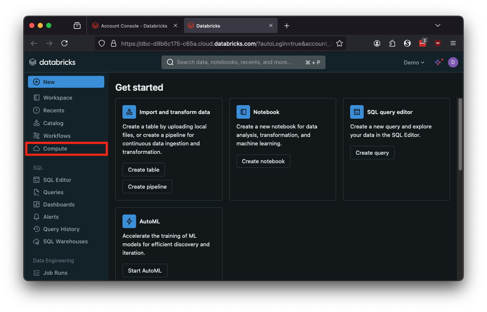{ loading=lazy }

In the Compute view, click the `Create compute` button:

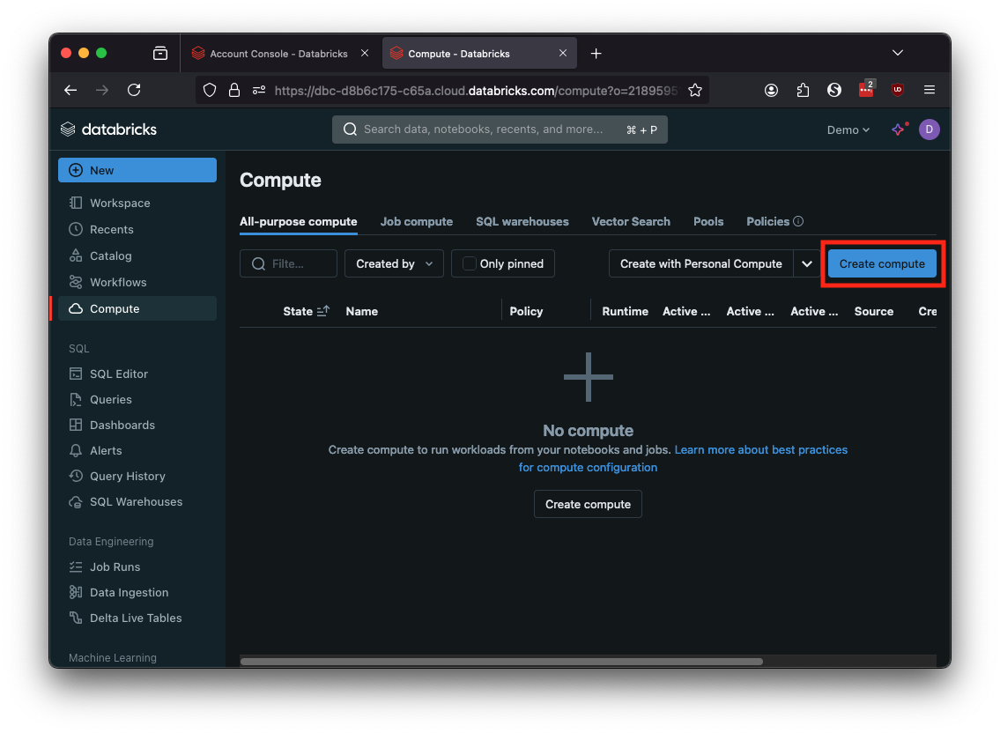{ loading=lazy }

Modify compute cluster options if desired and click the `Create compute` button:

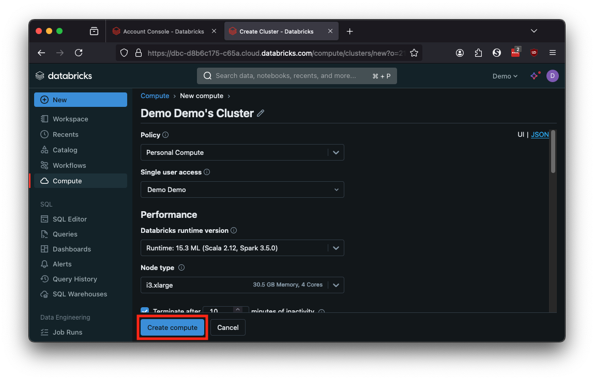{ loading=lazy }

#### Get JDBC/ODBC info

Scroll to the bottom of the view and click the open the `Advanced Options` view:

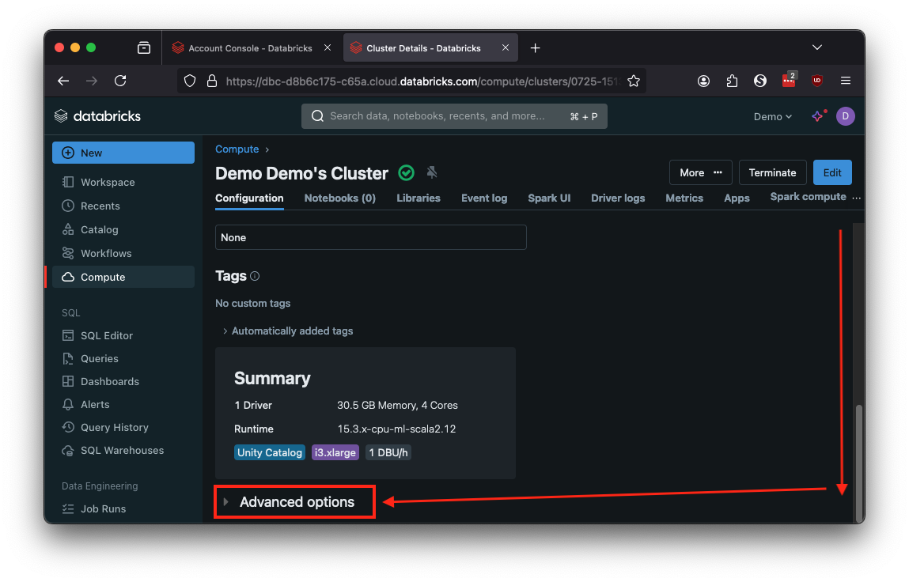{ loading=lazy }

Click the `JDBC/ODBC` tab:

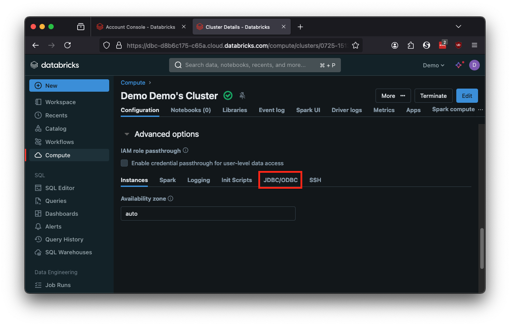{ loading=lazy }

Open your project's `config.yaml` configuration file in a text editor and add a new gateway named `databricks` below the existing `local` gateway:

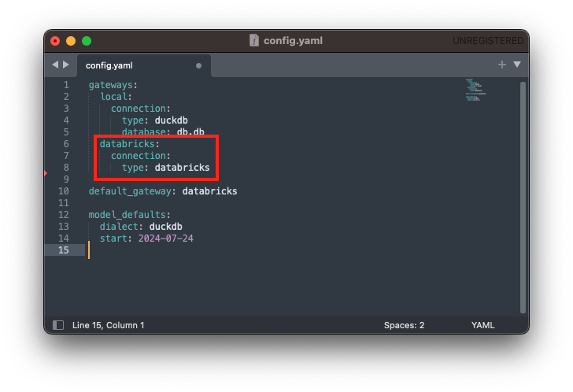{ loading=lazy }

Copy the `server_hostname` and `http_path` connection values from the Databricks JDBC/ODBC tab to the `config.yaml` file:

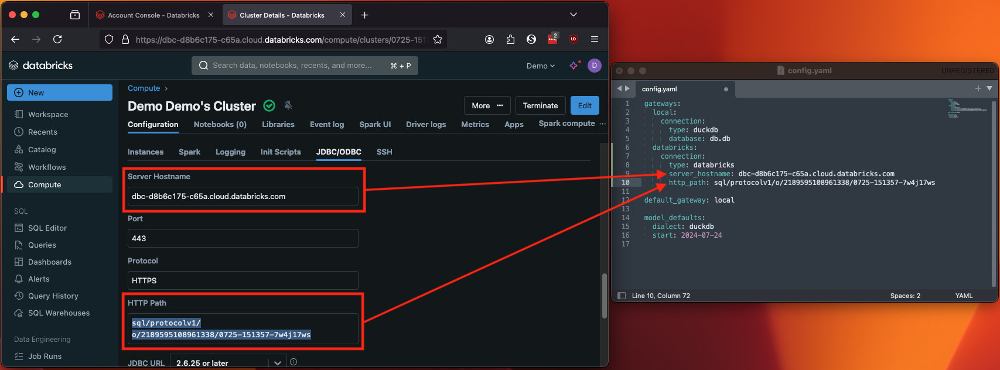{ loading=lazy }

#### Get personal access token

The final piece of information we need for the `config.yaml` file is your personal access token.

!!! warning
    **Do not share your personal access token with anyone.**

    Best practice for storing secrets like access tokens is placing them in [environment variables that the configuration file loads dynamically](../../guides/configuration.md#environment-variables). For simplicity, this guide instead places the value directly in the configuration file.

    This code demonstrates how to use the environment variable `DATABRICKS_ACCESS_TOKEN` for the configuration's `access_token` parameter:

    ```yaml linenums="1"
    gateways:
      databricks:
          connection:
            type: databricks
            access_token: {{ env_var('DATABRICKS_ACCESS_TOKEN') }}
    ```

<br></br>
To create a personal access token, click on your profile logo and go to your profile's `Settings` page:

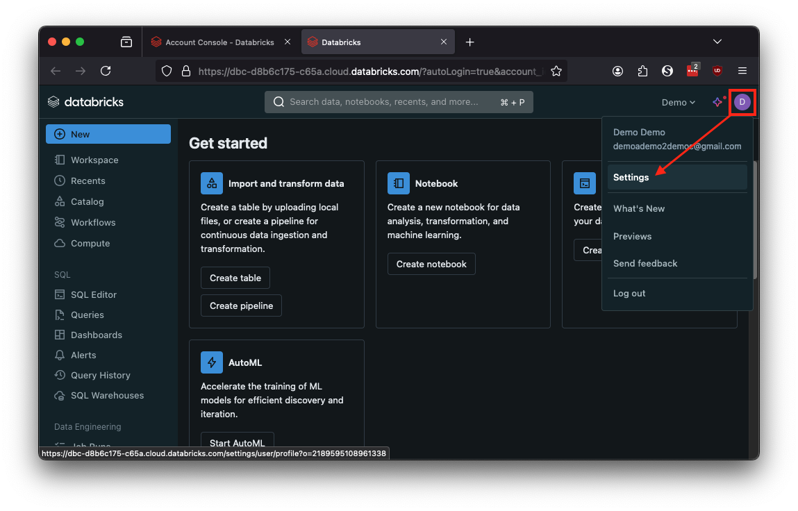{ loading=lazy }

Go to the `Developer` view in the User menu. Depending on your account's role, your page may not display the Workspace Admin section of the page.

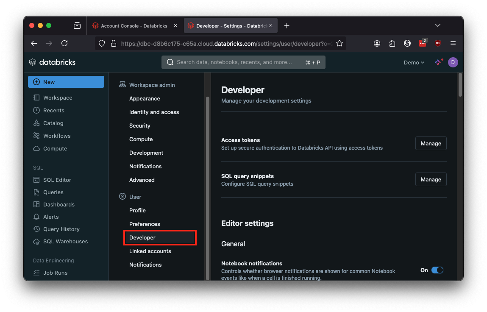{ loading=lazy }

Click the `Manage` button in the Access Tokens section:

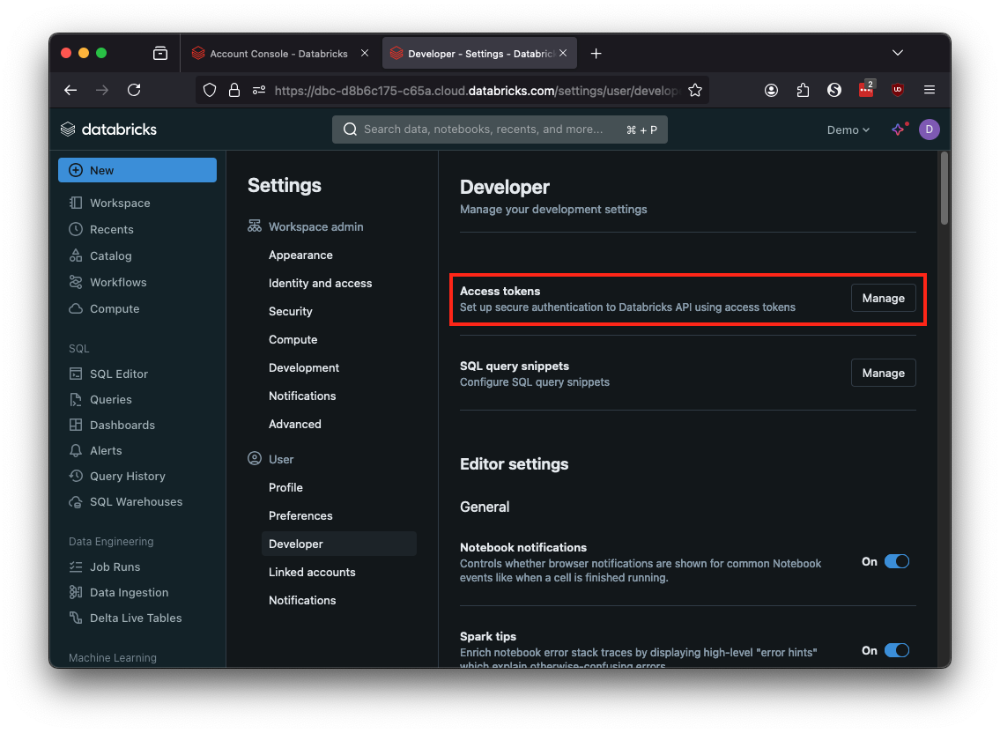{ loading=lazy }

Click the `Generate new token` button:

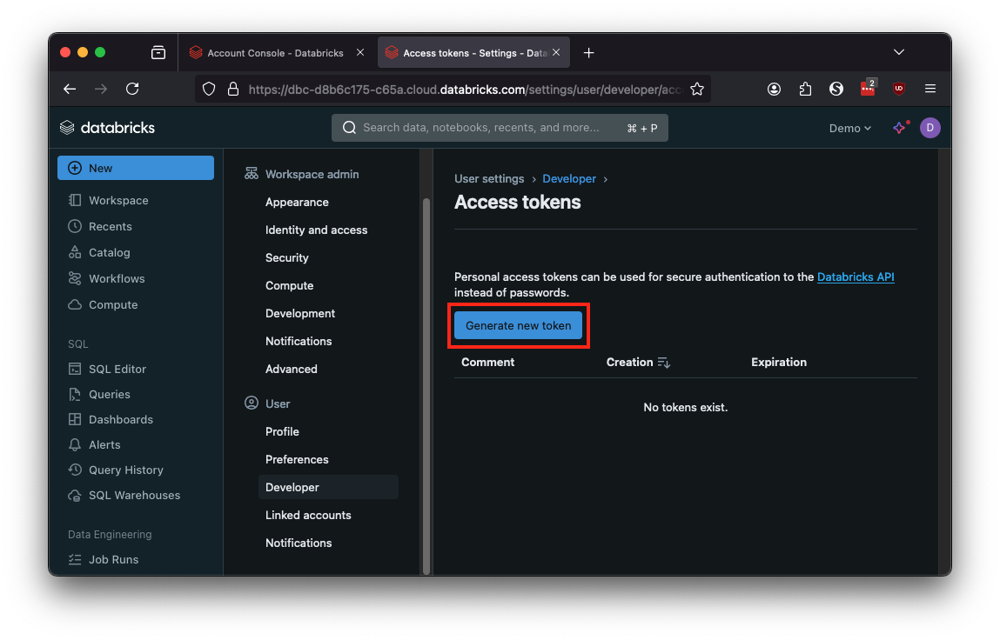{ loading=lazy }

Name your token in the `Comment` field, and click the `Generate` button:

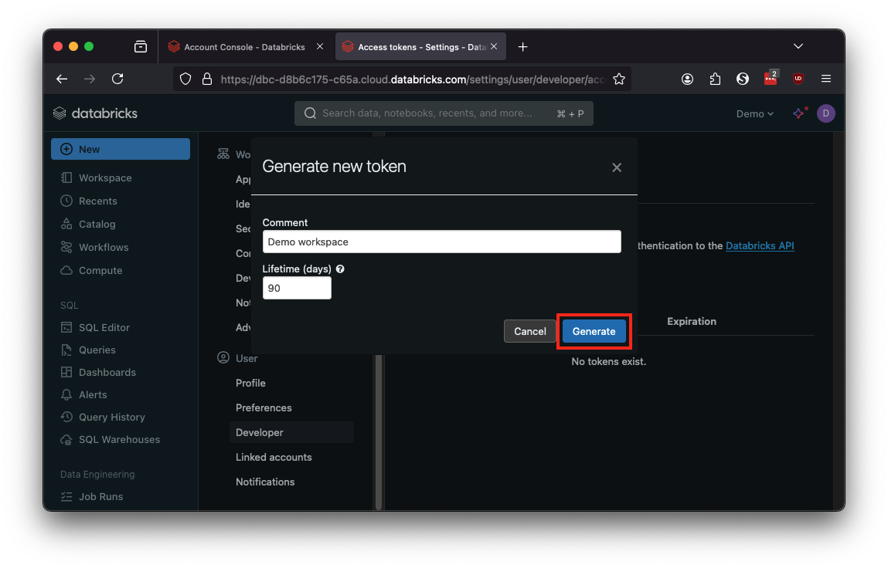{ loading=lazy }

Click the copy button and paste the token into the `access_token` key:

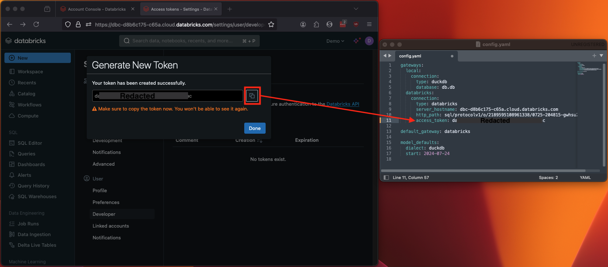{ loading=lazy }

!!! warning
    **Do not share your personal access token with anyone.**

    Best practice for storing secrets like access tokens is placing them in [environment variables that the configuration file loads dynamically](../../guides/configuration.md#environment-variables). For simplicity, this guide instead places the value directly in the configuration file.

    This code demonstrates how to use the environment variable `DATABRICKS_ACCESS_TOKEN` for the configuration's `access_token` parameter:

    ```yaml linenums="1"
    gateways:
      databricks:
          connection:
            type: databricks
            access_token: {{ env_var('DATABRICKS_ACCESS_TOKEN') }}
    ```

### Check connection

We have now specified the `databricks` gateway connection information, so we can confirm that SQLMesh is able to successfully connect to Databricks. We will test the connection with the `sqlmesh info` command.

First, open a command line terminal. Now enter the command `sqlmesh --gateway databricks info`.

We manually specify the `databricks` gateway because it is not our project's default gateway:

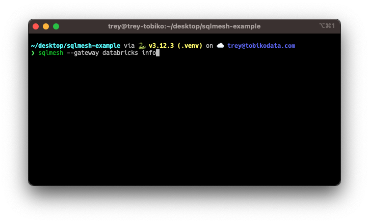{ loading=lazy }

The output shows that our data warehouse connection succeeded:

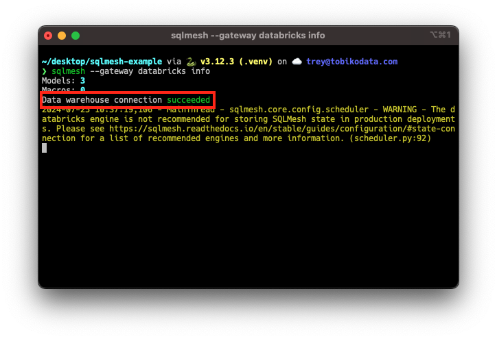{ loading=lazy }

However, the output includes a `WARNING` about using the Databricks SQL engine for storing SQLMesh state:

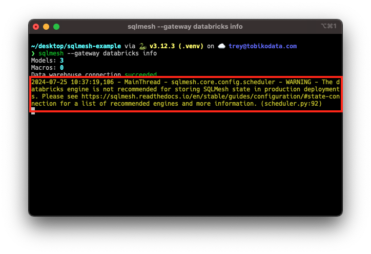{ loading=lazy }

!!! warning
    Databricks is not designed for transactional workloads and should not be used to store SQLMesh state even in testing deployments.

    Learn more about storing SQLMesh state [here](../../guides/configuration.md#state-connection).

### Specify state connection

We can store SQLMesh state in a different SQL engine by specifying a `state_connection` in our `databricks` gateway.

This example uses the DuckDB engine to store state in the local `databricks_state.db` file:

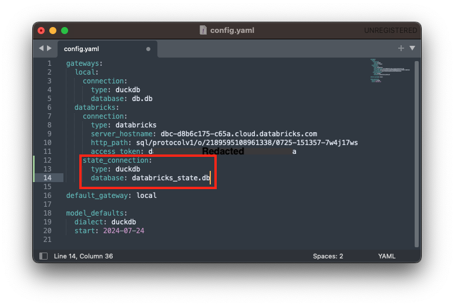{ loading=lazy }

Now we no longer see the warning when running `sqlmesh --gateway databricks info`, and we see a new entry `State backend connection succeeded`:

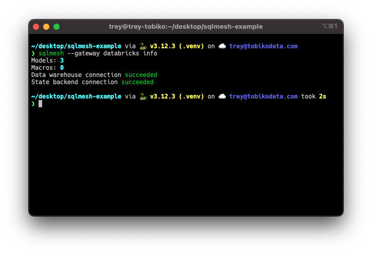{ loading=lazy }

### Run a `sqlmesh plan`

For convenience, we can omit the `--gateway` option from our CLI commands by specifying `databricks` as our project's `default_gateway`:

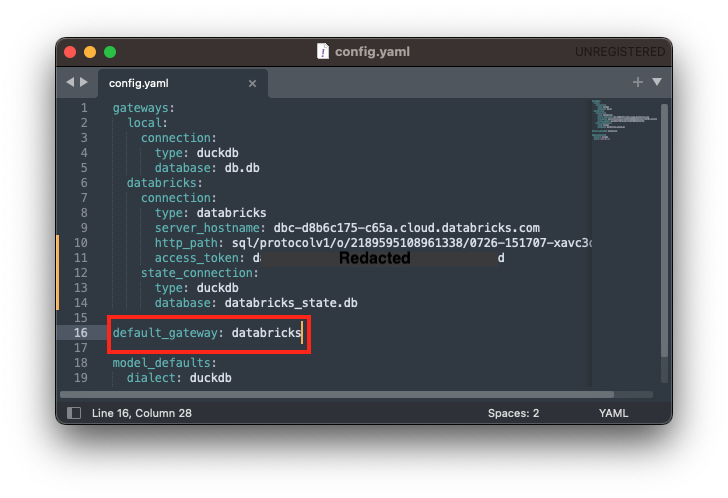{ loading=lazy }

And run a `sqlmesh plan` in Databricks:

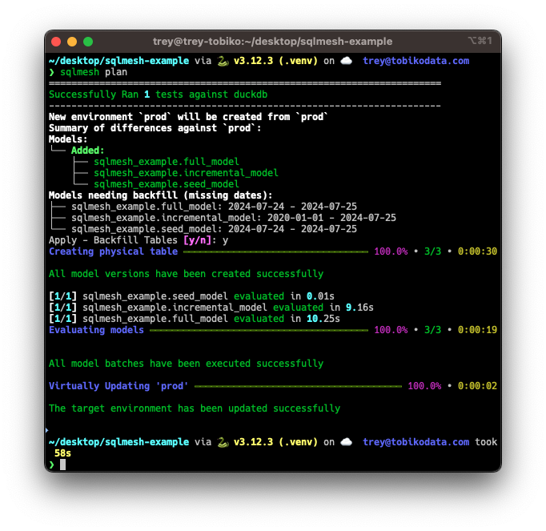{ loading=lazy }

And confirm that our schemas and objects exist in the Databricks catalog:

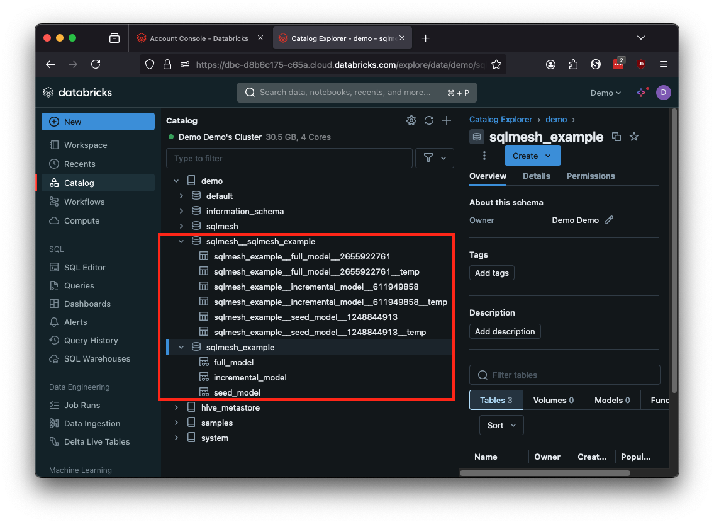{ loading=lazy }

Congratulations - your SQLMesh project is up and running on Databricks!

!!! tip
    SQLMesh connects to your Databricks Cluster's default catalog by default. Connect to a different catalog by specifying its name in the connection configuration's [`catalog` parameter](#connection-options).

## Local/Built-in Scheduler
**Engine Adapter Type**: `databricks`

### Installation
```
pip install "sqlmesh[databricks]"
```

### Connection method details

Databricks provides multiple computing options and connection methods. The [section above](#databricks-connection-methods) explains how to use them with SQLMesh, and this section provides additional configuration details.

#### Databricks SQL Connector

SQLMesh uses the [Databricks SQL Connector](https://docs.databricks.com/dev-tools/python-sql-connector.html) to connect to Databricks by default. Learn [more above](#databricks-sql-connector).

#### Databricks Connect

If you want Databricks to process PySpark DataFrames in SQLMesh Python models, then SQLMesh needs to use the [Databricks Connect](https://docs.databricks.com/dev-tools/databricks-connect.html) to connect to Databricks (instead of the Databricks SQL Connector).

SQLMesh **DOES NOT** include/bundle the Databricks Connect library. You must [install the version of Databricks Connect](https://docs.databricks.com/en/dev-tools/databricks-connect/python/install.html) that matches the Databricks Runtime used in your Databricks cluster.

SQLMesh's Databricks Connect implementation supports Databricks Runtime 13.0 or higher. If SQLMesh detects that you have Databricks Connect installed, then it will use it for all Python models (both Pandas and PySpark DataFrames).

Databricks Connect can execute SQL and DataFrame operations on different clusters by setting the SQLMesh `databricks_connect_*` connection options. For example, these options could configure SQLMesh to run SQL on a [Databricks SQL Warehouse](https://docs.databricks.com/sql/admin/create-sql-warehouse.html) while still routing DataFrame operations to a normal Databricks Cluster.

!!! note
    If using Databricks Connect, make sure to learn about the Databricks [requirements](https://docs.databricks.com/dev-tools/databricks-connect.html#requirements) and [limitations](https://docs.databricks.com/dev-tools/databricks-connect.html#limitations).

#### Databricks notebook interface

If you are always running SQLMesh commands directly on a Databricks Cluster (like in a Databricks Notebook using the [notebook magic commands](../../reference/notebook.md)), the SparkSession provided by Databricks is used to execute all SQLMesh commands.

The only relevant SQLMesh configuration parameter is the optional `catalog` parameter.

### Connection options

| Option                               | Description                                                                                                                                                                                                                                         |  Type  | Required |
|--------------------------------------|-----------------------------------------------------------------------------------------------------------------------------------------------------------------------------------------------------------------------------------------------------|:------:|:--------:|
| `type`                               | Engine type name - must be `databricks`                                                                                                                                                                                                             | string |    Y     |
| `server_hostname`                    | Databricks instance host name                                                                                                                                                                                                                       | string |    N     |
| `http_path`                          | HTTP path, either to a DBSQL endpoint (such as `/sql/1.0/endpoints/1234567890abcdef`) or to an All-Purpose cluster (such as `/sql/protocolv1/o/1234567890123456/1234-123456-slid123`)                                                               | string |    N     |
| `access_token`                       | HTTP Bearer access token, such as Databricks Personal Access Token                                                                                                                                                                                  | string |    N     |
| `catalog`                            | The name of the catalog to use for the connection. [Defaults to use Databricks cluster default](https://docs.databricks.com/en/data-governance/unity-catalog/create-catalogs.html#the-default-catalog-configuration-when-unity-catalog-is-enabled). | string |    N     |
| `http_headers`                       | SQL Connector Only: An optional dictionary of HTTP headers that will be set on every request                                                                                                                                                        |  dict  |    N     |
| `session_configuration`              | SQL Connector Only: An optional dictionary of Spark session parameters. Execute the SQL command `SET -v` to get a full list of available commands.                                                                                                  |  dict  |    N     |
| `databricks_connect_server_hostname` | Databricks Connect Only: Databricks Connect server hostname. Uses `server_hostname` if not set.                                                                                                                                                     | string |    N     |
| `databricks_connect_access_token`    | Databricks Connect Only: Databricks Connect access token. Uses `access_token` if not set.                                                                                                                                                           | string |    N     |
| `databricks_connect_cluster_id`      | Databricks Connect Only: Databricks Connect cluster ID. Uses `http_path` if not set. Cannot be a Databricks SQL Warehouse.                                                                                                                          | string |    N     |
| `databricks_connect_use_serverless`  | Databricks Connect Only: Use a serverless cluster for Databricks Connect. If using serverless then SQL connector is disabled since Serverless is not supported for SQL Connector                                                                    |  bool  |    N     |
| `force_databricks_connect`           | When running locally, force the use of Databricks Connect for all model operations (so don't use SQL Connector for SQL models)                                                                                                                      |  bool  |    N     |
| `disable_databricks_connect`         | When running locally, disable the use of Databricks Connect for all model operations (so use SQL Connector for all models)                                                                                                                          |  bool  |    N     |
| `disable_spark_session`              | Do not use SparkSession if it is available (like when running in a notebook).                                                                                                                                                                       |  bool  |    N     |

## Airflow Scheduler
**Engine Name:** `databricks` / `databricks-submit` / `databricks-sql`.

Databricks has multiple operators to help differentiate running a SQL query from running a Python script.

### Engine: `databricks` (Recommended)

When evaluating models, the SQLMesh Databricks integration implements the [DatabricksSubmitRunOperator](https://airflow.apache.org/docs/apache-airflow-providers-databricks/1.0.0/operators.html). This is needed to be able to run either SQL or Python scripts on the Databricks cluster.

When performing environment management operations, the SQLMesh Databricks integration is similar to the [DatabricksSqlOperator](https://airflow.apache.org/docs/apache-airflow-providers-databricks/stable/operators/sql.html#databrickssqloperator), and relies on the same [DatabricksSqlHook](https://airflow.apache.org/docs/apache-airflow-providers-databricks/stable/_api/airflow/providers/databricks/hooks/databricks_sql/index.html#airflow.providers.databricks.hooks.databricks_sql.DatabricksSqlHook) implementation.
All environment management operations are SQL-based, and the overhead of submitting jobs can be avoided.

### Engine: `databricks-submit`

Whether evaluating models or performing environment management operations, the SQLMesh Databricks integration implements the [DatabricksSubmitRunOperator](https://airflow.apache.org/docs/apache-airflow-providers-databricks/1.0.0/operators.html).

### Engine: `databricks-sql`

Forces the SQLMesh Databricks integration to use the operator based on the [DatabricksSqlOperator](https://airflow.apache.org/docs/apache-airflow-providers-databricks/stable/operators/sql.html#databrickssqloperator) for all operations. If your project is pure SQL operations, then this is an option.

To enable support for this operator, the Airflow Databricks provider package should be installed on the target Airflow cluster along with the SQLMesh package with databricks extra as follows:
```
pip install apache-airflow-providers-databricks
sqlmesh[databricks]
```

The operator requires an [Airflow connection](https://airflow.apache.org/docs/apache-airflow/stable/howto/connection.html) to determine the target Databricks cluster. Refer to [Databricks connection](https://airflow.apache.org/docs/apache-airflow-providers-databricks/stable/connections/databricks.html) for more details. SQLMesh requires that `http_path` be defined in the connection since it uses this to determine the cluster for both SQL and submit operators.

Example format: `databricks://<hostname>?token=<token>&http_path=<http_path>`

By default, the connection ID is set to `databricks_default`, but it can be overridden using both the `engine_operator_args` and the `ddl_engine_operator_args` parameters to the `SQLMeshAirflow` instance.
In addition, one special configuration that the SQLMesh Airflow evaluation operator requires is a dbfs path to store an application to load a given SQLMesh model. Also, a payload is stored that contains the information required for SQLMesh to do the loading. This must be defined in the `evaluate_engine_operator_args` parameter. Example of defining both:

```python linenums="1"
from sqlmesh.schedulers.airflow.integration import SQLMeshAirflow

sqlmesh_airflow = SQLMeshAirflow(
    "databricks",
    default_catalog="<catalog name>",
    engine_operator_args={
        "databricks_conn_id": "<Connection ID>",
        "dbfs_location": "dbfs:/FileStore/sqlmesh",
    },
    ddl_engine_operator_args={
        "databricks_conn_id": "<Connection ID>",
    }
)

for dag in sqlmesh_airflow.dags:
    globals()[dag.dag_id] = dag
```

!!! note
    If your Databricks connection is configured to run on serverless [DBSQL](https://www.databricks.com/product/databricks-sql), then you need to define `existing_cluster_id` or `new_cluster` in your `engine_operator_args`.

    Example:

    ```python linenums="1"
    sqlmesh_airflow = SQLMeshAirflow(
        "databricks",
        default_catalog="<catalog name>",
        engine_operator_args={
            "dbfs_location": "dbfs:/FileStore/sqlmesh",
            "existing_cluster_id": "1234-123456-slid123",
        }
    )
    ```

## Model table properties to support altering tables

If you are making a change to the structure of a table that is [forward only](../../guides/incremental_time.md#forward-only-models), then you may need to add the following to your model's `physical_properties`:


```sql
MODEL (
    name sqlmesh_example.new_model,
    ...
    physical_properties (
        'delta.columnMapping.mode' = 'name'
    ),
)
```

If you attempt to alter without having this property set, you will get an error similar to `databricks.sql.exc.ServerOperationError: [DELTA_UNSUPPORTED_DROP_COLUMN] DROP COLUMN is not supported for your Delta table.`.
[Databricks Documentation for more details](https://docs.databricks.com/en/delta/column-mapping.html#requirements).
