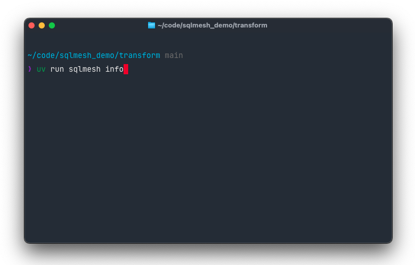
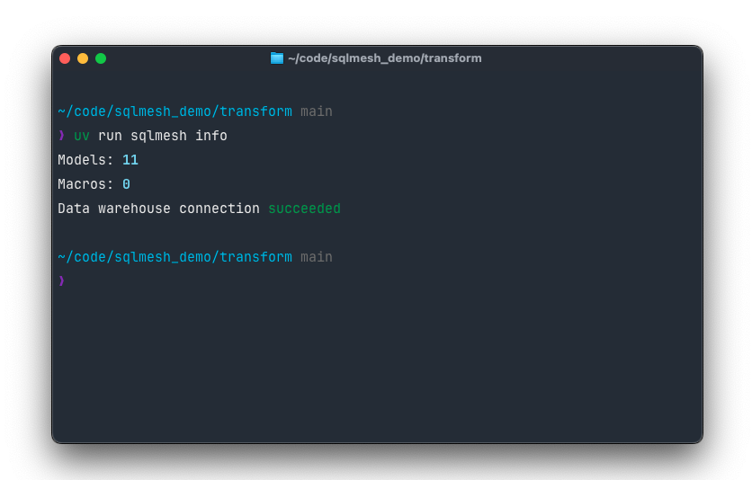
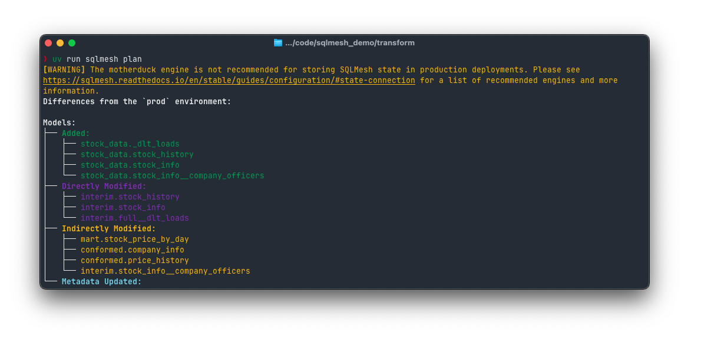
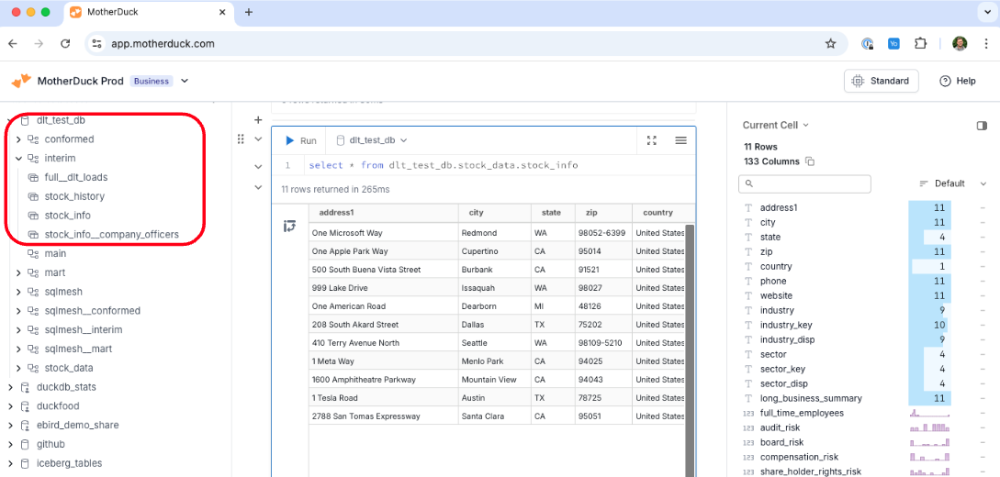

# MotherDuck

This page provides information about how to use SQLMesh with MotherDuck.

It begins with a [Connection Quickstart](#connection-quickstart) that demonstrates how to connect to MotherDuck, or you can skip directly to information about using MotherDuck with the built-in scheduler.

## Connection quickstart

Connecting to cloud warehouses involves a few steps, so this connection quickstart provides the info you need to get up and running with MotherDuck.

It demonstrates connecting to MotherDuck with the `duckdb` library bundled with SQLMesh.

MotherDuck provides a single way to authorize a connection. This quickstart demonstrates authenticating with a token.

!!! tip
    This quick start assumes you are familiar with basic SQLMesh commands and functionality.

    If you’re not familiar, work through the [SQLMesh Quickstart](../../quick_start.md) before continuing.

### Prerequisites

Before working through this quickstart guide, ensure that:

1. You have a motherduck account and an access token.
2. Your computer has SQLMesh installed with the DuckDB extra available.
   1. Install from command line with the command `pip install “sqlmesh[duckdb]”`
3. You have initialized a SQLMesh example project on your computer
   1. Open a command line interface and navigate to the directory where the project files should go.
   2. Initialize the project with the command `sqlmesh init duckdb`, since `duckdb` is the dialect.

#### Access control permissions

SQLMesh must have sufficient permissions to create and access your MotherDuck databases. Since permission is granted to specific databases for a specific user, you should create a service account for SQLMesh that will contain the credentials for writing to MotherDuck.

### Configure the connection

We now have what is required to configure SQLMesh’s connection to MotherDuck.

We start the configuration by adding a gateway named `motherduck` to our example project’s config.yaml file and making it our `default gateway`, as well as adding our token, persistent, and ephemeral catalogs.

```yaml
gateways:
  motherduck:
    connection:
      type: motherduck
        catalogs:
          persistent: "md:"
          ephemeral: ":memory:"
      token: <your_token>

default_gateway: motherduck
```

Catalogs can be defined to connect to anything that [DuckDB can be attached to](./duckdb.md#other-connection-catalogs-example).

!!! warning
    Best practice for storing secrets like tokens is placing them in [environment variables that the configuration file loads dynamically](../../guides/configuration.md#environment-variables). For simplicity, this guide instead places the value directly in the configuration file.

    This code demonstrates how to use the environment variable `MOTHERDUCK_TOKEN` for the configuration's `token` parameter:

    ```yaml linenums="1" hl_lines="5"
    gateways:
      motherduck:
        connection:
          type: motherduck
          token: {{ env_var('MOTHERDUCK_TOKEN') }}
    ```

### Check connection

We have now specified the `motherduck` gateway connection information, so we can confirm that SQLMesh is able to successfully connect to MotherDuck. We will test the connection with the `sqlmesh info` command.

First, open a command line terminal. Now enter the command `sqlmesh info`:



The output shows that our data warehouse connection succeeded:



### Run a `sqlmesh plan`

Now we're ready to run a `sqlmesh plan` in MotherDuck:



And confirm that our schemas and objects exist in the MotherDuck catalog:



Congratulations \- your SQLMesh project is up and running on MotherDuck\!


## Local/Built-in Scheduler

**Engine Adapter Type**: `motherduck`

### Connection options

| Option             | Description                                                                                                 | Type   | Required |
|--------------------|-------------------------------------------------------------------------------------------------------------|:------:|:--------:|
| `type`             | Engine type name - must be `motherduck`                                                                     | string | Y        |
| `database`         | The database name.                                                                                          | string | Y        |
| `token`            | The optional MotherDuck token. If not specified, the user will be prompted to login with their web browser. | string | N        |
| `extensions`       | Extension to load into duckdb. Only autoloadable extensions are supported.                                  | list   | N        |
| `connector_config` | Configuration to pass into the duckdb connector.                                                            | dict   | N        |
