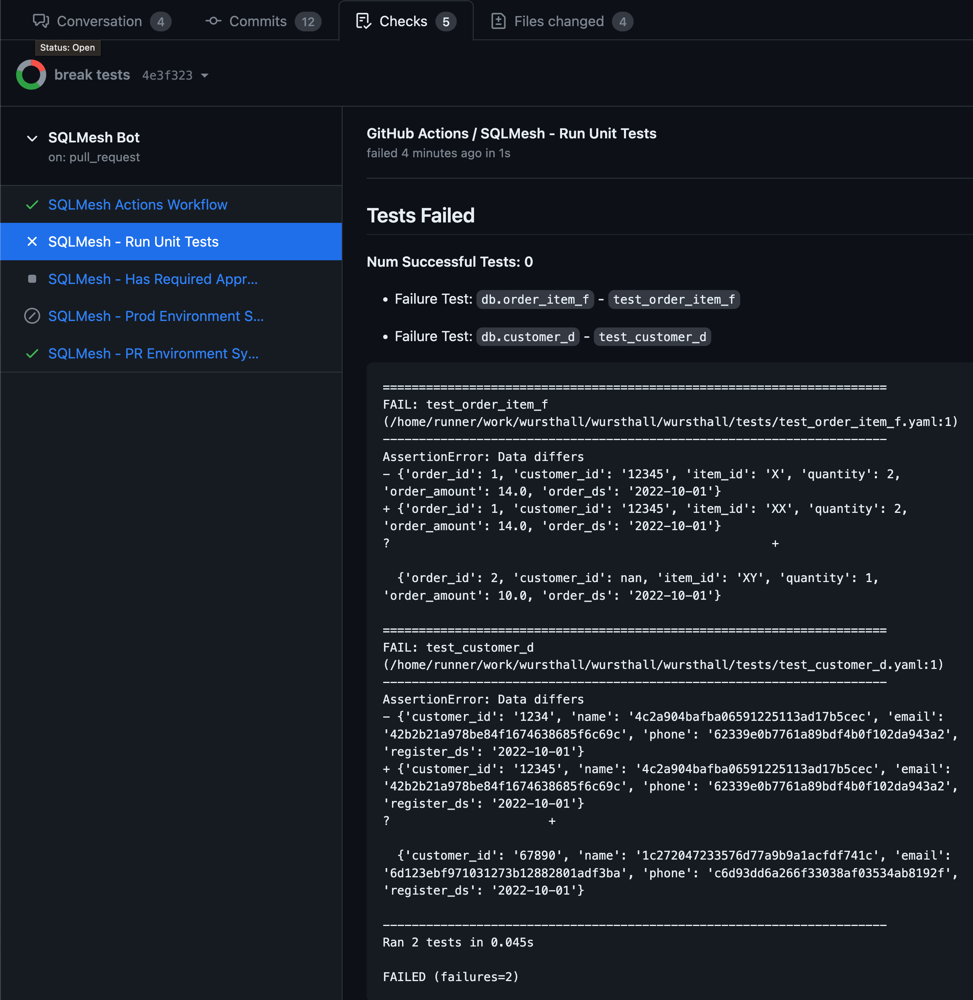
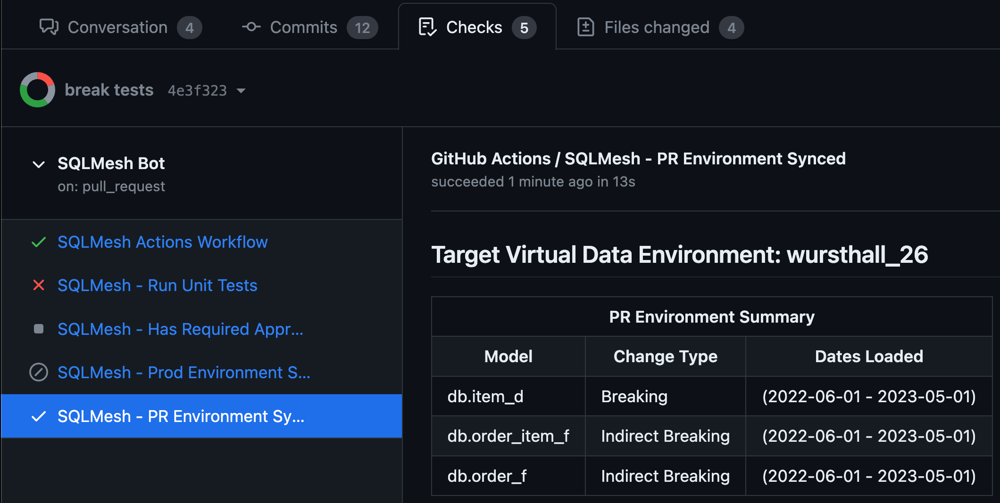
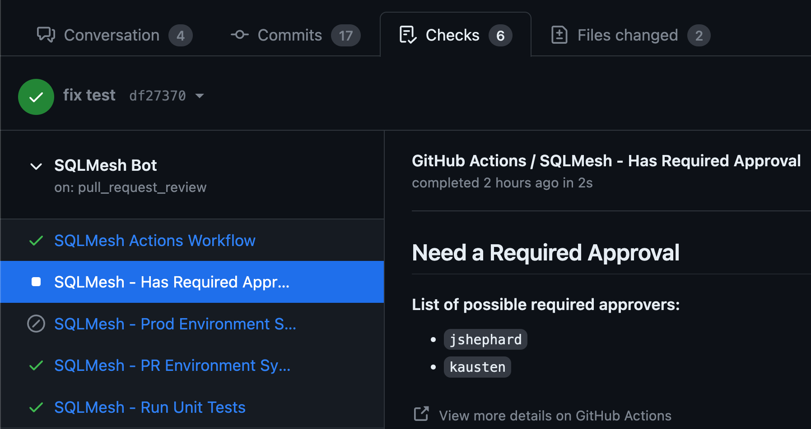
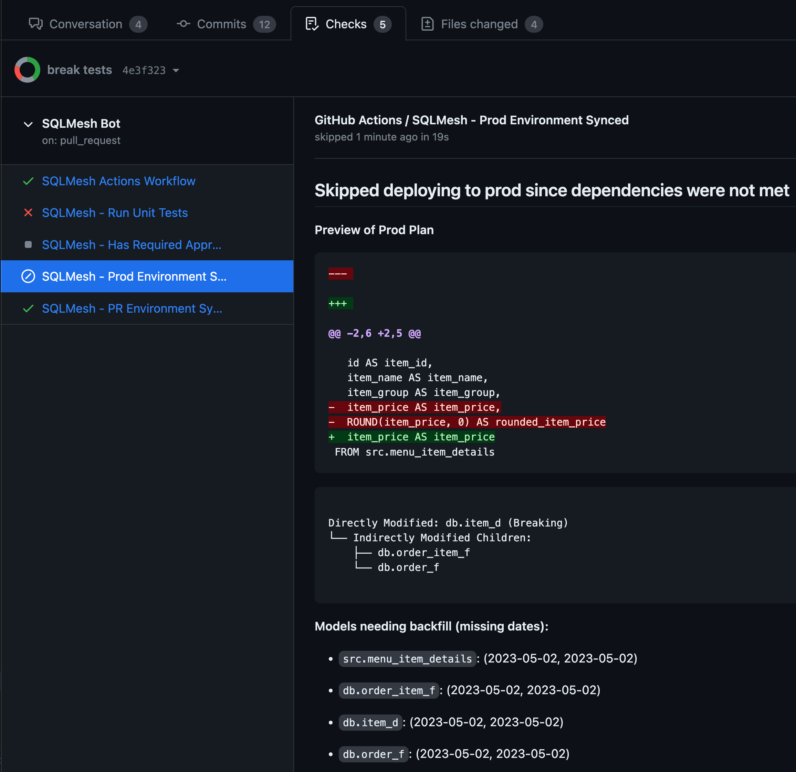

# GitHub Actions CI/CD Bot

## Features
### Automated Unit Tests with Error Summary

### Automatically create PR Environments that represent the code changes in the PR

### Enforce that certain reviewers have approved of the PR before it can be merged

### Preview Prod Plans before Deploying

### Automatic deployments to production and merge


### Combined these feature provide
* The ability to preview what will be deployed to production before it is deployed
* Gapless deployments to production by ensuring that dates loaded in dev tables match what is currently in production
* Full transparency into what exists in PR environment and what will be deployed to production - no surprises!
* The ability to sync your code and your data to ensure what is in your main branch is in production

## Getting Started
1. Make sure SQLMesh is added to your project's dependencies and it includes the github extra (.
2. Create a new file in `.github/workflows/sqlmesh.yml` with the following contents:
```yaml
name: SQLMesh Bot
run-name: 🚀SQLMesh Bot 🚀
on:
  pull_request:
    types:
    - synchronize
    - opened
  # Required if using required approvers to automate deployments
  pull_request_review:
    types:
    - edited
    - submitted
    - dismissed
  # Required if using comments to issue commands to the bot
  issue_comment:
    types: 
    - created
# The latest commit is the one that will be used to create the PR environment and deploy to production
concurrency:
  group: ${{ github.workflow }}-${{ github.head_ref || github.ref_name }}
  cancel-in-progress: true
jobs:
  sqlmesh:
    name: SQLMesh Actions Workflow
    runs-on: ubuntu-latest
    permissions:
      # Required to access code in PR
      contents: write
      # Required to post comments
      issues: write
      # Required to update check runs
      checks: write
      # Required to merge
      pull-requests: write
    steps:
      - name: Setup Python
        uses: actions/setup-python@v4
      - name: Checkout PR branch
        uses: actions/checkout@v3
        with:
          ref: refs/pull/${{ github.event.issue.pull_request && github.event.issue.number || github.event.pull_request.number  }}/merge
      - name: Install SQLMesh + Dependencies
        run: pip install -r requirements.txt
        shell: bash
      - name: Run CI/CD Bot
        run: |
          sqlmesh_cicd -p ${{ github.workspace }} github --token ${{ secrets.GITHUB_TOKEN }} run-all --merge_method merge --delete
```
3. (Optional) If you want to designate users as required approvers, update your SQLMesh config file to represent this. YAML Example:
```yaml
users:
  - username: <A username to use within SQLMesh to represent the user>
    github_username: <Github username>
    roles:
      - required_approver
```
4. You're done! SQLMesh will now automatically create PR environments, check for required approvers (if configured), and do data gapless deployments to production.

## Bot Commands
Commands can be issued to the bot to have it run specific actions. Below are the currently supported commands:
* `/deploy` - Deploys the changes in the PR to Production. It will run all the same checks as if you just pushed a commit except for the required approvals check since we assume we can to skip that check if you are manually deploying.

See [Run All Configuration](#run-all-configuration) for the `--command_namespace` option if you want SQLMesh's commands to have a different prefix to avoid them from clashing with other bots. 

## Configuration
### SQLMesh Configuration
`sqlmesh_cicd` accepts the following config:
* `-p/--paths` - Path(s) to the SQLMesh config/project. This is the same as the `-p/--paths` flag for `sqlmesh`.
* `--config` - Name of the config object. Only applicable to configuration defined using Python script. This is the same as the `--config` flag for `sqlmesh`.

### Github Configuration
`sqlmesh_cicd github` accepts the following config:
* `-t/--token` - The Github Token to be used. Pass in `${{ secrets.GITHUB_TOKEN }}` if you want to use the one created by Github actions

### Run All Configuration
The `run-all` config command will run all of the actions in a single step. 
This means it checks for approvers, runs unit tests, creates PR environment, and then deploys to prod.
It has two boolean flags that can be passed in to enable additional functionality:
* `--merge_method` - Providing this option will result in merging the PR after deploying to production in order to keep your main branch in-sync with your data. 
  * Options: `merge`, `squash`, `rebase`.
* `--delete` - This will delete the PR environment after deploying to production. 
    * Note: If using `--delete` then the runner will need a connection to the engine even if you are using Airflow. This is because the delete is done outside of Airflow.
    * Eventually want the SQLMesh Janitor to automatically do this cleanup which would remove the need for this flag.
* `--command_namespace` - Namespace to use for SQLMesh commands. For example if you provide `#SQLMesh` as a value then commands will be expected in the format of `#SQLMesh/<command>`. 

### Custom Workflow Configuration
You can configure each individual action to run as a separate step. This can allow for more complex workflows or integrating specific steps with other actions you want to trigger. Run `sqlmesh_cicd github` to see a list of commands that can be supplied and their potential options.
```bash
  Github Action CI/CD Bot

Options:
  -t, --token TEXT  The Github Token to be used. Pass in `${{
                    secrets.GITHUB_TOKEN }}` if you want to use the one
                    created by Github actions
  --help            Show this message and exit.

Commands:
  check-required-approvers  Checks if a required approver has provided...
  deploy-production         Deploys the production environment
  run-all                   Runs all the commands in the correct order.
  run-tests                 Runs the unit tests
  update-pr-environment     Creates or updates the PR environments
```

## Example Full Workflow
This workflow involves configuring a SQLMesh connection to Databricks and configuring access to GCP to talk to Cloud Composer (Airflow)
```yaml
name: SQLMesh Bot
run-name: 🚀SQLMesh Bot 🚀
on:
  pull_request:
    types:
    - synchronize
    - opened
  # Required if using required approvers to automate deployments
  pull_request_review:
    types:
    - edited
    - submitted
    - dismissed
  # Required if using comments to issue commands to the bot
  issue_comment:
    types: 
    - created
# The latest commit is the one that will be used to create the PR environment and deploy to production
concurrency:
  group: ${{ github.workflow }}-${{ github.head_ref || github.ref_name }}
  cancel-in-progress: true
jobs:
  sqlmesh:
    name: SQLMesh Actions Workflow
    runs-on: ubuntu-latest
    permissions:
      contents: write
      # Required to post comments
      issues: write
      # Required to update check runs
      checks: write
      # Required to merge
      pull-requests: write
    env:
      SQLMESH__GATEWAYS__DATABRICKS__CONNECTION__TYPE: "databricks"
      SQLMESH__GATEWAYS__DATABRICKS__CONNECTION__SERVER_HOSTNAME: "XXXXXXXXXXXXXXX"
      SQLMESH__GATEWAYS__DATABRICKS__CONNECTION__HTTP_PATH: "XXXXXXXXXXXX"
      SQLMESH__GATEWAYS__DATABRICKS__CONNECTION__ACCESS_TOKEN: ${{ secrets.DATABRICKS_TOKEN }}
      SQLMESH__DEFAULT_GATEWAY: "databricks"
    steps:
      - name: Setup Python
        uses: actions/setup-python@v4
        with:
          python-version: '3.9'
      - name: Checkout PR branch
        uses: actions/checkout@v3
        with:
          ref: refs/pull/${{ github.event.issue.pull_request && github.event.issue.number || github.event.pull_request.number  }}/merge
      - name: Install Dependencies
        run: pip install -r requirements.txt
        shell: bash
      - id: auth
        name: Authenticate to Google Cloud
        uses: google-github-actions/auth@v1
        with:
          credentials_json: '${{ secrets.GOOGLE_CREDENTIALS }}'
      - name: Run CI/CD Bot
        run: |
          sqlmesh_cicd -p ${{ github.workspace }} --token ${{ secrets.GITHUB_TOKEN }} run-all --merge_method squash --delete
```

## Future Improvements
* Currently if you are using the Airflow scheduler and are deploying a job and the workflow gets cancelled then
the job keeps running. Ideally we would then cancel the Airflow job as well.
* The Airflow job could take a while and we don't need to be running the Github Action for the entire time. Ideally
we would have Airflow tag the PR when the job is done which would trigger a follow up action to check status and 
move to the next step if successful.
* When using `run_all` ideally we could parallelize the tasks that can be run in parallel. One can work around this 
though by using the individual commands and running them in parallel from within the workflow.
