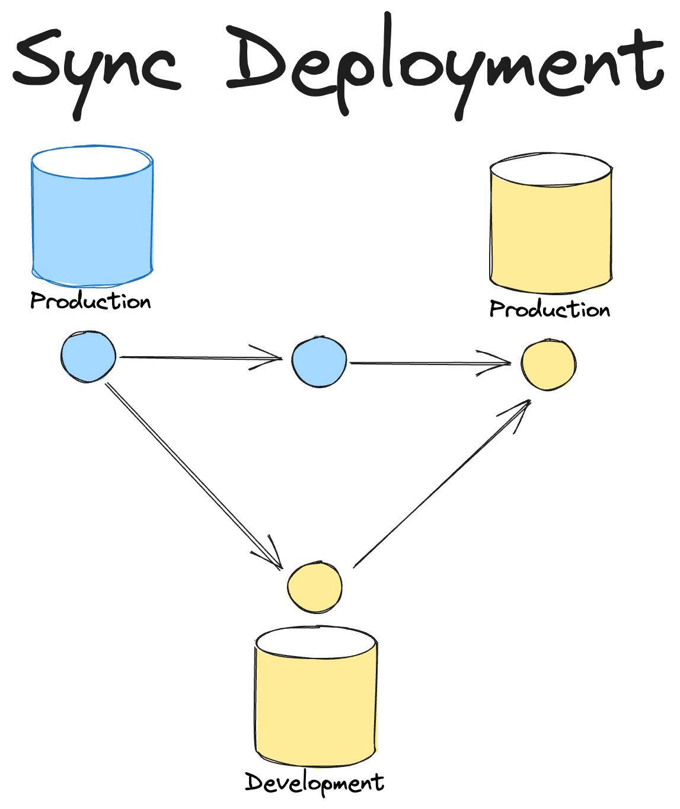

# GitHub Actions CI/CD Bot

<iframe width="704" height="396" src="https://www.youtube.com/embed/TkGT1vVZItU?si=gpnJeWefRN4qT4hi" title="Bot Overview" frameborder="0" allow="accelerometer; autoplay; clipboard-write; encrypted-media; gyroscope; picture-in-picture; web-share" allowfullscreen></iframe>

The GitHub Actions CI/CD Bot enables teams to automate their SQLMesh projects using GitHub Actions. It can be configured to perform the following things:

* Automatically run unit tests on PRs
* Automatically create PR environments that represent the code changes in the PR
* Automatically categorize and backfill data for models that have changed
* Automatically deploy changes to production with automatic data gap prevention and merge the PR

All of these features provide summaries and links to the relevant information in the PR so that you can easily see what is happening and why.

Due to the variety of ways that this bot can be configured, it is recommended to perform the initial setup and then explore the different configuration options to see which ones fit your use case.

## Initial Setup
1. Make sure SQLMesh is added to your project's dependencies and it includes the github extra (`pip install sqlmesh[github]`).
2. Create a new file in `.github/workflows/sqlmesh.yml` with the following contents:
```yaml
name: SQLMesh Bot
run-name: 🚀SQLMesh Bot 🚀
on:
  pull_request:
    types:
    - synchronize
    - opened
# The latest commit is the one that will be used to create the PR environment and deploy to production
concurrency:
  group: ${{ github.workflow }}-${{ github.head_ref || github.ref_name }}
  cancel-in-progress: true
jobs:
  sqlmesh:
    name: SQLMesh Actions Workflow
    runs-on: ubuntu-latest
    permissions:
      # Required to access code in PR
      contents: write
      # Required to post comments
      issues: write
      # Required to update check runs
      checks: write
      # Required to merge
      pull-requests: write
    steps:
      - name: Setup Python
        uses: actions/setup-python@v4
      - name: Checkout PR branch
        uses: actions/checkout@v3
        with:
          ref: refs/pull/${{ github.event.issue.pull_request && github.event.issue.number || github.event.pull_request.number  }}/merge
      - name: Install SQLMesh + Dependencies
        run: pip install -r requirements.txt
        shell: bash
      - name: Run CI/CD Bot
        run: |
          sqlmesh_cicd -p ${{ github.workspace }} github --token ${{ secrets.GITHUB_TOKEN }} run-all
```

Next checkout the [Core Bot Behavior Configuration Guide](#core-bot-behavior-configuration-guide) to see how to configure the bot's core behavior. Then checkout [Bot Configuration](#bot-configuration) to see how to configure the bot's behavior in general. Finally, checkout [Custom Workflow Configuration](#custom-workflow-configuration) to see the full set of customizations available to the bot.

## Core Bot Behavior Configuration Guide

There are two fundamental ways the bot can be configured: synchronized or desynchronized production code and data.

### Synchronized vs. Desynchronized Deployments

Typically, CI/CD workflows for data projects follow a flow where code is merged into a main branch and then the production datasets that are represented by the code in main are **eventually** updated to match the code. 
This could either be on merge, and therefore they will be updated after the refresh job completes, or it could be on a schedule where the refresh job is run on a schedule.
Either way the data in production is **lagging** behind the code in main and therefore code and data are **desynchronized**. 

The advantage though of this approach is that users just need to merge a branch in order to see their changes **eventually** represented in production.
The disadvantage is that it can be difficult for users to know the current state of production is and when their changes will be live.
In addition, if an error occurs while the data in production is being updated then the data in production may never reflect the state that is represented in the main branch.

SQLMesh's virtual data environments offer a different approach where the deployment can be **synchronized**.
This means that dev datasets can be quickly deployed to production using SQLMesh's virtual update and then immediately after the branch is automatically merged to main.
Now the code and data in production are synchronized and users can see their changes immediately.

The disadvantage of this approach is that users can't simply merge a branch to get their changes into production since SQLMesh needs to be able to deploy the changes and then perform the merge itself.
As a result it requires a "signal" from users to indicate that they want a change deployed to production that will then trigger the bot to deploy the changes and then merge the PR.

SQLMesh's GitHub CI/CD Bot supports either approach and it is up to each team which mode is the best fit given their organization's constraints.

### Synchronized Production Code and Data Configuration

Regardless of signal approach being used, the bot needs to be configured to use the merge method you want to use when merging the PR after deploying to production.

=== "YAML"

    ```yaml linenums="1"
    cicd_bot:
        type: github
        merge_method: squash
    ```

=== "Python"

    ```python linenums="1"
    from sqlmesh.integrations.github.cicd.config import GithubCICDBotConfig, MergeMethod
    from sqlmesh.core.config import Config
    
    config = Config(
        cicd_bot=GithubCICDBotConfig(
            merge_method=MergeMethod.SQUASH
        )
    )
    ```

In this example we configured the merge method to be `squash`. See [Bot Configuration](#bot-configuration) for more details on the `merge_method` option.

#### Required Approval Signal

One way to signal to SQLMesh that a PR is ready to go to production is through the use of "Required Approvers". 
In this approach users configure their SQLMesh project to list users that are designated as "Required Approver" and then when the bot detects an approval was received from one of these individuals then it determines that it is time to deploy to production.
This pattern can be a great fit for teams that already have an approval process like this in place and therefore it actually removes an extra step from either the author or the approver since SQLMesh will automate the deployment and merge until of it having to be manually done.

##### Required Approval Configuration

In order to configure this pattern, you need to define a user in your SQLMesh project that has the "Required Approver" role.

=== "YAML"

    ```yaml linenums="1"
    users:
    - username: <A username to use within SQLMesh to represent the user>
      github_username: <Github username>
      roles:
        - required_approver
    ```

=== "Python"

    ```python linenums="1"
    from sqlmesh.core.config import Config
    from sqlmesh.core.user import User, UserRole
    
    config = Config(
        users=[
            User(
                username="<A username to use within SQLMesh to represent the user>",
                github_username="<Github username>",
                roles=[UserRole.REQUIRED_APPROVER],
            )
        ]
    )
    ```

The GitHub Actions workflow needs to be updated to trigger the action based on if a pull request review has come in. 

```yaml linenums="1"
on:
  pull_request:
    types:
    - synchronize
    - opened
  # Required if using required approvers to automate deployments
  pull_request_review:
    types:
    - edited
    - submitted
    - dismissed
```

Now if the bot detects an approval from this user then it will deploy the changes to production and merge the PR.

### Deploy Command Signal

In this approach users can issue a `/deploy` command to the bot to signal that they want the changes in the PR to be deployed to production.
This pattern is more flexible than the required approval pattern.
Deploy command signal can be used alongside the required approval signal or on its own. 
The deploy command, if issued, overrides the required approval signal and will deploy the changes to production and merge the PR.

#### Deploy Command Configuration

This command must be enabled in the bot's configuration. 

=== "YAML"

    ```yaml linenums="1"
    cicd_bot:
        type: github
        merge_method: squash
        enable_deploy_command: true
    ```

=== "Python"

    ```python linenums="1"
    from sqlmesh.integrations.github.cicd.config import GithubCICDBotConfig, MergeMethod
    from sqlmesh.core.config import Config
    
    config = Config(
        cicd_bot=GithubCICDBotConfig(
            enable_deploy_command=True
            merge_method=MergeMethod.SQUASH
        )
    )
    ```

Optionally, a `command_namespace` can be configured to avoid clashing with other bots. See [Bot Configuration](#bot-configuration) for more details on the `command_namespace` option.

The GitHub Actions workflow needs to be updated to trigger the action based on if a comment has been created. 

```yaml linenums="1"
on:
  pull_request:
    types:
    - synchronize
    - opened
  # Required if using comments to issue commands to the bot
  issue_comment:
    types:
    - created
```

### Desynchronized Production Code and Data Configuration

In order to support this pattern we need to add an additional step to the workflow that will run the `deploy-production` command after the merge to main.
In addition we need to also update some prior steps with if checks to differentiate the merge vs. non-merge behavior.

```yaml linenums="1"
pull_request:
    types:
      - synchronize
      - opened
      # Add closed
      - closed
...
jobs:
  sqlmesh:
    steps:
    - name: Checkout PR branch
      uses: actions/checkout@v3
      # Add if statement so we don't checkout merged PR but instead main branch
      if: github.event.pull_request.merged == false
      with:
        ref: refs/pull/${{ github.event.issue.pull_request && github.event.issue.number || github.event.pull_request.number  }}/merge
    - name: Checkout main branch
      # Add if statement so we use main when merged
      if: github.event.pull_request.merged == true
      uses: actions/checkout@v4
      with:
        ref: main
        path: wursthall
    ...
    - name: Run CI/CD Bot
      # Add if statement so we don't run-all on merged PR
      if: github.event.pull_request.merged == false
      run: |
        sqlmesh_cicd -p ${{ github.workspace }} github --token ${{ secrets.GITHUB_TOKEN }} run-all
    # Add deploy step that only runs on merged PR
    - name: Deploy to Production
      if: github.event.pull_request.merged == true
      run: |
        sqlmesh_cicd -p ${{ github.workspace }} github --token ${{ secrets.GITHUB_TOKEN }} deploy-production
```

Make sure that "Required Approvers" are not configured (they are not by default) and "Deploy Command" is not enabled (it is not by default).

## Bot Configuration
The bot's behavior is configured using your project's `config.yaml` or `config.py` file. See [SQLMesh Configuration](https://sqlmesh.readthedocs.io/en/stable/guides/configuration/) for more details on how to generally setup and configure SQLMesh.

Below is an example of how to define the default config for the bot in either YAML or Python.

=== "YAML"

    ```yaml linenums="1"
    cicd_bot:
        type: github
    ```

=== "Python"

    ```python linenums="1"
    from sqlmesh.integrations.github.cicd.config import GithubCICDBotConfig
    from sqlmesh.core.config import Config
    
    config = Config(
        cicd_bot=GithubCICDBotConfig()
    )
    ```

### Configuration Properties

| Option                                | Description                                                                                                                                                                                                                                                            |  Type  | Required |
|---------------------------------------|------------------------------------------------------------------------------------------------------------------------------------------------------------------------------------------------------------------------------------------------------------------------|:------:|:--------:|
| `invalidate_environment_after_deploy` | Indicates if the PR environment created should be automatically invalidated after changes are deployed. Invalidated environments are cleaned up automatically by the Janitor. Default: `True`                                                                          |  bool  |    N     |
| `merge_method`                        | The merge method to use when automatically merging a PR after deploying to prod. Defaults to `None` meaning automatic merge is not done. Options: `merge`, `squash`, `rebase`                                                                                          | string |    N     |
| `enable_deploy_command`               | Indicates if the `/deploy` command should be enabled in order to allowed synchronized deploys to production. Default: `False`                                                                                                                                          |  bool  |    N     |
| `command_namespace`                   | The namespace to use for SQLMesh commands. For example if you provide `#SQLMesh` as a value then commands will be expected in the format of `#SQLMesh/<command>`. Default: `None` meaning no namespace is used.                                                        | string |    N     |
| `auto_categorize_changes`             | Auto categorization behavior to use for the bot. If not provided then the project-wide categorization behavior is used. See [Auto-categorize model changes](https://sqlmesh.readthedocs.io/en/stable/guides/configuration/#auto-categorize-model-changes) for details. |  dict  |    N     |
| `default_pr_start`                    | Default start when creating PR environment plans. If running in a mode where the bot automatically backfills models (based on `auto_categorize_changes` behavior) then this can be used to limit the amount of data backfilled. Defaults to `1 day ago`                |  str   |    N     |
| `skip_pr_backfill`                    | Indicates if the bot should skip backfilling models in the PR environment. Default: `True`                                                                                                                                                                             |  bool  |    N     |


Example with all properties defined:

=== "YAML"

    ```yaml linenums="1"
    cicd_bot:
        type: github
        invalidate_environment_after_deploy: false
        enable_deploy_command: true
        merge_method: squash
        command_namespace: "#SQLMesh"
        auto_categorize_changes:
          external: full
          python: full
          sql: full
          seed: full
        default_pr_start: "1 week ago"
        skip_pr_backfill: false
    ```

=== "Python"

    ```python linenums="1"
    from sqlmesh.integrations.github.cicd.config import GithubCICDBotConfig, MergeMethod
    from sqlmesh.core.config import AutoCategorizationMode, CategorizerConfig, Config
    
    config = Config(
        cicd_bot=GithubCICDBotConfig(
            invalidate_environment_after_deploy=False,
            enable_deploy_command=True,
            merge_method=MergeMethod.SQUASH,
            command_namespace="#SQLMesh",
            auto_categorize_changes=CategorizerConfig(
                external=AutoCategorizationMode.FULL,
                python=AutoCategorizationMode.FULL,
                sql=AutoCategorizationMode.FULL,
                seed=AutoCategorizationMode.FULL,
            ),
            default_pr_start="1 week ago",
            skip_pr_backfill=False,
        )
    )
    ```

## Custom Workflow Configuration
You can configure each individual action to run as a separate step. This can allow for more complex workflows or integrating specific steps with other actions you want to trigger. Run `sqlmesh_cicd github` to see a list of commands that can be supplied and their potential options.
```bash
  Github Action CI/CD Bot

Options:
  -t, --token TEXT  The Github Token to be used. Pass in `${{
                    secrets.GITHUB_TOKEN }}` if you want to use the one
                    created by Github actions
  --help            Show this message and exit.

Commands:
  check-required-approvers  Checks if a required approver has provided...
  deploy-production         Deploys the production environment
  run-all                   Runs all the commands in the correct order.
  run-tests                 Runs the unit tests
  update-pr-environment     Creates or updates the PR environments
```

## Example Full Workflow
This workflow involves configuring a SQLMesh connection to Databricks and configuring access to GCP to talk to Cloud Composer (Airflow)
```yaml
name: SQLMesh Bot
run-name: 🚀SQLMesh Bot 🚀
on:
  pull_request:
    types:
    - synchronize
    - opened
  # Required if using required approvers to automate deployments
  pull_request_review:
    types:
    - edited
    - submitted
    - dismissed
  # Required if using comments to issue commands to the bot
  issue_comment:
    types:
    - created
# The latest commit is the one that will be used to create the PR environment and deploy to production
concurrency:
  group: ${{ github.workflow }}-${{ github.head_ref || github.ref_name }}
  cancel-in-progress: true
jobs:
  sqlmesh:
    name: SQLMesh Actions Workflow
    runs-on: ubuntu-latest
    permissions:
      contents: write
      # Required to post comments
      issues: write
      # Required to update check runs
      checks: write
      # Required to merge
      pull-requests: write
    env:
      SQLMESH__GATEWAYS__DATABRICKS__CONNECTION__TYPE: "databricks"
      SQLMESH__GATEWAYS__DATABRICKS__CONNECTION__SERVER_HOSTNAME: "XXXXXXXXXXXXXXX"
      SQLMESH__GATEWAYS__DATABRICKS__CONNECTION__HTTP_PATH: "XXXXXXXXXXXX"
      SQLMESH__GATEWAYS__DATABRICKS__CONNECTION__ACCESS_TOKEN: ${{ secrets.DATABRICKS_TOKEN }}
      SQLMESH__DEFAULT_GATEWAY: "databricks"
    steps:
      - name: Setup Python
        uses: actions/setup-python@v4
        with:
          python-version: '3.9'
      - name: Checkout PR branch
        uses: actions/checkout@v3
        with:
          ref: refs/pull/${{ github.event.issue.pull_request && github.event.issue.number || github.event.pull_request.number  }}/merge
      - name: Install Dependencies
        run: pip install -r requirements.txt
        shell: bash
      - id: auth
        name: Authenticate to Google Cloud
        uses: google-github-actions/auth@v1
        with:
          credentials_json: '${{ secrets.GOOGLE_CREDENTIALS }}'
      - name: Run CI/CD Bot
        run: |
          sqlmesh_cicd -p ${{ github.workspace }} github --token ${{ secrets.GITHUB_TOKEN }} run-all
```

## Example Screenshots
### Automated Unit Tests with Error Summary

### Automatically create PR Environments that represent the code changes in the PR

### Enforce that certain reviewers have approved of the PR before it can be merged

### Preview Prod Plans before Deploying

### Automatic deployments to production and merge

