# Notebook

This page works through the SQLMesh example project using the SQLMesh notebook interface. 

The notebook interface works with both Jupyter and Databricks notebooks. Learn more about configuring a Databricks connection at the [Execution Engines](../integrations/engines.md#databricks) page.

## 1. Create the SQLMesh project
First, create a SQLMesh project directory with your operating system's graphical or command-line tools. Next, create a Jupyter or Databricks notebook file - it does not need to be in the SQLMesh project directory.

If using a python virtual environment, ensure it's activated first by running the `source .env/bin/activate` command from the folder used during [installation](../installation.md).

Import the SQLMesh library to load the notebook magic commands:

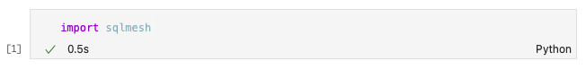

Next, create a SQLMesh scaffold with the `%init` notebook magic, specifying a default SQL dialect for your models. The dialect should correspond to the dialect most of your models are written in; it can be overridden for specific models in the model's `MODEL` specification. All SQL dialects [supported by the SQLGlot library](https://github.com/tobymao/sqlglot/blob/main/sqlglot/dialects/dialect.py) are allowed. 

In this example, we specify the `snowflake` dialect:

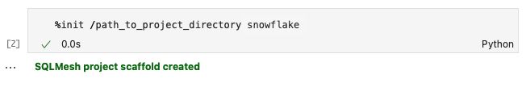

If the scaffold is successfully created, it will return `SQLMesh project scaffold created`. See the [quick start overview](../quick_start.md#project-directories-and-files) for more information about the project directories, files, data, and models.

Inform SQLMesh of the project location by setting a context with the `%context` notebook magic. If the context is set successfully, it will return a message including the repository or list of repositories:

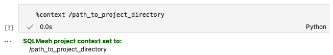

You can specify multiple directories in one call to `%context` if your SQLMesh project has [multiple repositories](../guides/multi_repo.md). 

## 2. Create a prod environment

SQLMesh's key actions are creating and applying *plans* to *environments*. At this point, the only environment is the empty `prod` environment.

The first SQLMesh plan must execute every model to populate the production environment. Running the notebook magic `%plan` will generate the plan and the following output: 

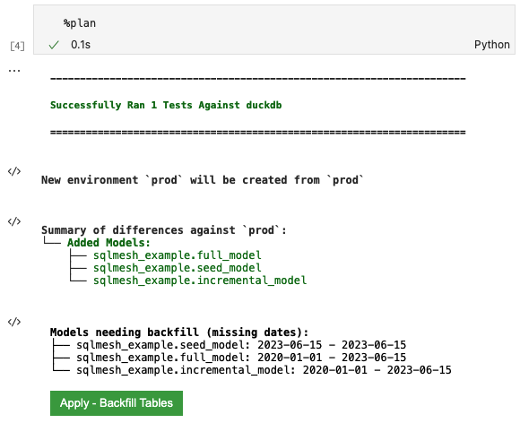

The first block of output notes that `%plan` successfully executed the project's test `tests/test_full_model.yaml` with duckdb.

The `New environment` line describes what environments the plan will affect when applied - a new `prod` environment in this case.

The `Summary of differences` section shows that SQLMesh detected three new models relative to the current empty environment.

The `Models needing backfill` section lists each model that will be executed by the plan, along with the date intervals that will be run. Both `full_model` and `incremental_model` show `2020-01-01` as their start date because:

1. The incremental model specifies that date in the `start` property of its `MODEL` statement and 
2. The full model depends on the incremental model. 

The `seed_model` date range begins on the same day the plan was made because `SEED` models have no temporality associated with them other than whether they have been modified since the previous SQLMesh plan.

Click the green button labeled `Apply - Backfill Tables` to apply the plan and initiate backfill. The following output will be displayed:

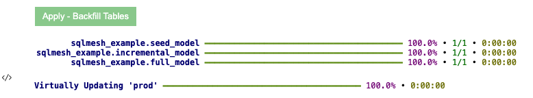

The first output block shows the completion percentage and run time for each model (very fast in this simple example). The following line shows that the `prod` environment now points to the tables created during model execution.

You've now created a new production environment with all of history backfilled.

## 3. Update a model

Now that we have have populated the `prod` environment, let's modify one of the SQL models.

We can modify the incremental SQL model using the `%model` *line* notebook magic (note the single `%`) and the model name:

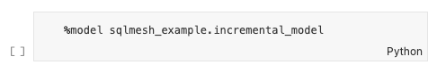

After we execute the cell, the contents will be replaced by the `%%model` *cell* notebook magic (note the double `%%`) and the model contents, along with a rendered version of the model SQL query. SQLMesh has automatically added explicit column aliases to the query (e.g., `id AS id`):

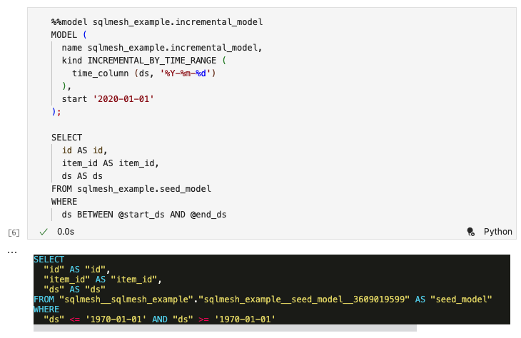

We modify the incremental SQL model by adding a new column to the query. When we execute the cell it will write the updated model contents to the file and update the rendered version of the query:

## 4. Work with a development environment

### 4.1 Create a dev environment
Now that you've modified a model, it's time to create a development environment so that you can validate the model change without affecting production. 

Run `%plan dev` to create a development environment called `dev`. The following output will be displayed:

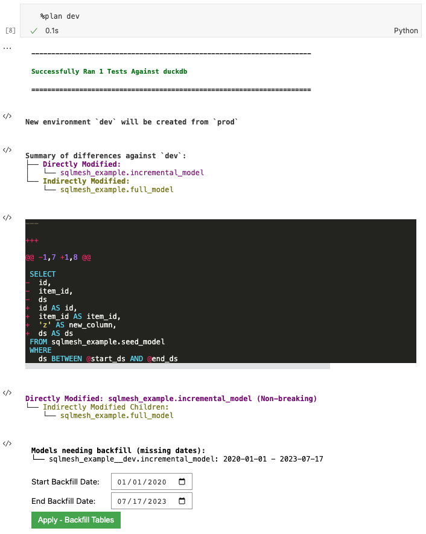

The first block of output notes that `%plan` successfully executed the project's test `tests/test_full_model.yaml` with duckdb.

The `New environment` line describes what environments the plan will affect when applied - a new `dev` environment will be created from the existing `prod` environment.

The `Summary of differences` section summarizes the differences between the modified model and the new `dev` environment (right now just a copy of `prod`), detecting that we directly modified `incremental_model` and that `full_model` was indirectly modified because it selects from the incremental model. It shows a diff between the existing and updated model.

SQLMesh automatically classified the change as `Non-breaking` because understood that the change was additive (added a column not used by `full_model`) and did not invalidate any data already in `prod`.

The `Models needing backfill` section shows that only the directly modified `incremental_model` needs backfill and provides a date picker to specify the start and end dates for the backfill. 

Click the green button to perform the backfill:

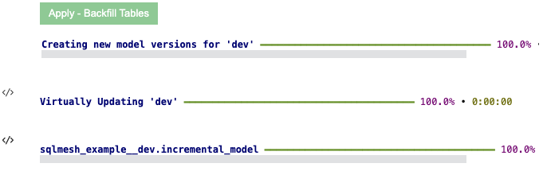

The output shows that SQLMesh created a new model version in `dev`. The last line of the output shows that SQLMesh applied the change to `sqlmesh_example__dev.incremental_model`. In the model schema, the suffix "`__dev`" indicates that it is in the `dev` environment. 

SQLMesh did not need to backfill anything for the `full_model` since the change was `Non-breaking`.

### 4.2 Validate updates in dev
You can now view this change by querying data from `incremental_model` with the `%%fetchdf` *cell* magic (note the two `%` symbols) and the SQL query `select * from sqlmesh_example__dev.incremental_model`. 

Note that the environment name `__dev` is appended to the schema namespace `sqlmesh_example` in the query:

You can see that `new_column` was added to the dataset. 

The production table was not modified; you can validate this by querying the production table using `%%fetchdf` and the query `select * from sqlmesh_example.incremental_model`. 

Note that nothing has been appended to the schema namespace `sqlmesh_example` because `prod` is the default environment:

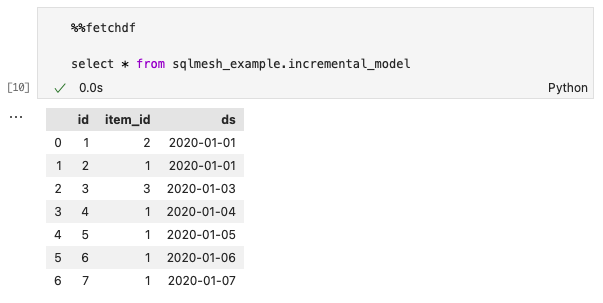

The production table does not have `new_column` because the changes to `dev` have not yet been applied to `prod`.

## 5. Update the prod environment
Now that we've tested the changes in dev, it's time to move them to production. Run `%plan` to plan and apply your changes to the `prod` environment:

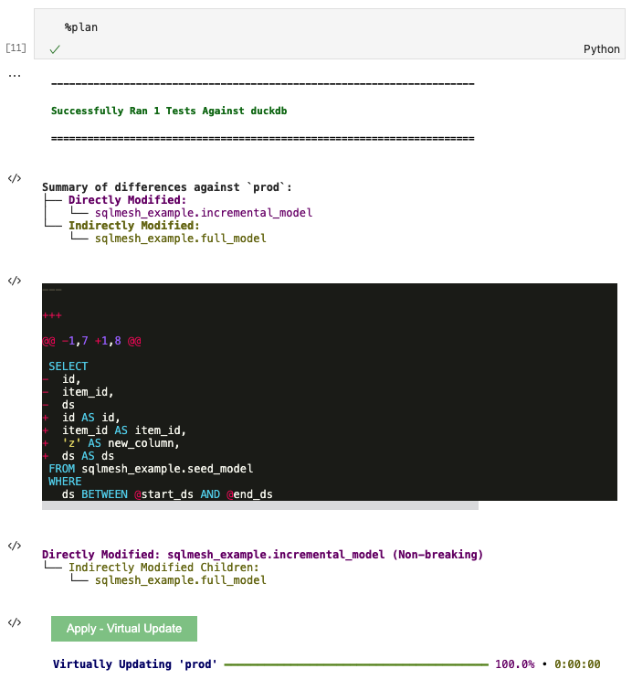

Click the green `Apply - Virtual Update` button to apply the plan and execute the backfill:

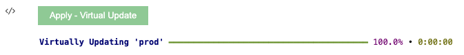

Note that a backfill was not necessary and only a Virtual Update occurred.

### 5.2 Validate updates in prod
Double-check that the data updated in `prod` by running `%%fetchdf` with the SQL query `select * from sqlmesh_example.incremental_model`:

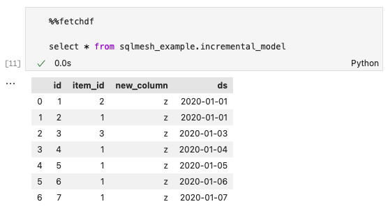

`new_column` is now present in the `prod` incremental model.

## 6. Next steps

Congratulations, you've now conquered the basics of using SQLMesh!

From here, you can:

* [Set up a connection to a database or SQL engine](../guides/connections.md)
* [Learn more about SQLMesh concepts](../concepts/overview.md)
* [Join our Slack community](https://tobikodata.com/slack)