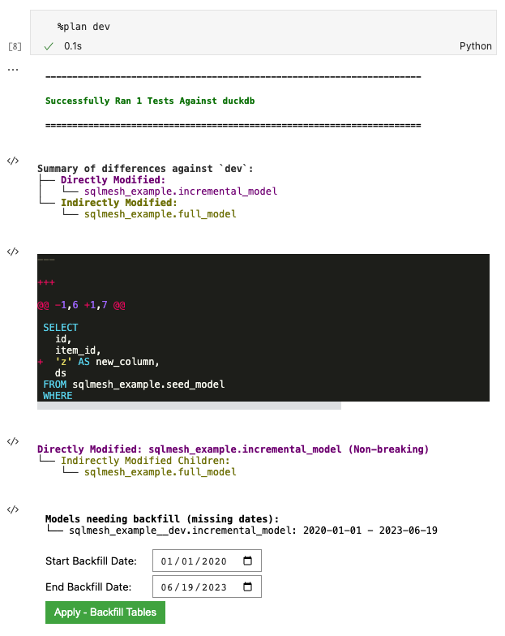
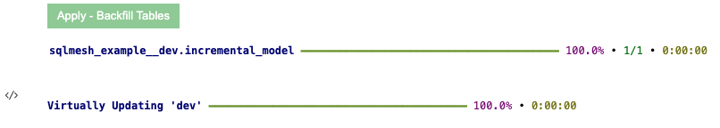

# Notebook

This page works through the SQLMesh example project using the SQLMesh notebook interface. 

The notebook interface works with both Jupyter and Databricks notebooks. Learn more about configuring a Databricks connection at the [Execution Engines](../integrations/engines.md#databricks) page.

## 1. Create the SQLMesh project
First, create a SQLMesh project directory with your operating system's graphical or command-line tools. Next, create a Jupyter or Databricks notebook file - it does not need to be in the SQLMesh project directory.

If using a python virtual environment, ensure it's activated first by running the `source .env/bin/activate` command from the folder used during [installation](../installation.md).

Import the SQLMesh library to load the notebook magic commands:

Next, create a SQLMesh scaffold with the `%init` notebook magic:

If the scaffold is successfully created, it will return `SQLMesh project scaffold created`. See the [quick start overview](../quick_start.md#project-directories-and-files) for more information about the project directories, files, data, and models.

Inform SQLMesh of the project location by setting a context with the `%context` notebook magic. If the context is set successfully, it will return a message including the repository or list of repositories:

You can specify multiple directories in one call to `%context` if your SQLMesh project has [multiple repositories](../guides/multi_repo.md). 

## 2. Plan and apply environments
### 2.1 Create a prod environment

SQLMesh's key actions are creating and applying *plans* to *environments*. At this point, the only environment is the empty `prod` environment.

The first SQLMesh plan must execute every model to populate the production environment. Running the notebook magic `%plan` will generate the plan and the following output: 

The first block of output notes that `%plan` successfully executed the project's test `tests/test_full_model.yaml` with duckdb.

The `New environment` line describes what environments the plan will affect when applied - a new `prod` environment in this case.

The `Summary of differences` section shows that SQLMesh detected three new models relative to the current empty environment.

The `Models needing backfill` section lists each model that will be executed by the plan, along with the date intervals that will be run. Both `full_model` and `incremental_model` show `2020-01-01` as their start date because:

1. The incremental model specifies that date in the `start` property of its `MODEL` statement and 
2. The full model depends on the incremental model. 

The `seed_model` date range begins on the same day the plan was made because `SEED` models have no temporality associated with them other than whether they have been modified since the previous SQLMesh plan.

Click the green button labeled `Apply - Backfill Tables` to apply the plan and initiate backfill. The following output will be displayed:

The first output block shows the completion percentage and run time for each model (very fast in this simple example). The following line shows that the `prod` environment now points to the tables created during model execution.

You've now created a new production environment with all of history backfilled.

### 2.2 Create a dev environment
Now that you've created a production environment, it's time to create a development environment so that you can modify models without affecting production. 

Run `%plan dev` to create a development environment called `dev`. The following output will be displayed:

The output does not list any added or modified models because `dev` is being created from the existing `prod` environment without modification. 

The `New environment` line shows that when you apply the plan creating the `dev` environment, it will only involve a Virtual Update. This is because SQLMesh is able to safely reuse the tables you've already backfilled in the `prod` environment. 

Click the green button to perform the Virtual Update:

The output confirms that the `dev` environment has been updated successfully.

## 3. Make your first update

Now that we have have populated both `prod` and `dev` environments, let's modify one of the SQL models, validate it in `dev`, and push it to `prod`.

### 3.1 Edit the configuration
We can modify the incremental SQL model using the `%model` *line* notebook magic (note the single `%`) and the model name:

After we execute the cell, the contents will be replaced by the `%%model` *cell* notebook magic (note the double `%%`) and the model contents, along with a rendered version of the model SQL query. SQLMesh has automatically added explicit column aliases to the query (e.g., `id AS id`):

We modify the incremental SQL model by adding a new column to the query. When we execute the cell it will write the updated model contents to the file and update the rendered version of the query:

## 4. Plan and apply updates
We can preview the impact of the change using the `%plan dev` command:

The first block of output notes that `%plan` successfully executed the project's test `tests/test_full_model.yaml` with duckdb.

The second block "Summary of differences against `dev`" summarizes the differences between the modified project components and the existing `dev` environment, detecting that we directly modified `incremental_model` and that `full_model` was indirectly modified because it selects from the incremental model. 

The third block shows the modifications we made to the rendered query.

The next block shows that we directly modified the incremental model. SQLMesh understood that the change was additive (added a column not used by `full_model`) and automatically classified it as a non-breaking change.

The final block describes the models requiring backfill, including the incremental model from our start date `2020-01-01`. We can modify the backfill start and end dates for the incremental model with the date picker widget, if desired. 

Click the green `Apply - Backfill Tables` button to apply the plan and execute the backfill:

SQLMesh applies the change to `sqlmesh_example.incremental_model` and backfills the model. SQLMesh did not need to backfill `sqlmesh_example.full_model` since the change was `non-breaking`.

### 4.1 Validate updates in dev
You can now view this change by querying data from `incremental_model` with the `%%fetchdf` *cell* magic (note the two `%` symbols) and the SQL query `select * from sqlmesh_example__dev.incremental_model`. 

Note that the environment name `__dev` is appended to the schema namespace `sqlmesh_example` in the query: `select * from sqlmesh_example__dev.incremental_model`.

You can see that `new_column` was added to the dataset. 

The production table was not modified; you can validate this by querying the production table using `%%fetchdf` and the query `select * from sqlmesh_example.incremental_model`. Note that nothing has been appended to the schema namespace `sqlmesh_example` because `prod` is the default environment.

The production table does not have `new_column` because the changes to `dev` have not yet been applied to `prod`.

### 4.2 Apply updates to prod
Now that we've tested the changes in dev, it's time to move them to prod. Run `%plan` to plan and apply your changes to the prod environment. 

Click the green `Apply - Virtual Update` button to apply the plan and execute the backfill:

Note that a backfill was not necessary and only a Virtual Update occurred.

### 4.3. Validate updates in prod
Double-check that the data updated in `prod` by running `%%fetchdf` with the SQL query `select * from sqlmesh_example.incremental_model`:

`new_column` is now present in the `prod` incremental model.

## 5. Next steps

Congratulations, you've now conquered the basics of using SQLMesh!

From here, you can:

* [Set up a connection to a database or SQL engine](../guides/connections.md)
* [Learn more about SQLMesh concepts](../concepts/overview.md)
* [Join our Slack community](https://tobikodata.com/slack)