# Browser UI

This page works through the SQLMesh example project using the SQLMesh web browser user interface.

The SQLMesh browser UI requires additional Python libraries not included in the base SQLMesh installation. To use the UI, install SQLMesh with the `web` add-on.

First, if using a python virtual environment, ensure it's activated by running `source .env/bin/activate` command from the folder used during [installation](../installation.md).

Next, install the UI with `pip`:

```bash
pip install 'sqlmesh[web]'
```
## 1. Create the SQLMesh project
Before working in the SQLMesh browser UI, create a project directory with your operating system's graphical interface or from the command line:

```bash
mkdir sqlmesh-example
```

Navigate to the directory on the command line:

```bash
cd sqlmesh-example
```

If using a python virtual environment, ensure it's activated by running `source .env/bin/activate` from the folder used during [installation](../installation.md).

Create a SQLMesh scaffold with the following command, specifying a default SQL dialect for your models. The dialect should correspond to the dialect most of your models are written in; it can be overridden for specific models in the model's `MODEL` specification. All SQL dialects [supported by the SQLGlot library](https://github.com/tobymao/sqlglot/blob/main/sqlglot/dialects/dialect.py) are allowed.

In this example, we specify the `duckdb` dialect:

```bash
sqlmesh init duckdb
```

See the [quick start overview](../quick_start.md#project-directories-and-files) for more information about the project directories, files, data, and models.

## 2. Open the SQLMesh web UI

Open the UI by running the `sqlmesh ui` command from within the project directory:

```bash
sqlmesh ui
```

After starting up, the SQLMesh web UI is served at `http://127.0.0.1:8000` by default:

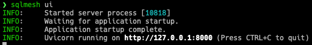

Navigate to the URL by clicking the link in your terminal (if supported) or copy-pasting it into your web browser:

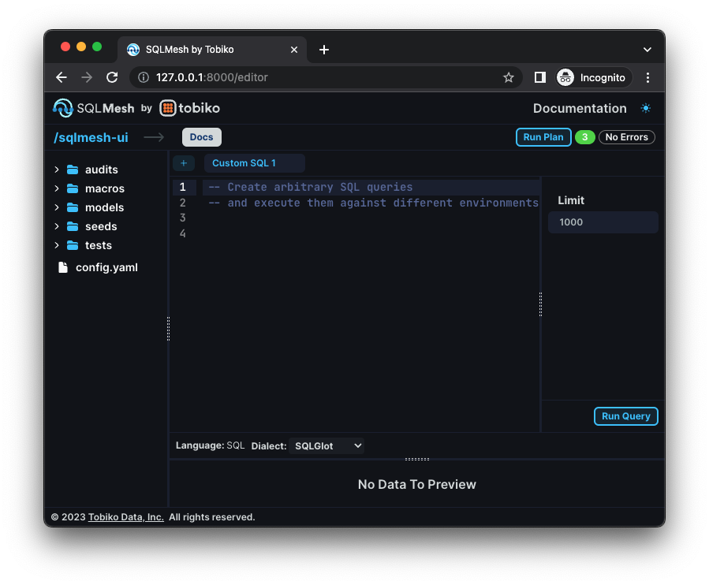

The SQLMesh UI default view contains five panes:

1. Project directory allows navigation of project directories and files.
2. Editor tabs displays open code editors.
3. Code editor allows viewing and editing code files.
4. Inspector provides settings and information based on recent actions and the currently active pane.
5. Details displays results of queries.

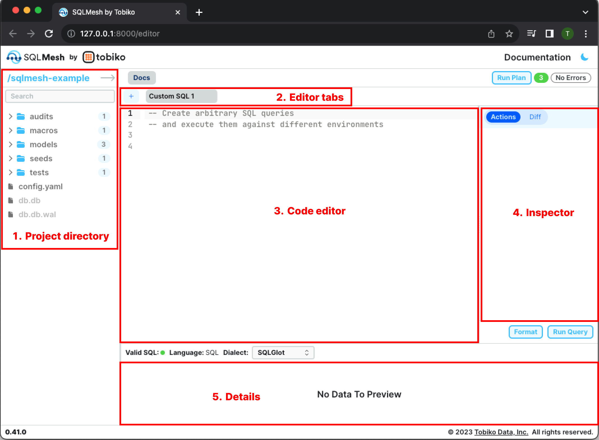

It also contains five buttons:

1. Add new tab opens a new code editor window.
2. Toggle Editor/Docs view toggles between the Code Editor (default) and Docs views.
3. Run plan command executes the [`sqlmesh plan` command](../reference/cli.md#plan).
4. Run query command executes the [`sqlmesh fetchdf` command](../reference/cli.md#fetchdf).
5. Change SQL dialect specifies the SQL dialect of the current tab for custom SQL queries. It does not affect the SQL dialect for the project.

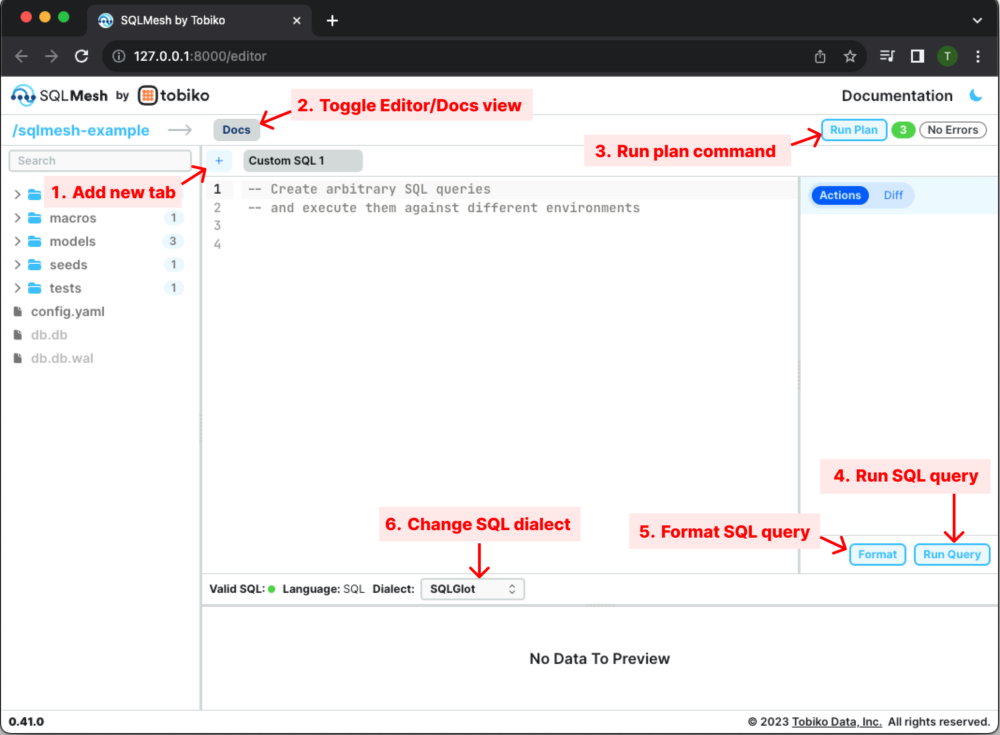

The default view contains three status indicators:

1. Editor tab language displays the programming language of the current code editor tab (SQL or Python).
2. Change indicator displays a summary of the changes in the most recently run SQLMesh plan.
3. Error indicator displays the count of errors that occurred in the most recently run SQLMesh plan.

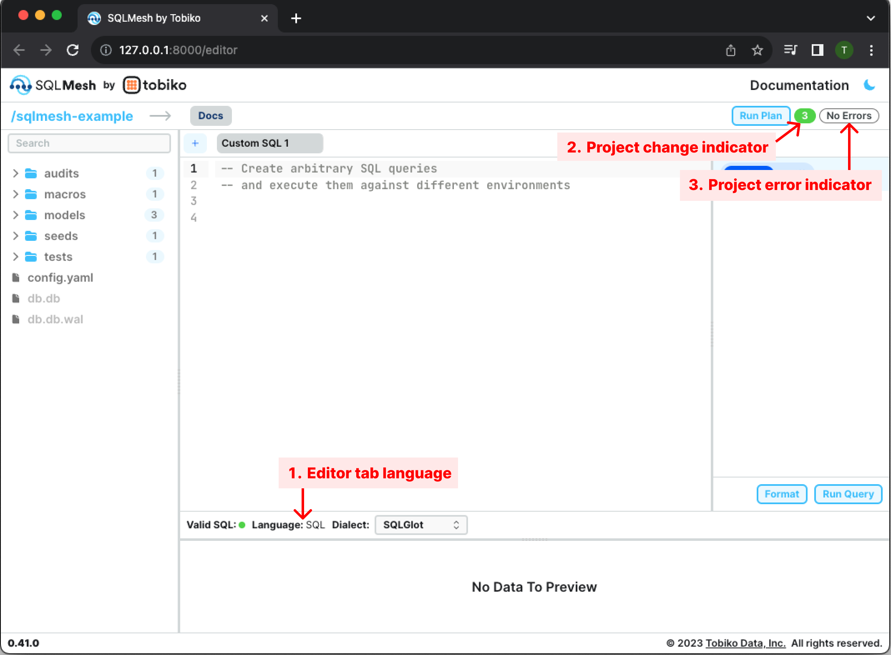

## 3. Plan and apply environments
### 3.1 Create a prod environment

SQLMesh's key actions are creating and applying *plans* to *environments*. At this point, the only environment is the empty `prod` environment.

The first SQLMesh plan must execute every model to populate the production environment. Click the blue `Run Plan` button in the top right, and a new pane will open on the right side.

The pane contains multiple pieces of information about the plan:

- The pane title on the top left states that the plan's target environment is `prod`. The error indicator on the top right shows that the plan has no errors associated with it.
- The `Initializing Prod Environment` section shows that the plan is initializing the `prod` environment.
- The `Tests` section notes that the plan successfully executed the project's test `tests/test_full_model.yaml` with duckdb.
- The `Models` section shows that SQLMesh detected three new models added relative to the current empty environment.
- In the `Backfill` section, the `Needs Backfill` sub-section lists each model that will be executed by the plan, along with the date intervals that will be run. Both `full_model` and `incremental_model` show `2020-01-01` as their start date because:

    1. The incremental model specifies that date in the `start` property of its `MODEL` statement and
    2. The full model depends on the incremental model

    The `seed_model` date range begins on the same day the plan was made because `SEED` models have no temporality associated with them other than whether they have been modified since the previous SQLMesh plan.

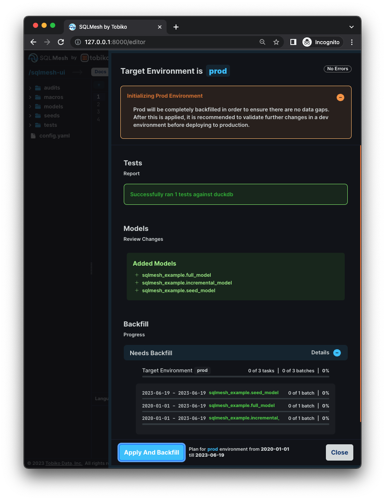

Click the blue button labeled `Apply And Backfill` to apply the plan and initiate backfill. The `Backfill` section contents at the bottom will update.

The updated backfill output shows the operation's completion status. The first progress indicator shows the total number of tasks and completion percentage for the entire backfill operation. The remaining progress bars show completion percentage and run time for each model (very fast in this simple example).

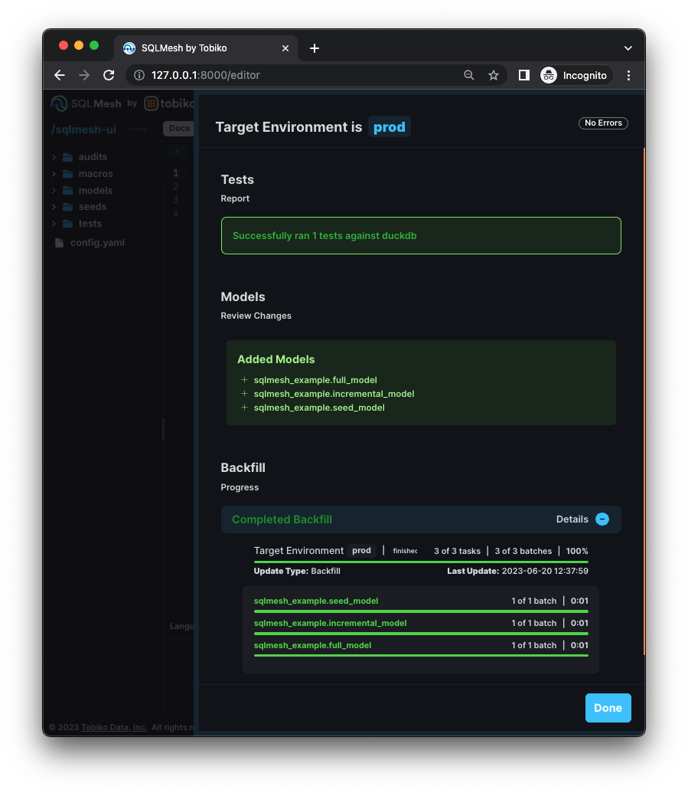

Click the blue `Done` button to close the pane.

You've now created a new production environment with all of history backfilled.

### 2.2 Create a dev environment
Now that you've created a production environment, it's time to create a development environment so that you can modify models without affecting production.

Open the environment menu by clicking the button labeled `prod \/` next to the blue `Run plan` button on the top right. Type `dev` into the Environment field and click the blue `Add` button.

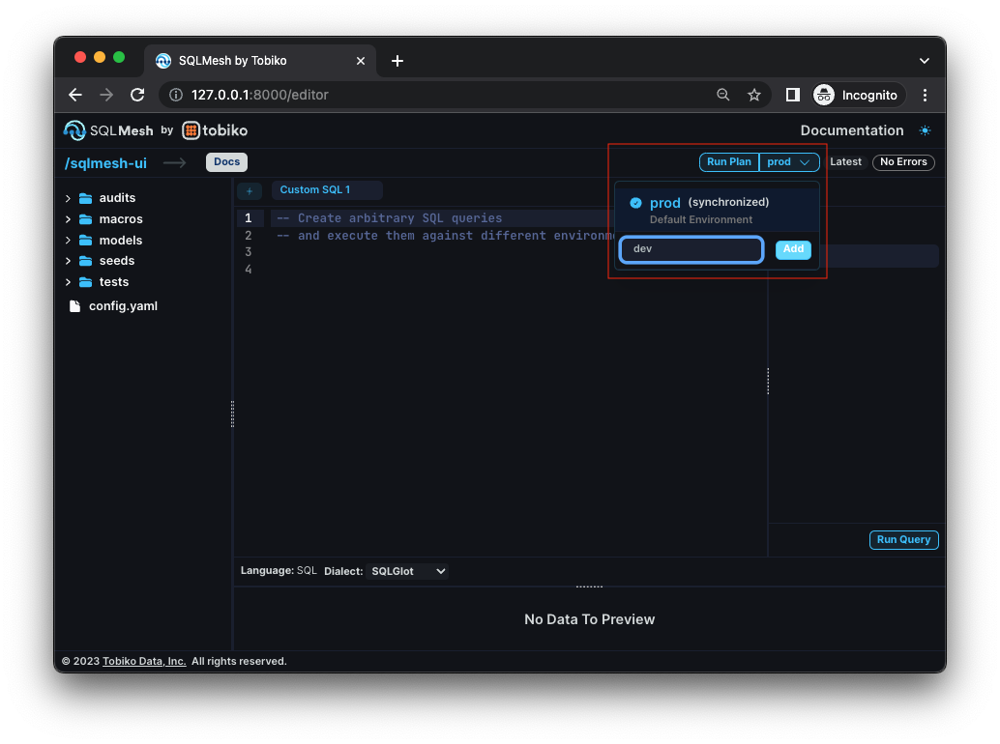

The button now shows that the SQLMesh UI is working in the `dev` environment:

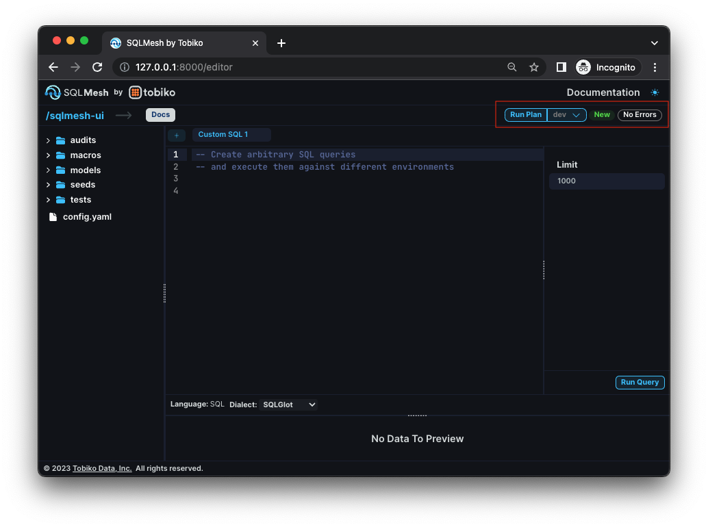

Click the `Run Plan` button, and a new pane will open:

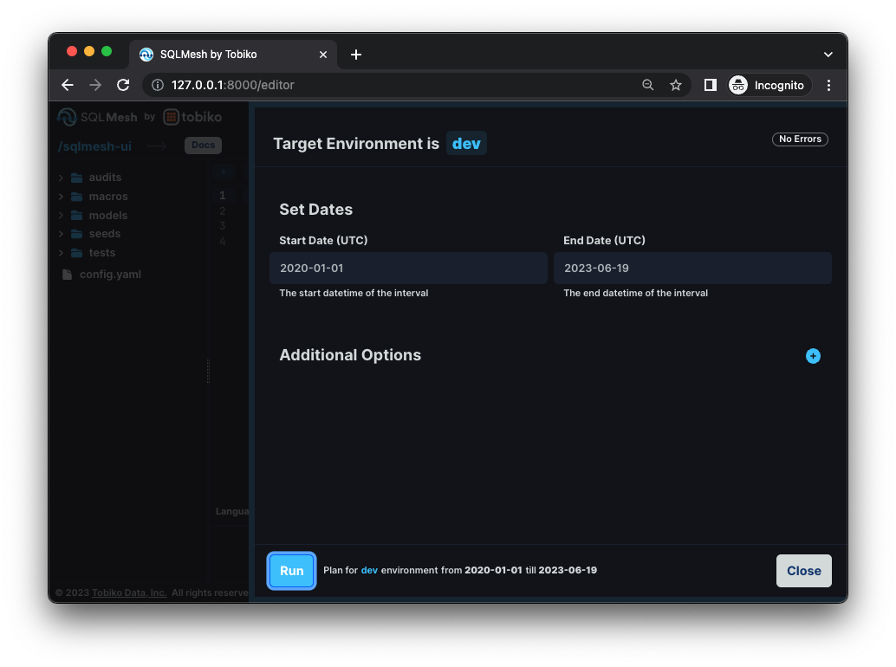

The pane title on the top left states that the plan's target environment is now `dev`. The error indicator on the top right shows that the plan has no errors associated with it.

The output does not list any added or modified models because `dev` is being created from the existing `prod` environment without modification.

Dates in the `Set Dates` section are automatically populated based on the `prod` environment.

The `Additional Options` section can be opened to display detailed configuration options for the plan.

Click the blue `Run` button to create the new plan:

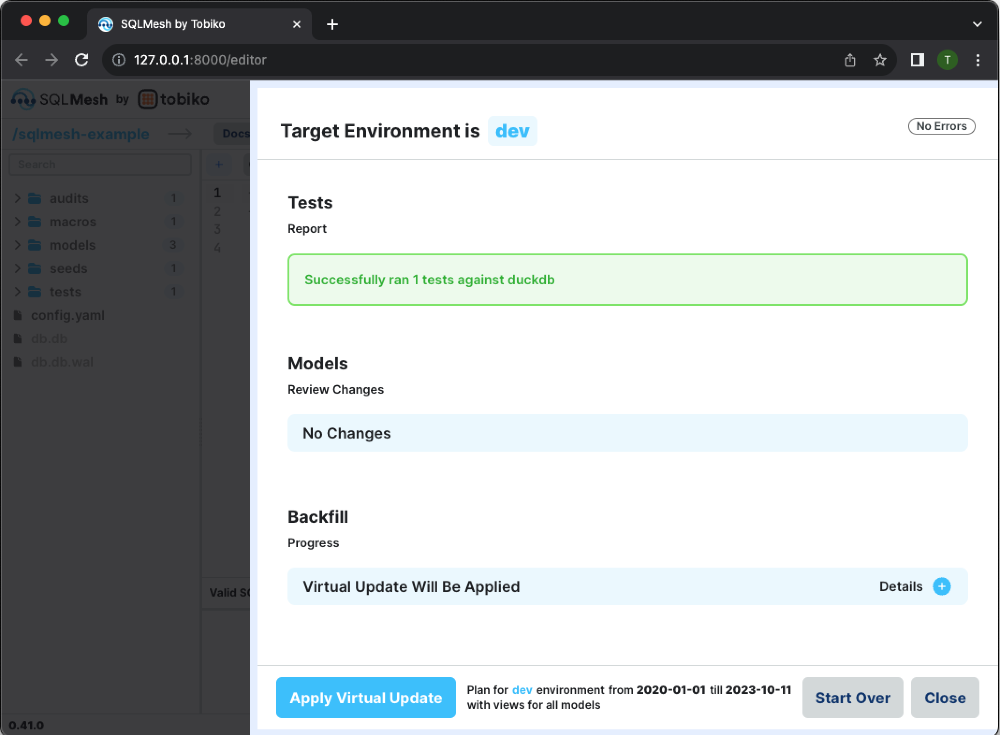

The `Backfill` section shows that only a virtual update will occur.

Click the blue `Apply Virtual Update` button to perform the virtual update:

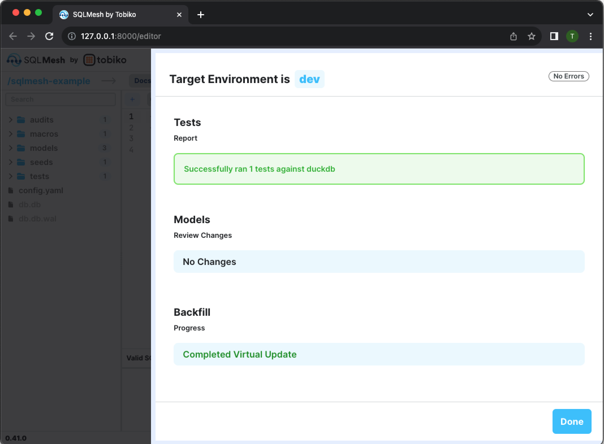

The output confirms that the virtual update has completed. Click the blue `Done` button to close the pane.

## 3. Make your first update

Now that we have have populated both `prod` and `dev` environments, let's modify one of the SQL models, validate it in `dev`, and push it to `prod`.

### 3.1 Edit the configuration
To modify the incremental SQL model, open it in the editor by clicking on it in the project directory pane.

The inspector pane on the right now shows the `Actions` tab, where you can specify parameters and [`Evaluate`](../reference/cli.md#evaluate) the SQLMesh model. The `Docs` tab displays information about the model query, including its columns and the rendered query.

The `Details` pane at the bottom displays the project's table and column lineage.


Modify the incremental SQL model by adding a new column to the query. Press `Cmd + S` (`Ctrl + S` on Windows) to save the modified model file and display the updated lineage:


## 4. Plan and apply updates
Preview the impact of the change by clicking the `Run Plan` button in the top right.

Click the blue `Run` button in the newly opened pane, and the updated plan information will appear:

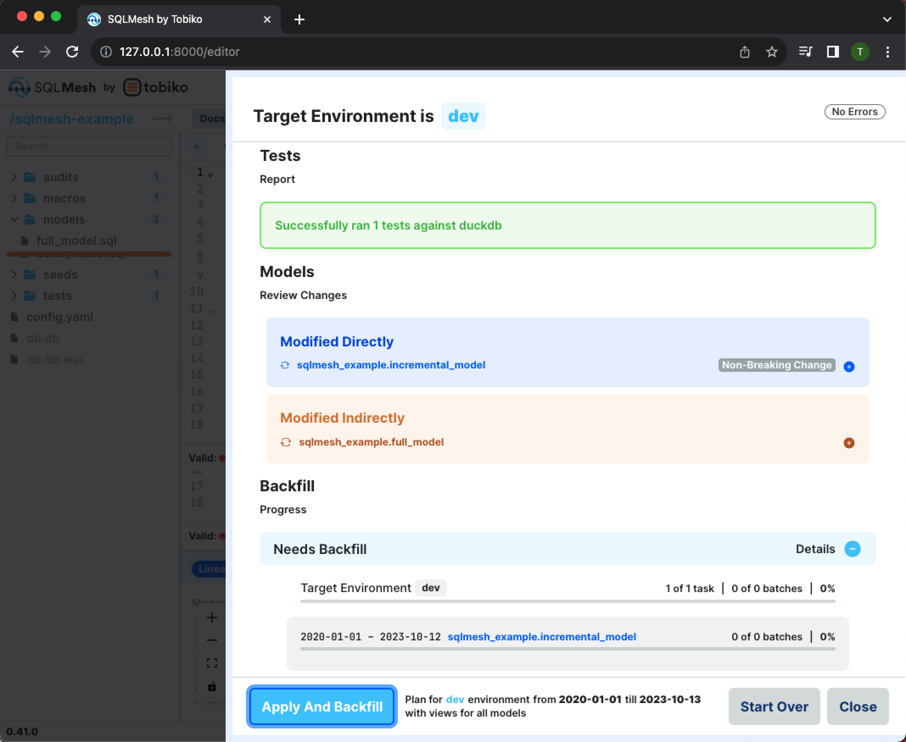

The `Test` output section notes that `plan` successfully executed the project's test `tests/test_full_model.yaml` with duckdb.

The `Models` section detects that we directly modified `incremental_model` and that `full_model` was indirectly modified because it selects from the incremental model. SQLMesh understood that the change was additive (added a column not used by `full_model`) and was automatically classified as a non-breaking change.

The `Backfill` section describes the models requiring backfill, including the incremental model from our start date `2020-01-01`. Click the blue `Apply And Backfill` button to apply the plan and execute the backfill:

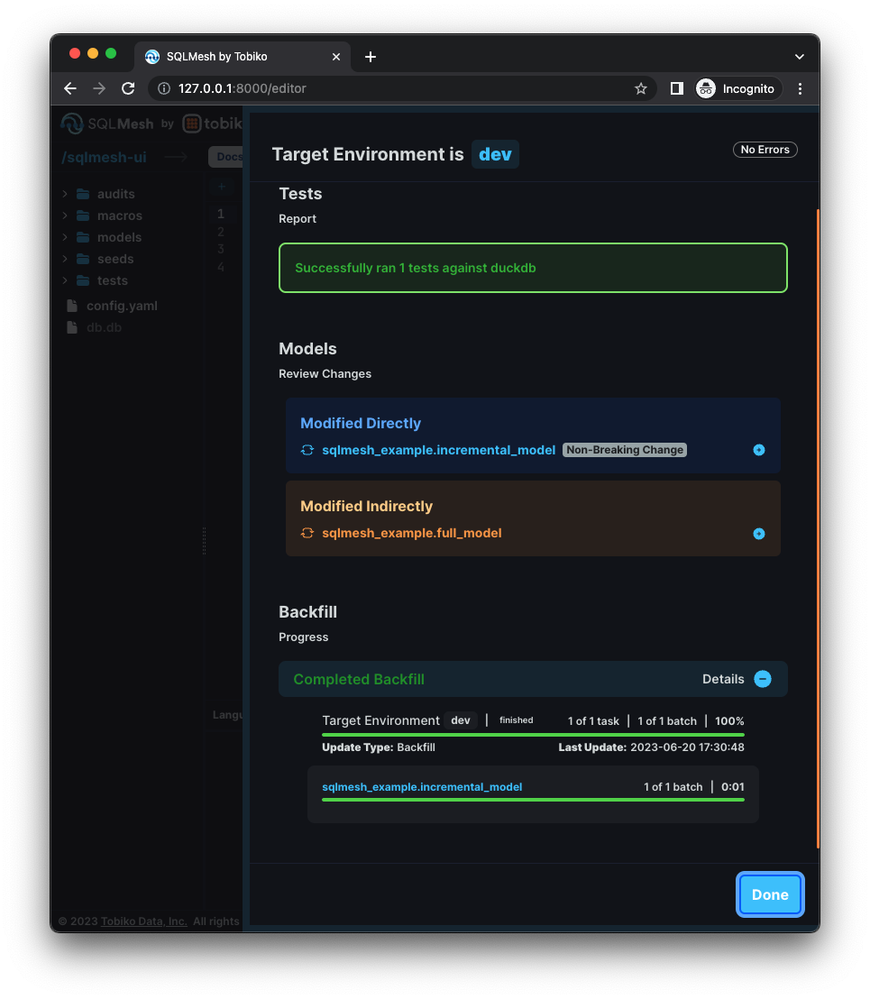

SQLMesh applies the change to `sqlmesh_example.incremental_model` and backfills the model. The `Backfill` section shows that the backfill completed successfully.

### 4.1 Validate updates in dev
You can now view this change by querying data from `incremental_model`. Add the SQL query `select * from sqlmesh_example__dev.incremental_model` to the Custom SQL 1 tab in the editor:


Note that the environment name `__dev` is appended to the schema namespace `sqlmesh_example` in the query: `select * from sqlmesh_example__dev.incremental_model`.

Click the `Run Query` button in the bottom right to execute the query:

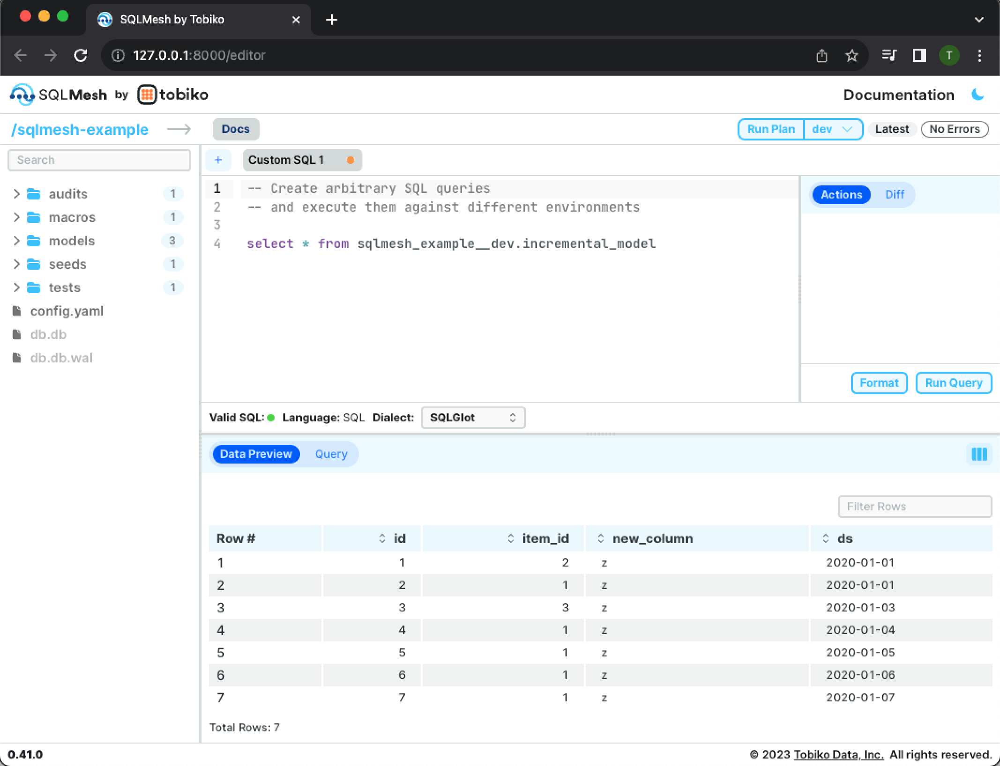

You can see that `new_column` was added to the dataset. The production table was not modified; you can validate this by modifying the query so it selects from the production table with `select * from sqlmesh_example.incremental_model`.

Note that nothing has been appended to the schema namespace `sqlmesh_example` because `prod` is the default environment.


The production table does not have `new_column` because the changes to `dev` have not yet been applied to `prod`.

### 4.2 Apply updates to prod
Now that we've tested the changes in dev, it's time to move them to prod. Open the environment menu in top right and select the `prod` environment:


Click the `Run Plan` button, and a warning screen will appear:


Click the `Yes, Run prod` button to proceed, and the run plan interface will appear:


Click the `Run` button, and the apply plan interface will appear:


Click the blue `Apply Virtual Update` button to apply the plan and execute the backfill:


Note that a backfill was not necessary and only a Virtual Update occurred. Click the blue `Done` button to close the pane.

### 4.3. Validate updates in prod
Double-check that the data updated in `prod` by re-running the SQL query from the editor. Click the `Run Query` button to execute the query:


`new_column` is now present in the `prod` incremental model.

## 5. Next steps

Congratulations, you've now conquered the basics of using SQLMesh!

From here, you can:

* [Set up a connection to a database or SQL engine](../guides/connections.md)
* [Learn more about SQLMesh concepts](../concepts/overview.md)
* [Join our Slack community](https://tobikodata.com/slack)