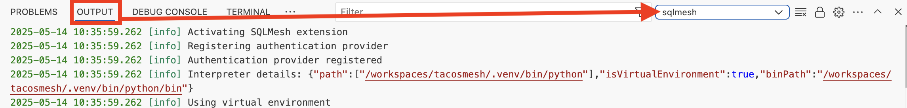
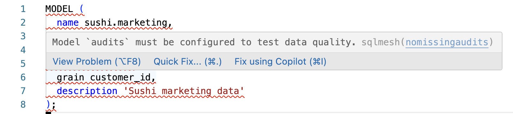

# Visual Studio Code Extension

> The extension is currently in **preview** and as such is subject to change. You may also encoutnter bugs and api incompatibilities with the SQLMesh version you are running.  We encourage you to try it and raise any issues [here](https://github.com/tobikodata/sqlmesh/issues).

In this quickstart guide, you'll set up the SQLMesh extension in Visual Studio Code, we'll show you the capabilities of the extension and how to troubleshoot common issues. 

## Installation

Installation is done through the VSCode extension marketplace, search for `SQLMesh` and install the extension from the [marketplace](https://marketplace.visualstudio.com/items?itemName=tobikodata.sqlmesh). For a more in depth guide on how to install extensions, see the [VSCode documentation](https://code.visualstudio.com/docs/configure/extensions/extension-marketplace#_install-an-extension).

### Recommended setup

While installing the extension is simple, setting up a python environmnt correctly is a bit more involved. We do recommend using a dedicated *python virtual environment* to install SQLMesh. For a complete guide visit the [python documentation](https://docs.python.org/3/library/venv.html) but the following steps will create the virtual environment, activate it and install SQLMesh for both a SQLMesh core setup and a Tobiko Cloud setup.

#### SQLMesh Core

 but as a summary you can do the following, which will create the virtual environment, activate it and install SQLMesh:

```bash
python -m venv .venv
source .venv/bin/activate
pip install 'sqlmesh[lsp]'
```

Once you have the virtual environment, you can make sure that Visual Studio Code is using the correct python interpreter by going to the [command palette](https://code.visualstudio.com/docs/getstarted/userinterface#_command-palette) and running `Python: Select Interpreter`. Select the python executable in the virtual environment.


Once that's done, you can validate that the extension is correctly using the virtual environment by checking the `sqlmesh` output channel in the [output panel](https://code.visualstudio.com/docs/getstarted/userinterface#_output-panel) which details the python path and the details of your SQLMesh installation and looks as follows:



#### Tobiko Cloud

For Tobiko Cloud, the tcloud utility is used to install SQLMesh, so you'll need to set up a python environment, activate it and install SQLMesh using the tcloud utility as follows.

```bash
python -m venv .venv
source .venv/bin/activate
pip install tcloud
```

Once you have the virtual environment, you can make sure that Visual Studio Code is using the correct python interpreter by going to the [command palette](https://code.visualstudio.com/docs/getstarted/userinterface#_command-palette) and running `Python: Select Interpreter`. Select the python executable in the virtual environment.


You can use the `tcloud` commands in your terminal to do the operations as usual or the extension exposes the same commands through the command pallette under the following commands: 
- `Sign in to Tobiko Cloud`
- `Sign out of Tobiko Cloud`

## Features

### Lineage 

The extension adds a lineage view to the SQLMesh models. To view the lineage of a model, use the `Lineage` tab in the panel as shown below:


### Commands

The extension exposes the following commands through the command palette:

- `Sign in to Tobiko Cloud`
- `Sign out of Tobiko Cloud`
- `Format SQLMesh project`

### LSP Features 

The SQLMesh LSP adds a number of features to the editor: 

**Completion**

When writing SQL models, keywords or model names, you should see a completion suggestion.


**Go to definition and hover information**

The SQLMesh LSP adds a definition provider for SQLMesh models. When you hover over a model name, you should see a tooltip with the model description and on click you will be taken to the model definition.

**Diagnostics**

The SQLMesh LSP adds a diagnostic provider for your SQLMesh project. If you have the SQLMesh linter enabled, issues will be reported in your editor. This works for both SQLMesh built in rules and custom rules.



**Formatting**

The SQLMesh LSP also adds a formatting provider for SQLMesh models. When you write SQL models, you should see the model formatted correctly.

## Troubleshooting

### LSP extensions

When installing SQLMesh, some dependencies that are required by the extension are not installed by default. You can install them by running the following command in your terminal. Specifying the `[lsp]` flag will install the dependencies required by the extension.

```bash
pip install 'sqlmesh[lsp]'
```

If you are in a cloud environment, you can make sure the extension requirements are correctly installed by adding `lsp` to the list of extras required in the `tcloud.yaml` file.

### Python environment woes

The most common issue is that the extension is not using the correct python interpreter. We recommend following the [recommended setup](#recommended-setup) to ensure that the extension is using the correct python interpreter. If you have checked the `sqlmesh` output channel and the extension is still not using the correct python interpreter, please raise an issue [here](https://github.com/tobikodata/sqlmesh/issues).

### SQLMesh compatibility

While the extension is in preview and the APIs to the underlying SQLMesh version are not stable, we do not guarantee compatibility between the extension and the SQLMesh version you are using. If you encounter an issue, please raise an issue [here](https://github.com/tobikodata/sqlmesh/issues).

