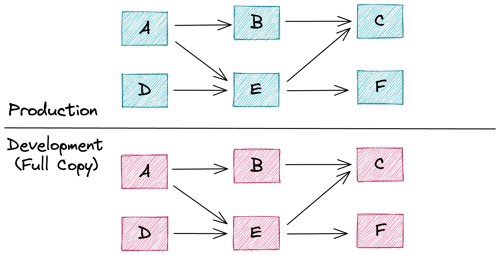
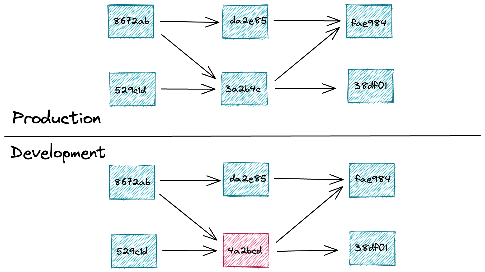
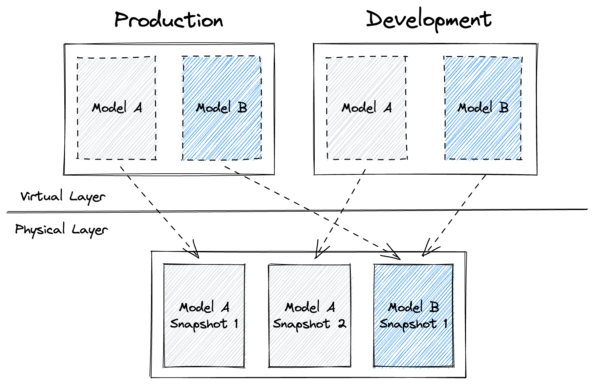
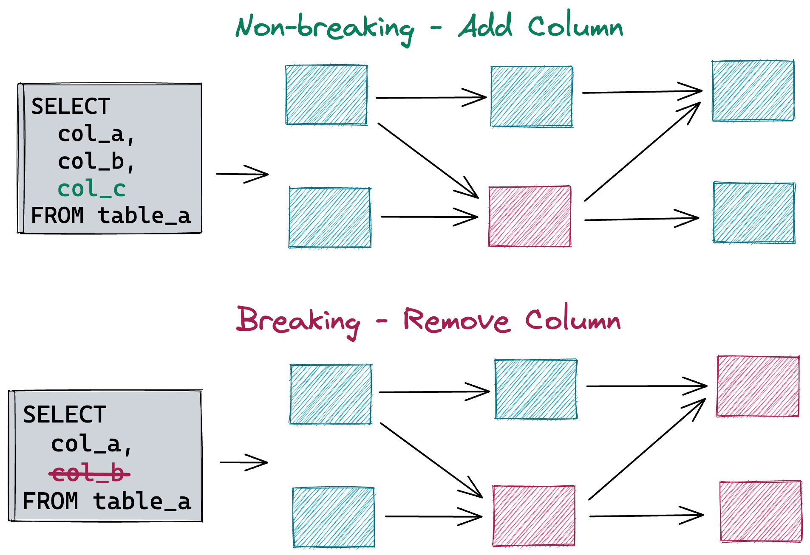
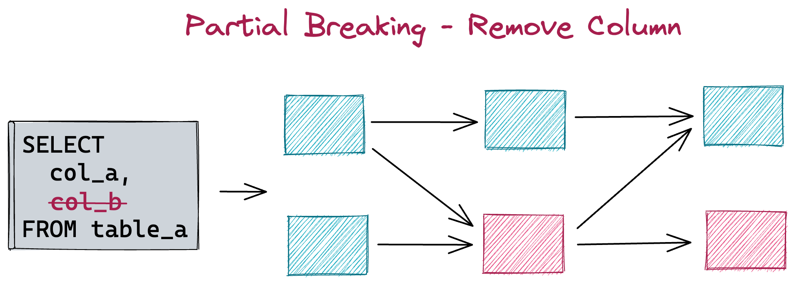
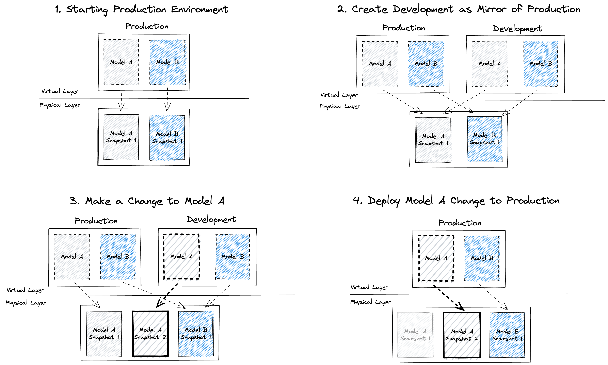

# Virtual Data Environments
*by [Iaroslav Zeigerman](https://github.com/izeigerman), [Tobiko Data Team](https://tobikodata.com/)*

In this post, I'm going to explain why existing approaches to managing development environments for data lead to low productivity and increased costs because they are:
- **Inefficient** - creating new environments is usually associated with additional compute and storage costs. Deploying changes to production after they’ve been tested involves additional overhead.
- **Non-scalable** - managing multiple environments and concurrent changes is a manual process that is time-consuming and error-prone, especially in bigger organizations.
- **Unsafe** - there are no guarantees that results observed during development are reproducible on production, especially when deploying changes concurrently.

I'll introduce [Virtual Data Environments](#virtual-data-environments-1) - a novel approach that provides low-cost, efficient, scalable, and safe data environments that are easy to use and manage. They significantly boost the productivity of anyone who has to create or maintain data pipelines.

Finally, I’m going to explain how **Virtual Data Environments** are implemented in [SQLMesh](https://github.com/TobikoData/sqlmesh) and share details on each core component involved:
- Data [fingerprinting](#fingerprinting)
- [Automatic change categorization](#automatic-change-categorization)
- Decoupling of [physical](#physical-layer) and [virtual](#virtual-layer) layers

## Environments for Data
Environments are a common technique in both software and data to allow developers to safely validate and deploy their changes. Software engineers, through innovations in virtualization (eg. Docker) and orchestration (eg. Kubernetes), have been reliably and efficiently doing this for many years now.

Data teams have some of these benefits but lack key innovations to work at the level of efficiency and reliability that software engineers enjoy. **Virtual Data Environments** fill this gap.

### Current Landscape
Environments are routinely used by data practitioners. For example, **dbt** allows its users to configure different *targets* — connections to different schemas within a Data Warehouse or even separate Data Warehouses instances altogether.

**dbt**’s approach is sufficient for deploying data pipelines into separate environments for development / testing, staging, and production, while ensuring that changes are only applied to the target environment and leave datasets in other environments unaffected.

*Figure 1: Isolated but rigid Data Warehouse environments*

However, this development process becomes troublesome as an organization grows in size and multiple users begin to iterate and push changes (oftentimes concurrently). Some of the challenges include:

1. Populating different environments with data is hard. Generally, there are four approaches:

    - Create a complete copy of data used in the production environment
    - Create a subset of production data by downsampling it
    - Use static test datasets
    - Generate datasets using random values

   The first approach is extremely compute-intensive (not to mention the storage overhead) and drives up cost. The remaining three are not sufficient to get an adequate preview of the impact the changes would have if applied to production data.

2. When pipeline changes are deployed to production, they need to be reapplied in that environment. This leads to additional recomputation and the risk of getting results that are different from the ones observed in the development environment.

3. Changes are not reflected immediately once deployed to production. This means there is a period of inconsistency between the code and data generated by it.

#### Stateful Development Environments

Some tools go one step further and allow their users to create snapshots of the current state of the environment based on the raw contents of source files of the pipelines deployed there.

This approach helps determine which pipelines have been modified in the new environment and allows users to reuse the unmodified portion of production datasets as part of their development environment.

Variations of this approach can be seen in dbt’s [state](https://docs.getdbt.com/docs/deploy/project-state) + [defer](https://docs.getdbt.com/reference/node-selection/defer) method and Fivetran’s [“smart runs”](https://www.fivetran.com/blog/how-we-execute-dbt-runs-faster-and-cheaper).

*Figure 2: Detecting changes by comparing the raw contents of source files*

This approach, though clearly an improvement, still has several shortcomings:
- Users are not informed about the **indirect** impact their changes have on downstream datasets, so they are forced to rely on their judgment and choose to either recompute the entire dependency graph (correctness) or recompute modified datasets only (efficiency). Anything in between requires careful manual intervention on the user’s part, which is error-prone and doesn’t scale to large dependency graphs.
- Existing datasets can be reused when creating new development environments, but not when deploying changes to production. As mentioned earlier, this leads to changes being recomputed all over again without any guarantee of yielding the same results. Meanwhile, existing production data and deployed code remain out of sync for the duration of the recomputation.
- State is discarded once the changes are deployed to production, making it impossible to reuse previously built datasets when reverting applied changes.

I will demonstrate that there doesn’t have to be a tradeoff between correctness and efficiency. Both can be achieved without compromising either.

### Correctness or Efficiency… Why not both?
In the sections that follow, I’m going to explain how **Virtual Data Environments** work and how they help users achieve both correctness and efficiency through the following features:
- Creating safe and isolated development environments is fast and comes at almost no additional cost.
- New environments are populated with representative data right away. No action from users or extensive data copying is needed.
- The impacts of changes are identified automatically so that all (and only) affected downstream dependencies can be recomputed.
- Multiple versions of the same datasets coexist at the same time, making it trivial to roll changes back / forward.
- Datasets prebuilt in the development environment can safely be reused when deploying changes to production. This prevents any surprises when going from development to production.
- Changes deployed to production are reflected on underlying datasets immediately. Therefore, production data and the code that generates it are always in sync.

## Virtual Data Environments
When spinning up new data environments cheaply and easily, the primary challenge is populating new environments with representative data.

"Representative", in this case, means that data necessary to preview and adequately assess the impact the proposed changes would have on production datasets. Thus, it's only reasonable to conclude that the most representative datasets are the production ones themselves.

Therefore, we can state the problem as "how can we share datasets across environments while ensuring that no changes applied in one environment impact any existing datasets in all other environments?"

More generally, we're looking for a way to **reuse** existing data when appropriate to get an accurate **preview** of proposed changes in a fully **isolated** manner.

SQLMesh’s Virtual Data Environments achieve exactly this thanks to the following aspects of the platform:
- Each dataset managed by the platform is populated by a logic defined as a [model](https://sqlmesh.readthedocs.io/en/stable/concepts/models/overview/) using either SQL or Python. Every time a change to an existing model is made, a new [snapshot](https://sqlmesh.readthedocs.io/en/stable/concepts/architecture/snapshots/) of this model gets created and associated with a unique [fingerprint](https://sqlmesh.readthedocs.io/en/stable/concepts/architecture/snapshots/#fingerprinting). The fingerprint itself is a combination of hashes computed on the attributes that constitute a model. By default, each model snapshot writes into its own unique table (or updates its own unique view), so multiple versions of a model can exist at the same time without causing conflicts.
- The platform doesn't expose datasets (physical tables or views) populated with model snapshots directly. Instead, it provides access to them through a layer of indirection implemented using [views](https://en.wikipedia.org/wiki/View_(SQL)). This way, updating a dataset version in production becomes the atomic and almost instantaneous operation of updating a view associated with it by swapping the source it points to. The best part is that this operation is completely transparent to downstream consumers who always refer to a view and never to an underlying physical table. I refer to the layer of indirection powered by views as the **virtual layer**, while the layer of tables and views populated directly with model snapshots is called the **physical layer**.

*Figure 3: Environments managed through the virtual layer*

These two properties combined constitute **Virtual Data Environments**.

### Model Snapshots
As mentioned earlier, every time a model changes a new model snapshot is created to capture the change. Each snapshot represents the state of a model at the time the snapshot was generated. In SQLMesh, snapshots are generated automatically when a new [plan](https://sqlmesh.readthedocs.io/en/stable/concepts/plans/) is created and applied.

#### Fingerprinting
Each snapshot is uniquely identified by its "fingerprint". A fingerprint consists of the following attributes:
- The data hash of the model is computed from the model attributes that have a direct impact on the dataset produced by this model. The attributes include the model's query, storage format, partitioning scheme, etc. When this hash changes, the model is considered to be modified **directly**.
- The data hash of upstream models. This is the same data hash calculation applied to models upstream of the current model, which captures data changes caused by the model's dependencies. When this hash changes the model is considered to be modified **indirectly**.
- The metadata hash of the model is based on model attributes that have no impact on data itself. This includes metadata like ownership information, descriptions, comments, etc.
- The metadata hash of upstream models captures metadata changes in model's dependencies.

Additionally, thanks to the [SQLGlot optimizer](https://github.com/tobymao/sqlglot/blob/main/posts/python_sql_engine.md#optimizing) we’re able to create a canonical version of each SQL query, so that non-functional changes like formatting or structural refactoring don’t impact the fingerprint.

#### Automatic Change Categorization
The difference between **direct** and **indirect** modifications becomes relevant when [categorizing](https://sqlmesh.readthedocs.io/en/stable/concepts/plans/#change-categories) individual changes during plan creation.

Every time a model is modified directly, SQLMesh automatically categorizes the change as “breaking” (downstream models are affected) or “non-breaking” (only the modified model is affected) based on the change’s impact on downstream models. This is possible due to the platform’s ability to understand SQL semantically, at the [AST](https://en.wikipedia.org/wiki/Abstract_syntax_tree) level. By comparing the current model version with the previous one we’re able to compute a [semantic diff](https://github.com/tobymao/sqlglot/blob/main/posts/sql_diff.md), which SQLMesh further analyzes to understand the impacts it would have on downstream models.

For example, adding a new column is not considered to be a breaking change, but removing or modifying the existing one is.

*Figure 4: Breaking vs. non-breaking changes*

This way SQLMesh automatically reduces the amount of necessary recomputation to a minimum while guaranteeing correctness. No user intervention needed.

Currently, this approach doesn’t extend beyond looking at each model as a whole. Soon, however, SQLMesh will categorize changes per *individual column* instead, thanks to its ability to determine column-level lineage.

This will allow an even finer balance between correctness and efficiency, since changes like removing a column that is not referenced downstream will no longer be categorized as “breaking.”

*Figure 5: Column-level change categorization*

#### Physical Layer
When a model is modified directly or indirectly, a new snapshot that captures the change gets associated with its own unique table (or view) in the **physical layer**, the name of which is based on the snapshot's fingerprint.

This means different versions of the same model can coexist and be evaluated at the same time without overriding each others' outputs. The platform keeps track of missing data intervals for each individual snapshot and automatically [backfills](https://sqlmesh.readthedocs.io/en/stable/concepts/plans/#backfilling) data gaps during the plan application.

Model snapshots alone are not enough, however, since we need to expose various dataset versions in different environments and be able to swap these versions on the fly without requiring changes to existing workflows. Both of these items are handled in the **virtual layer**.

### Virtual Layer
When a downstream consumer or workflow wants to access data produced by a model, they do so by querying a view that is part of the **virtual layer**.

Physical datasets generated by model snapshots are never accessed directly, which allows SQLMesh to update views to point to different dataset versions without affecting downstream consumers. Sort of like using a pointer or reference in programming.

If a snapshot is not referenced by any views in the **virtual layer**, it gets automatically garbage collected by the janitor process after a configurable period of time. Until then, it can be used to cheaply and quickly revert state to a previous point in time.

This idea is not new. Storage engines like [Iceberg](https://iceberg.apache.org/), [Delta Lake](https://delta.io/), and [Snowflake](https://www.snowflake.com/en/) implement something similar in the storage layer, which lets their users maintain multiple versions (a.k.a. snapshots) of tables and even create low-cost shallow clones of individual datasets.

Those versions/clones, however, are not tied in any way to underlying pipelines or a dependency graph that reference them, so users are responsible for correctly picking an appropriate copy. Additionally, the number of copies of the same dataset that can be created this way is rather limited.

Unlike those tools, SQLMesh uses the virtual layer approach to create and manage entire dataset graphs (as opposed to individual datasets), while keeping the implementation completely agnostic to the underlying storage technology.

Each [environment](https://sqlmesh.readthedocs.io/en/stable/concepts/environments/) in SQLMesh is just a collection of views, one per model, each pointing at a snapshot table in the **physical layer**. This works equally well with most Data Warehouse technologies, be it Iceberg, Delta Lake, Snowflake, BigQuery, or something else.

*Figure 6: Virtual Data Environments end-to-end*

Views that belong to environments other than production have an environment name attached as a suffix to the schema portion of their fully qualified names. For example, the `db.model_a` dataset is accessed using that name in the production environment, but in an environment named `test` the name `db__test.model_a` would be used instead. That's how changes can be **previewed** before making their way into production.

When a new environment is created, it uses the same set of snapshot table pointers as the production environment. Once changes are applied to the new environment, new model snapshots are generated and only the affected views are updated. Views that are part of the production environment remain unaffected. This is how SQLMesh ensures environment **isolation**.

Finally, if a model implementation hasn't changed in relation to production (either **directly** or **indirectly**), the platform can safely **reuse** the same snapshot table that is currently being used in the production environment. Similarly, new snapshot tables created during development can be safely reused when changes are promoted into production.

## Conclusions
With **Virtual Data Environments**, SQLMesh is able to provide fully **isolated** development environments with a complete **preview** of changes before they make it into production while **reusing** production datasets when it's appropriate and safe to do so. This, in turn, results in tangible benefits for users:
- Creating new environments is cheap since it only involves creating a new set of views.
- Data is immediately available in new environments thanks to the separation between **virtual** and **physical** layers.
- Changes and their downstream impacts are categorized automatically to achieve both efficiency and correctness.
- Rolling back a change happens almost instantaneously since no data movement is involved and only views that are part of the **virtual layer** get updated.
- Deploying changes to production is a **virtual layer** operation, which ensures that results observed during development are exactly the same in production and that data and code are always in sync.

To streamline deploying changes to production, our team is about to release the SQLMesh [CI/CD bot](https://github.com/TobikoData/sqlmesh/blob/main/docs/integrations/github.md), which will help automate this process.

Don't miss out - join our [Slack channel](https://tobikodata.com/slack) and stay tuned!
