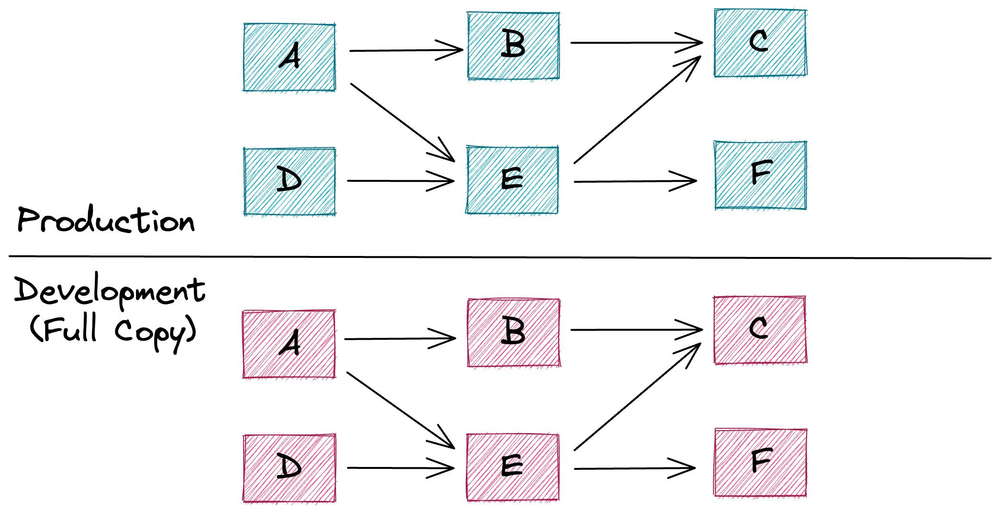

# Virtual Environments for Data
*by [Iaroslav Zeigerman](https://github.com/izeigerman), [Tobiko Data Team](https://tobikodata.com/)*

The existing approaches to managing development environments for data are any or all of the following:
- **Inefficient** - creating new environments is usually associated with additional compute and storage costs. Deploying changes to production after they’ve been tested involves more overhead on top of that.
- **Non-scalable** - managing multiple environments and concurrent changes is a manual process that is time-consuming and error-prone, especially in bigger organizations.
- **Unsafe** - there are no guarantees that results observed during development are reproducible on production, especially when deploying changes concurrently.

In this post we introduce a novel approach that provides low-cost, efficient, scalable and safe data environments that are easy to use and manage. This will significantly boost the productivity of anyone who has to create and maintain data pipelines.

## Environments for Data
Environments are used in both software and data to enable developers to safely deploy and validate their changes. Software engineers, through innovations in virtualization (Docker) and orchestration (Kubernetes), have been reliably and efficiently doing this for many years now.

Data teams have some of these benefits but are lacking key innovations to work at the level of efficiency and reliability that software engineers enjoy. [SQLMesh](https://github.com/TobikoData/sqlmesh) offers those innovations.

### Current Landscape
Environments are routinely used by data practitioners. Tools like **dbt** allow its users to configure different *targets* - connections to different schemas within a Data Warehouse or even separate Data Warehouses instances altogether.

Existing approaches are sufficient for deploying data pipelines into separate environments for development / testing, staging and production, while ensuring that changes are only applied to the target environment and leave datasets in other environments unaffected.

*Figure 1: Isolated but rigid Data Warehouse environments.*

However, this development process becomes troublesome as an organization grows in size and multiple users begin to iterate and push changes (oftentimes concurrently). Some of the challenges include:
- Populating different environments with data is hard. Generally there are four ways to do this: create a complete copy of data used in the production environment, create a subset of production data by downsampling it, use static test datasets or generate datasets using random values. The first approach is extremely compute-intensive and hence very costly (not to mention the associated storage overhead). The remaining three are not sufficient to get an adequate preview of the impact the changes would have when applied to production data.
- When pipeline changes are deployed to production they need to be-reapplied in that environment all over again which leads to additional recomputation and the risk of getting results that are different from the ones observed in the development environment.
- Furthermore, changes are not reflected immediately once deployed to production. This means  there exists a period of inconsistency between the code and data generated by it.

#### Stateful Development Environments

Other tools take this approach further and allow their users to create snapshots of the current state of the environment based on the contents of source files of pipelines deployed there. This helps determine which pipelines have been modified in the new environment and allows users to reuse the unmodified portion of production datasets as part of their development environment. Some variation of this approach can be seen in the dbt’s [state](https://docs.getdbt.com/docs/deploy/project-state) + [defer](https://docs.getdbt.com/reference/node-selection/defer) method and the Fivetran’s [“smart runs”](https://www.fivetran.com/blog/how-we-execute-dbt-runs-faster-and-cheaper).

*Figure 2: Detecting changes by comparing the contents of source files.*

However, due to the lack of semantic understanding of the *impact* changes have on downstream datasets as well as the environment isolation technique described earlier, users are left on their own with the following challenges:
- Without informing a user about the *indirect* impact their changes have on downstream datasets, they are forced to rely on their judgment and choose to either recompute the entire dependency graph (correctness) or recompute modified datasets only (efficiency). Anything in-between requires careful manual intervention on the user’s part, which is very error-prone and doesn’t scale to large dependency graphs.
- Existing datasets can be easily reused when creating new development environments, but not when deploying changes back to production. As mentioned earlier, this leads to changes being re-applied all over again without any guarantee of yielding the same results. Meanwhile existing production data and deployed code remain out of sync for the duration of this recomputation.

We’re going to show that there shouldn’t be a tradeoff between correctness and efficiency. Both can be achieved without compromising each other.

### Correctness or Efficiency… Why not both?
In the sections that follow, we introduce the concept of **Virtual Environments** - a low-cost, efficient and safe way to test changes and deploy them back into production. We’re going to demonstrate how it helps users realize the following benefits:
- Creation of safe and isolated development environments is fast and comes at almost no additional cost.
- New environments are populated with representative data right away. No action from a user or extensive data copying is needed.
- The impact of changes is identified automatically so that all affected downstream dependencies can be recomputed.
- Multiple versions of the same datasets coexist at the same time, making it a trivial operation to roll changes back / forward.
- Datasets prebuilt in the development environment can safely be reused when deploying changes to production. This prevents any surprises when going from development to production.
- Changes deployed to production are reflected on underlying datasets immediately. Therefore production data and the code that generates it are always in sync.

## Virtual Environments
When it comes to spinning up new data environments cheaply and easily, the primary challenge becomes populating such new environments with representative data. By "representative" we mean data necessary to preview and adequately assess the impact the proposed changes would have on production datasets. Thus it's only reasonable to conclude that the most representative datasets are the production ones.

Therefore we can define the problem statement as "how can we share datasets across environments while ensuring that no changes applied in one environment impact any existing datasets in all other environments". More generally, we're looking for a way to **reuse** existing data when appropriate to get an accurate **preview** of proposed changes in a fully **isolated** manner.

With SQLMesh’s Virtual Environments we achieve exactly this thanks to the following aspects of the platform:
- Each dataset managed by the platform is populated by a logic defined as a [model](https://sqlmesh.readthedocs.io/en/stable/concepts/models/overview/) using either SQL or Python. Every time a change to an existing model is made a new [snapshot](https://sqlmesh.readthedocs.io/en/stable/concepts/architecture/snapshots/) of this model gets created and associated with a unique [fingerprint](https://sqlmesh.readthedocs.io/en/stable/concepts/architecture/snapshots/#fingerprinting). The fingerprint itself is a combination of hashes computed using attributes that constitute a model. By default each model snapshot writes into its own unique table (or updates its own unique view), which means that multiple versions of a model can coexist at the same time without causing conflicts.
- The platform doesn't expose datasets (tables or views) populated with model snapshots directly. Instead it provides access to them through the layer of indirection implemented using [views](https://en.wikipedia.org/wiki/View_(SQL)). This way updating a dataset version becomes an atomic and almost instantaneous operation of updating a view associated with it by swapping the source it points to. The best part is that this operation is completely transparent to downstream consumers who always refer to a view and never to an underlying table. We refer to the layer of indirection powered by views as the **virtual layer**, while the layer of tables and views populated directly with model snapshots is called the **physical layer**.

*Figure 3: Environments managed through the virtual layer.*

These two properties combined is what constitutes **virtual environments**.

### Model Snapshots
As mentioned earlier, every time a model changes a new model snapshot gets created to capture the change. Each snapshot represents the state of a model at the time when this snapshot was generated. In SQLMesh snapshots are generated automatically when a new [plan](https://sqlmesh.readthedocs.io/en/stable/concepts/plans/) is created and applied.

#### Fingerprinting
Each snapshot is uniquely identified by its "fingerprint". A fingerprint consists of the following attributes:
- The data hash of the model is based on model attributes that have a direct impact on the dataset produced by this model. Such attributes include the model's query, storage format, partitioning scheme, etc. When this hash changes the model is considered to be modified **directly**.
- The data hash of upstream models. This is the same data hash calculation logic but applied to models that are upstream from the current model in order to capture data changes caused by the model's dependencies. Similarly, when this hash changes the model is considered to be modified **indirectly**.
- The metadata hash of the model is based on model attributes that have no impact on data itself. This includes metadata like ownership information, descriptions, comments, etc.
- The metadata hash of upstream models captures metadata changes in model's dependencies.

Additionally, thanks to the [SQLGlot optimizer](https://github.com/tobymao/sqlglot/blob/main/posts/python_sql_engine.md#optimizing) we’re able to create a canonical version of each SQL query, so that non-functional changes like formatting or structural refactoring don’t impact the fingerprint.

#### Automatic Change Categorization
The difference between **direct** and **indirect** modifications becomes relevant when [categorizing](https://sqlmesh.readthedocs.io/en/stable/concepts/plans/#change-categories) individual changes during plan creation.

Every time a model is modified directly, SQLMesh automatically categorizes the change as “breaking” or “non-breaking” based on the change’s impact on models that are downstream from the modified one. This is possible thanks to the platform’s ability to understand SQL semantically, at the [AST](https://en.wikipedia.org/wiki/Abstract_syntax_tree) level. By comparing the current model version with the previous one we’re able to compute a [semantic diff](https://github.com/tobymao/sqlglot/blob/main/posts/sql_diff.md) which SQLMesh further analyzes to understand what kind of impact it would have on downstream models.

Thus, for example, adding a new column is not considered to be a breaking change but removing or modifying the existing one - is.

*Figure 4: Breaking vs. non-breaking changes.*

This way SQLMesh can automatically reduce the amount of necessary recomputation to a minimum while guaranteeing correctness. No user intervention needed.

Presently this approach doesn’t extend beyond looking at each model as a whole. Soon, however, we’ll be able to categorize changes per individual column instead, thanks to the platform’s support for column-level lineage. The platform will achieve an even finer balance between correctness and efficiency, since changes like removing a column that is not referenced downstream will no longer be categorized as a “breaking”.

*Figure 5: Column-level change categorization.*

#### Physical Layer
When a model is modified directly or indirectly, a new snapshot which captures the change gets associated with its own unique table (or a view) in the **physical layer**, the name of which is based on the snapshot's fingerprint. Thus different versions of the same model can coexist and be evaluated at the same time without overriding each others' outputs. The platform keeps track of missing data intervals for each individual snapshot and automatically [backfills](https://sqlmesh.readthedocs.io/en/stable/concepts/plans/#backfilling) existing data gaps during the plan application.

Model snapshots alone are not enough, however, since various dataset versions still need to be exposed in different environments as well as be able to swap these versions on the fly without requiring changes to existing workflows. Both of these items are handled in the **virtual layer**.

### Virtual Layer
When a downstream consumer or a workflow wants to access data produced by a model they do this by querying a view that is part of the **virtual layer**. Datasets generated by model snapshots are never accessed directly which allows SQLMesh update these views to point to different dataset versions without affecting downstream. Sort of like using a pointer or a reference in programming.

If a snapshot is not referenced by any views in the **virtual layer**, it gets automatically garbage collected by the janitor process after a configurable period of time.

This idea is not new. Storage engines like [Iceberg](https://iceberg.apache.org/), [Delta Lake](https://delta.io/) and [Snowflake](https://www.snowflake.com/en/) implement something quite similar in the storage layer, which lets their users maintain multiple versions (a.k.a. snapshots) of tables and even create low-cost shallow clones of individual datasets. Such copies, however, are not tied in any way to underlying pipelines or a dependency graph that reference them and it’s a responsibility of a user to pick an appropriate copy correctly. Additionally, the number of copies of the same dataset that can be created this way is rather limited.

Unlike mentioned solutions, SQLMesh uses this approach to create and manage entire dataset graphs as opposed to individual datasets, while keeping the implementation completely agnostic to an underlying storage technology. Each [environment](https://sqlmesh.readthedocs.io/en/stable/concepts/environments/) in SQLMesh is just a collection of views, one per model, each pointing at one of the snapshot tables in the **physical layer**. This works equally well with Iceberg, Delta Lake, Snowflake or BigQuery.

*Figure 6: Virtual Environments end-to-end.*

Views that belong to environments other than the production one get an environment name attached as a suffix to the schema portion of their fully qualified names. Thus the `db.model_a` dataset can be accessed using its original name in the production environment, while in order to access it in the environment named `test` the `db__test.model_a` name should be used instead. That's how changes can be **previewed** before making their way into production.

When a new environment is created it shares the same set of snapshot table pointers with the production environment. Once changes are applied to that environment, new model snapshots are generated and some of the views get updated. Views that are part of the production environment remain unaffected. This is how SQLMesh ensures environment **isolation**.

Finally, if a model implementation hasn't changed in relation to production (either **directly** or **indirectly**), the platform can safely **reuse** the same snapshot table that is currently being used in the production environment. Similarly, new snapshot tables created as part of the development process can be safely reused when changes are promoted into production.

## Conclusions
With **virtual environments** SQLMesh is able to provide fully **isolated** development environments with a complete **preview** of changes before they make it into production while **reusing** production datasets when it's appropriate and safe to do so. This, in turn, results in very tangible benefits for end users:
- Creating new environments is cheap since it only involves creation of a new set of views.
- Data is immediately available in new environments thanks to the separation between **virtual** and **physical** layers.
- Changes and their downstream impact are categorized automatically to achieve both efficiency and correctness.
- Rolling back a change happens almost instantaneously since no data movement is involved and only views that are part of the **virtual layer** get updated.
- Deploying changes to production is also a **virtual layer** operation, which helps ensure that results observed during development are exactly the same on production and that data and code are always in sync.

When it comes to the last point of deploying changes to production, our team is about to release the [CI/CD bot](https://github.com/TobikoData/sqlmesh/blob/main/docs/integrations/github.md) which will help streamline and automate this process. Don't miss out, join our [Slack channel](https://join.slack.com/t/tobiko-data/shared_invite/zt-1ma66d79v-a4dbf4DUpLAQJ8ptQrJygg) and stay tuned.
